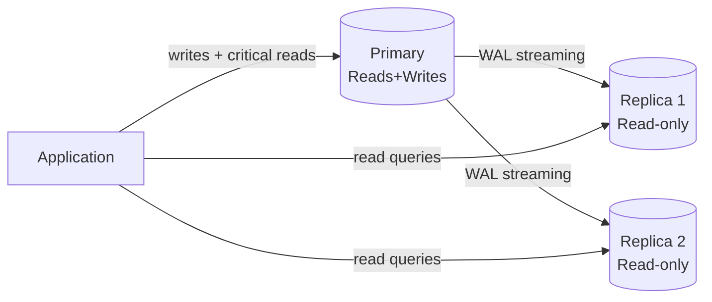
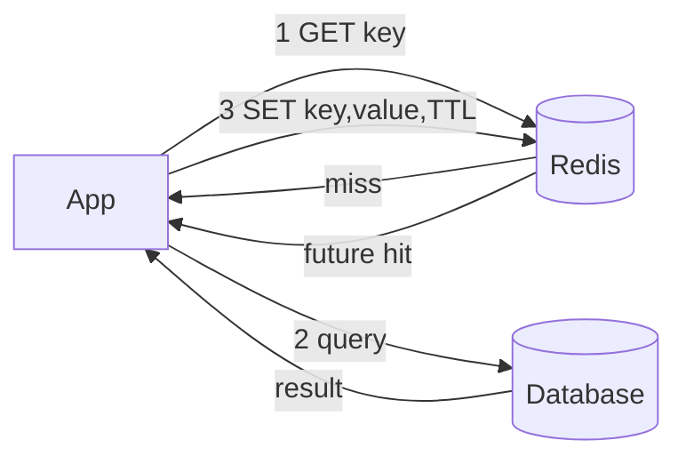
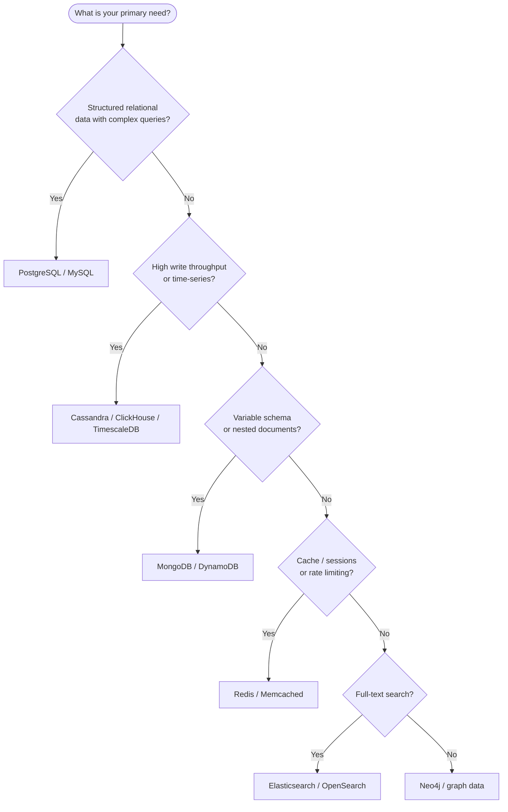

# Database & Caching

## Table of Contents
1. [SQL vs NoSQL](#sql-vs-nosql)
2. [Indexes Deep Dive](#indexes-deep-dive)
3. [Materialized Views & Advanced Views](#materialized-views--advanced-views)
4. [EXPLAIN & Query Analysis](#explain--query-analysis)
5. [Transactions & Isolation](#transactions--isolation)
6. [MVCC & PostgreSQL Concurrency](#mvcc--postgresql-concurrency)
7. [Sharding & Replication](#sharding--replication)
8. [Caching Strategies](#caching-strategies)
9. [Redis Deep Dive](#redis-deep-dive)
10. [Database Selection Guide](#database-selection-guide)

---

## SQL vs NoSQL

Choosing the right database is one of the most consequential architectural decisions. SQL databases model data as related tables and excel at enforcing consistency and answering ad-hoc queries via joins. NoSQL databases sacrifice query flexibility for one of: schema flexibility (MongoDB), massive write throughput (Cassandra), sub-millisecond access (Redis), or graph traversal (Neo4j). In practice, most systems use multiple databases — polyglot persistence — with each database handling the workload it's best at.

| | SQL (Relational) | Document (MongoDB) | Column (Cassandra) | Key-Value (Redis) | Graph (Neo4j) |
|---|---|---|---|---|---|
| Schema | Fixed, enforced | Flexible / schema-less | Column families | None | Nodes + edges |
| Transactions | Full ACID | Multi-doc ACID (4.0+) | Lightweight | Lua scripts | ACID |
| Scaling | Vertical + read replicas | Horizontal | Horizontal-first | Horizontal (cluster) | Vertical |
| Joins | Native | Avoided / $lookup | Not supported | N/A | Traversal |
| Query | SQL | MQL / aggregation | CQL | Key-based | Cypher |
| Best for | Complex queries, integrity | Variable-schema, docs | Time-series, write-heavy | Cache, sessions, counters | Social graphs, recommendations |

**When to choose what:**
- Complex transactions, relational integrity → **PostgreSQL / MySQL**
- Variable-schema, nested documents, flexible queries → **MongoDB**
- Time-series, massive write throughput → **Cassandra / ClickHouse**
- Caching, sessions, rate limiting, pub/sub → **Redis**
- Social/recommendation graphs → **Neo4j**
- Full-text search → **Elasticsearch**

---

## Indexes Deep Dive

An index is a separate data structure that the database maintains to speed up lookups, at the cost of additional storage and slightly slower writes (the index must be updated on every INSERT/UPDATE/DELETE). Without an index on a filter column, the database performs a sequential scan — reading every row. With an index, it can jump directly to the matching rows in O(log N) time. Choosing which columns to index (and in what combination) is one of the most impactful performance tuning activities.

### B-Tree Index (Default)

B-tree (Balanced Tree) is the default index structure in PostgreSQL, MySQL, Oracle.

```
B-Tree structure (height ~3-4 for millions of rows):
Root: [50 | 200]
├── [10 | 30]    ← internal nodes contain keys
│   ├── [1,5,9]  ← leaf nodes contain actual data pointers
│   └── [11,25]
└── [100 | 150]
```

**Properties:**
- Self-balancing: all leaf nodes at same depth
- O(log N) for point queries and range queries
- Good for: `=`, `<`, `>`, `BETWEEN`, `LIKE 'prefix%'`
- NOT good for: `LIKE '%suffix'`, full-text search

### Hash Index

- O(1) point lookup; does NOT support range queries
- PostgreSQL supports hash indexes; MySQL InnoDB only B-tree
- Good for: equality checks only (`=`)

### Index Types in PostgreSQL

| Type | Use Case |
|---|---|
| B-Tree | Default; equality and range queries |
| Hash | Equality only, faster than B-tree for = |
| GIN | Full-text search, arrays, JSONB |
| GiST | Geometric types, full-text |
| BRIN | Very large tables with natural ordering (time-series) |
| Partial | `WHERE` clause in index — smaller, faster |

### Composite Index & Leftmost Prefix Rule

```sql
-- Composite index: order MATTERS
CREATE INDEX idx_orders ON orders(customer_id, status, created_at);

-- Benefits from index (uses leftmost prefix):
WHERE customer_id = 5                                          -- ✅
WHERE customer_id = 5 AND status = 'PAID'                     -- ✅
WHERE customer_id = 5 AND status = 'PAID' AND created_at > ?  -- ✅

-- Does NOT benefit:
WHERE status = 'PAID'                                          -- ❌ skips customer_id
WHERE created_at > ?                                           -- ❌ skips first two
```

### Covering Index (Index-Only Scan)

```sql
-- All needed columns in index — avoids heap (table) lookup
CREATE INDEX idx_covering ON orders(customer_id, status, total_amount);

SELECT status, total_amount FROM orders WHERE customer_id = 5;
-- → Index-Only Scan (no table access needed)
```

### Index Selectivity & Cardinality

- **High cardinality** (many distinct values: user_id, email) → index is useful
- **Low cardinality** (few distinct values: boolean, status with 3 values) → table scan often faster
- Use `EXPLAIN ANALYZE` to verify query plan

```sql
-- Check index usage
EXPLAIN ANALYZE SELECT * FROM orders WHERE customer_id = 5;
-- Look for: Index Scan, Bitmap Index Scan (good) vs Seq Scan (bad for selective queries)

-- Check cardinality
SELECT customer_id, COUNT(*) FROM orders GROUP BY customer_id LIMIT 10;
```

### Partial Index

```sql
-- Index only active orders (not archived ones)
CREATE INDEX idx_active_orders ON orders(customer_id, created_at)
WHERE status != 'ARCHIVED';
-- Smaller, faster, less maintenance overhead
```

### Clustered Index (Index-Organized Table)

A **clustered index** (or index-organized table) stores the actual row data *inside* the B-tree leaf nodes, ordered by the index key. There can be only one clustered index per table because the physical row order on disk can only follow one sequence. In MySQL InnoDB, the primary key is always the clustered index. In PostgreSQL, `CLUSTER` reorders heap pages by an index, but it's a one-time operation (not maintained automatically).

```sql
-- MySQL InnoDB: PRIMARY KEY is always the clustered index
-- Rows physically stored in PK order → PK lookups = no heap jump needed
CREATE TABLE orders (
    id BIGINT PRIMARY KEY,       -- clustered index: row data is HERE in the B-tree
    customer_id BIGINT,
    status VARCHAR(20),
    total DECIMAL(10,2),
    INDEX idx_customer (customer_id)  -- secondary index: stores PK (id) as pointer to row
);

-- PostgreSQL: CLUSTER command (one-time physical reorder)
CLUSTER orders USING idx_orders_created_at;
-- After CLUSTER: rows on disk are ordered by created_at
-- Subsequent inserts disrupt order; must CLUSTER again periodically
-- PROS: range scans on created_at become sequential reads → very fast
-- CONS: one-time, not maintained; locks table during operation
```

**Key difference: clustered vs non-clustered:**
- **Clustered (primary):** leaf node = actual row data. One I/O to get the row.
- **Non-clustered (secondary):** leaf node = pointer to row (in PostgreSQL, the ctid; in MySQL, the PK value). Two I/Os: index lookup → then row fetch (unless it's a covering index).

---

## Materialized Views & Advanced Views

A **regular view** is a stored query — it executes the underlying query every time you select from it. A **materialized view** pre-computes and stores the query result as a physical table that can be indexed. This trades storage and staleness for dramatically faster reads on complex aggregations, joins, or reporting queries that would otherwise take seconds.

```sql
-- Regular view: executes the full query on every SELECT
CREATE VIEW order_summary AS
SELECT customer_id,
       COUNT(*)            AS total_orders,
       SUM(total)          AS total_spent,
       MAX(created_at)     AS last_order_date
FROM orders
GROUP BY customer_id;
-- SELECT * FROM order_summary WHERE customer_id = 42;
-- → runs the full GROUP BY on every call (slow for large tables)

-- Materialized view: results stored as a physical table
CREATE MATERIALIZED VIEW order_summary_mv AS
SELECT customer_id,
       COUNT(*)            AS total_orders,
       SUM(total)          AS total_spent,
       MAX(created_at)     AS last_order_date
FROM orders
GROUP BY customer_id
WITH DATA;  -- populate immediately

-- Can add indexes on the materialized view!
CREATE INDEX ON order_summary_mv (customer_id);
-- Now: SELECT * FROM order_summary_mv WHERE customer_id = 42; → index scan, microseconds
```

### Refreshing Materialized Views

```sql
-- Full refresh: recompute entire result (blocks reads during refresh)
REFRESH MATERIALIZED VIEW order_summary_mv;

-- Concurrent refresh: no read lock (requires a UNIQUE index)
REFRESH MATERIALIZED VIEW CONCURRENTLY order_summary_mv;

-- Automatic refresh: use a scheduled job or trigger
-- PostgreSQL doesn't auto-refresh; options:
-- 1. pg_cron extension: schedule REFRESH on interval
-- 2. Trigger on base table: AFTER INSERT/UPDATE → REFRESH (careful: expensive if frequent writes)
-- 3. Application-level: refresh after batch processing, at off-peak hours
```

### When to Use Materialized Views

| Use Case | Regular View | Materialized View |
|---|---|---|
| Simple filter/join used occasionally | ✅ | Overkill |
| Complex aggregation, used frequently | ❌ Slow | ✅ |
| Reporting/dashboards with slight staleness OK | ❌ Slow | ✅ |
| Real-time data required | ✅ (always fresh) | ❌ (stale between refreshes) |
| Large table joins, analytics | ❌ Very slow | ✅ |

**Practical examples where materialized views shine:**
- Sales dashboard: total revenue per region per month
- User activity summaries: messages sent, orders placed (for recommendations)
- Search-friendly denormalization: pre-join product + category + brand for search index feed

---

## EXPLAIN & Query Analysis

`EXPLAIN` shows the **query execution plan** the database chose — without actually running the query. `EXPLAIN ANALYZE` executes it and shows actual vs estimated row counts and actual timings. This is the primary tool for diagnosing slow queries and verifying that indexes are used.

```sql
-- EXPLAIN: show plan without executing
EXPLAIN SELECT * FROM orders WHERE customer_id = 42 AND status = 'PENDING';

-- EXPLAIN ANALYZE: execute + show actual stats (use on non-destructive queries)
EXPLAIN ANALYZE
SELECT o.id, o.total, c.name
FROM orders o
JOIN customers c ON o.customer_id = c.id
WHERE o.status = 'PENDING'
ORDER BY o.created_at DESC
LIMIT 20;
```

**Reading EXPLAIN output — what to look for:**

```
Limit  (cost=0.43..10.52 rows=20 width=48) (actual time=0.082..0.193 rows=20 loops=1)
  -> Sort  (cost=... rows=1250 ...) (actual ... rows=1250 ...)
      Sort Key: o.created_at DESC
      Sort Method: quicksort  Memory: 285kB
    -> Hash Join  (cost=... rows=1250 ...) (actual ... rows=1250 ...)
        Hash Cond: (o.customer_id = c.id)
        -> Index Scan using idx_orders_status on orders o
              Index Cond: (status = 'PENDING')          ← index used ✅
              Rows Removed by Filter: 0
        -> Hash  (cost=... rows=5000 ...)
            -> Seq Scan on customers c                  ← full scan ⚠️
```

| Node Type | Meaning | Good/Bad |
|---|---|---|
| `Seq Scan` | Full table scan (reads every row) | ⚠️ Bad on large tables |
| `Index Scan` | Traverses B-tree, fetches rows from heap | ✅ Good for selective queries |
| `Index Only Scan` | Reads from index only (covering index) | ✅ Best — no heap access |
| `Bitmap Index Scan` | Uses index to build bitmap, then heap scan | ✅ Good for low-selectivity |
| `Hash Join` | Build hash table from smaller set, probe with larger | ✅ Good for unsorted joins |
| `Merge Join` | Join two sorted sets | ✅ Good when both sides sorted |
| `Nested Loop` | For each row in outer, scan inner | ⚠️ Bad at scale; good with index on inner |
| `Sort` | In-memory or disk sort | ⚠️ Watch for `Disk: xxxkB` → add index |

**Key columns to check:**
- `rows=N` (estimated) vs `actual rows=N`: large discrepancy → stale statistics → run `ANALYZE`
- `cost=X..Y`: startup cost..total cost (planner units, not ms)
- `actual time=X..Y ms`: real execution time per node
- `loops=N`: how many times this node was executed (multiply by loops for total)

```sql
-- Fix stale statistics → recalculate cardinality estimates
ANALYZE orders;
ANALYZE customers;

-- Force index use (rarely needed; trust the planner)
SET enable_seqscan = OFF;  -- test only, not for production
```

**Common EXPLAIN findings and fixes:**

| Finding | Root Cause | Fix |
|---|---|---|
| `Seq Scan` on large table | Missing index on filter column | `CREATE INDEX` |
| High `rows removed by filter` | Index exists but not selective enough | Composite index or partial index |
| `Sort` on large dataset | No index matching ORDER BY | Add index on sort column |
| Estimated vs actual rows mismatch | Stale statistics | `ANALYZE` table |
| `Nested Loop` with large outer | No index on join column | Index on join column |
| `Hash Join` taking too long | Hash table spilling to disk | Increase `work_mem` |

```sql
-- Increase work_mem for expensive sort/hash operations (session-level)
SET work_mem = '256MB';
EXPLAIN ANALYZE SELECT ...; -- see if Sort/Hash switches to in-memory
RESET work_mem;
```

---

## Transactions & Isolation

Transactions group multiple operations into a single atomic unit — either all succeed or all fail. Isolation controls what intermediate state one transaction can see from another that's running concurrently. Higher isolation levels prevent more anomalies but at the cost of more contention (locks or MVCC overhead). The default in most databases (READ COMMITTED) is a practical balance: prevents dirty reads but allows non-repeatable reads, which is acceptable for most web applications.

### ACID Properties

| Property | Meaning | Mechanism |
|---|---|---|
| **Atomicity** | All-or-nothing | Transaction log / undo log |
| **Consistency** | Data remains valid (constraints hold) | Constraint checking |
| **Isolation** | Concurrent transactions don't interfere | Locks or MVCC |
| **Durability** | Committed data survives crashes | WAL (Write-Ahead Log) |

### Isolation Levels & Anomalies

| Level | Dirty Read | Non-Repeatable Read | Phantom Read | Implementation |
|---|---|---|---|---|
| READ UNCOMMITTED | ✅ possible | ✅ possible | ✅ possible | No locks |
| READ COMMITTED | ❌ | ✅ possible | ✅ possible | Lock released after read |
| REPEATABLE READ | ❌ | ❌ | ✅ possible (MySQL: ❌) | Lock held until commit |
| SERIALIZABLE | ❌ | ❌ | ❌ | Predicate locks / SSI |

**Anomaly definitions:**
- **Dirty read:** Read uncommitted data from another transaction
- **Non-repeatable read:** Same row read twice, different values (another tx committed between reads)
- **Phantom read:** Same query returns different rows (rows added/deleted by another tx)
- **Lost update:** Two transactions read-modify-write; one overwrites the other

**Defaults:**
- PostgreSQL: **READ COMMITTED** (default) — uses MVCC, no read locks
- MySQL InnoDB: **REPEATABLE READ** — uses gap locks to prevent phantoms
- SQL Server: READ COMMITTED (with RCSI snapshot by default in Azure SQL)

### Locking vs Optimistic Concurrency

```java
// Pessimistic locking — SELECT FOR UPDATE
@Lock(LockModeType.PESSIMISTIC_WRITE)
@Query("SELECT p FROM Product p WHERE p.id = :id")
Product findByIdForUpdate(@Param("id") Long id);

// Optimistic locking — @Version
@Entity
public class Product {
    @Version
    private Long version; // auto-incremented; JPA throws OptimisticLockException on conflict
}

// Handle optimistic lock conflict
@Retryable(value = OptimisticLockingFailureException.class, maxAttempts = 3)
public void updateStock(Long productId, int delta) {
    Product p = repo.findById(productId).orElseThrow();
    p.setStock(p.getStock() - delta);
    repo.save(p); // throws if version changed since read
}
```

---

## MVCC & PostgreSQL Concurrency

**Multi-Version Concurrency Control (MVCC)** is PostgreSQL's core concurrency mechanism. Instead of locking rows for reads, it maintains multiple versions of each row — old versions remain visible to transactions that started before the update. This means reads never block writes and writes never block reads, giving very high concurrent throughput. The trade-off is that old row versions accumulate and must be cleaned up by `VACUUM`.

```
How PostgreSQL MVCC works:
Each row has hidden columns: xmin (created by tx), xmax (deleted by tx)

TX 100 inserts row: {xmin=100, xmax=null, data="Alice"}
TX 101 updates row: 
  - marks old: {xmin=100, xmax=101, data="Alice"}  ← invisible to tx >= 101 after commit
  - inserts new: {xmin=101, xmax=null, data="Alice Updated"}

TX 99 (started before 101): still sees {xmin=100, xmax=null, data="Alice"}
TX 102 (started after 101): sees {xmin=101, xmax=null, data="Alice Updated"}
```

**Consequence:** `VACUUM` needed to clean dead tuples (old versions). `autovacuum` runs periodically. Table bloat is a concern for write-heavy tables.

**Snapshot Isolation in PostgreSQL:**
- Each transaction gets a snapshot at start (READ COMMITTED: per statement; REPEATABLE READ: per transaction)
- No read locks needed — reads are always consistent without blocking

### PostgreSQL Lock Types

PostgreSQL has multiple lock granularities. Understanding them prevents accidental lock contention in production.

| Lock Mode | Conflicts With | Acquired By |
|---|---|---|
| `ACCESS SHARE` | `ACCESS EXCLUSIVE` only | `SELECT` |
| `ROW SHARE` | `EXCLUSIVE`, `ACCESS EXCLUSIVE` | `SELECT FOR UPDATE` |
| `ROW EXCLUSIVE` | `SHARE`, `SHARE ROW EXCLUSIVE`, `EXCLUSIVE`, `ACCESS EXCLUSIVE` | `INSERT`, `UPDATE`, `DELETE` |
| `SHARE` | `ROW EXCLUSIVE` and above | `CREATE INDEX` (non-concurrent) |
| `EXCLUSIVE` | Everything except `ACCESS SHARE` | Rarely used directly |
| `ACCESS EXCLUSIVE` | All locks | `DROP`, `TRUNCATE`, `LOCK TABLE` |

**Row-level locks:**
```sql
SELECT * FROM orders WHERE id = 1 FOR UPDATE;           -- exclusive row lock (blocks other updates)
SELECT * FROM orders WHERE id = 1 FOR SHARE;            -- shared row lock (allows other reads)
SELECT * FROM orders WHERE id = 1 FOR UPDATE SKIP LOCKED; -- skip already-locked rows (queue processing)
SELECT * FROM orders WHERE id = 1 FOR UPDATE NOWAIT;    -- fail immediately if locked (don't queue)
```

### Advisory Locks (Application-Level)

Advisory locks are explicit, application-controlled locks not tied to any row or table. They're perfect for distributed coordination tasks like "only one scheduler runs at a time."

```sql
-- Session-level advisory lock: held until session ends or explicitly released
SELECT pg_try_advisory_lock(12345);    -- returns true if acquired
SELECT pg_advisory_unlock(12345);      -- release

-- Transaction-level advisory lock: auto-released on COMMIT/ROLLBACK
SELECT pg_try_advisory_xact_lock(42); -- returns true if acquired

-- Practical use: distributed cron job — only one instance runs
-- Each instance tries: SELECT pg_try_advisory_lock(hashtext('daily-report-job'))
-- Winner runs the job; others skip
```

### Deadlock Detection in PostgreSQL

PostgreSQL automatically detects deadlocks and kills one of the transactions (the one with less work done). The default deadlock detection timeout is 1 second (`deadlock_timeout`).

```sql
-- Session 1                        -- Session 2
BEGIN;                               BEGIN;
UPDATE accounts SET balance=balance-100 WHERE id=1;
                                     UPDATE accounts SET balance=balance-50 WHERE id=2;
UPDATE accounts SET balance=balance+100 WHERE id=2;  -- WAITS for Session 2
                                     UPDATE accounts SET balance=balance+50 WHERE id=1;  -- WAITS for Session 1
-- PostgreSQL detects cycle after deadlock_timeout (1s)
-- Rolls back one transaction with: ERROR: deadlock detected
```

**Prevention:** always acquire locks in the same order across all code paths.

### VACUUM and Table Bloat

```sql
-- Check for table bloat (dead tuples)
SELECT relname, n_dead_tup, n_live_tup,
       round(n_dead_tup * 100.0 / NULLIF(n_live_tup + n_dead_tup, 0), 2) AS dead_pct
FROM pg_stat_user_tables
ORDER BY n_dead_tup DESC;

-- Manual VACUUM (reclaims dead tuple space, updates visibility map)
VACUUM orders;

-- VACUUM FULL (rewrites table entirely — locks table, frees disk space back to OS)
VACUUM FULL orders;  -- use only off-hours; causes brief downtime

-- ANALYZE updates statistics used by query planner
ANALYZE orders;

-- Check autovacuum activity
SELECT relname, last_autovacuum, last_autoanalyze
FROM pg_stat_user_tables
WHERE relname = 'orders';
```

**When to tune autovacuum aggressively:**
- Write-heavy tables (high UPDATE/DELETE rate)
- Large tables where default triggers are too infrequent
- Tables with visibility map issues (causes sequential scans instead of index-only scans)

---

## Sharding & Replication

A single database node has finite resources. Replication creates read replicas that serve SELECT queries, relieving the primary of read pressure while also providing high availability failover. Sharding partitions data horizontally across multiple independent database nodes — each node owns a subset of the data. Replication improves read throughput and availability; sharding improves write throughput and storage capacity. They're complementary: production systems typically run each shard with its own replica set.

### Replication



| | Synchronous | Asynchronous |
|---|---|---|
| Durability | No data loss | Possible lag (seconds) |
| Write latency | Higher (waits for replica) | Lower |
| Failover | Zero data loss | RPO > 0 |
| Use case | Financial, critical data | Analytics reads, reporting |

**Replication lag** → read-your-writes problem: write to primary, immediate read from replica might not see your write. Fix: route user's own reads to primary (session stickiness), or use synchronous replication.

### Sharding Strategies

| Strategy | How | Pros | Cons |
|---|---|---|---|
| **Range** | `user_id 0-1M → Shard1`, `1M-2M → Shard2` | Simple, range queries work | Hotspots if traffic skews to range |
| **Hash** | `hash(user_id) % N → shard` | Even distribution | No range queries across shards |
| **Directory** | Lookup table: `user_id → shard_id` | Flexible, any distribution | Lookup table becomes SPOF |
| **Geo** | Users in US → US shard | Low latency for regional users | Uneven if regions have different sizes |
| **Consistent Hashing** | Virtual nodes on ring | Minimal remapping on add/remove | More complex |

**Cross-shard queries problem:**
- Queries that need data from multiple shards require scatter-gather → expensive
- Avoid: cross-shard joins, cross-shard transactions (use eventual consistency or denormalization)

### Consistent Hashing Deep Dive

```
Ring (0 to 2^32):
Nodes placed at multiple virtual positions (vnodes):
  Node A: positions 10, 45, 80
  Node B: positions 25, 60, 95
  Node C: positions 35, 75, 15

Key 27 → clockwise → Node B (at 60)
Key 50 → clockwise → Node B (at 60)
Key 72 → clockwise → Node C (at 75)

Remove Node B: only keys in B's ranges remapped to next node
Add Node D: only some ranges from neighbors remapped
```

**Why vnodes?** Avoids hot spots when a node has disproportionate range. Standard: 150-256 vnodes/node.

### Read Replicas for Scale

```sql
-- Spring Data JPA: route reads to replica
@Transactional(readOnly = true)
public List<Order> findByCustomer(Long customerId) {
    return orderRepo.findByCustomerId(customerId);
}
-- @Transactional(readOnly=true) + AbstractRoutingDataSource → route to replica
```

---

## Caching Strategies

Caching is a copy of data stored in faster storage to avoid re-computing or re-fetching it. The critical design question is *who is responsible for populating the cache* and *when does the cache become stale*. Cache-aside puts the application in control (explicit load on miss, explicit invalidation on write). Write-through keeps the cache always current but doubles write latency. Write-behind accelerates writes but risks losing un-flushed data. The right choice depends on the consistency requirements and write/read ratio of your use case.

### Cache-Aside (Lazy Loading) — Most Common



```java
// Spring @Cacheable implements cache-aside
@Cacheable(value = "products", key = "#id", unless = "#result == null")
public Product getProduct(Long id) {
    return repo.findById(id).orElse(null);
}

@CacheEvict(value = "products", key = "#product.id")
public Product updateProduct(Product product) {
    return repo.save(product);
}
```

### Write-Through

Write to cache and DB synchronously. Cache never stale, but doubles write latency. Use for: read-heavy, consistency critical.

### Write-Behind (Write-Back)

Write to cache immediately, flush to DB asynchronously. Lower write latency, risk of data loss on cache crash. Use for: write-heavy, can tolerate slight delay.

### Cache Stampede (Thundering Herd) Prevention

```java
// Problem: many threads miss cache simultaneously → DB overloaded
// Solution 1: probabilistic early expiration
public Product getWithPER(Long id) {
    CachedValue v = cache.get(id);
    if (v == null || shouldEarlyRefresh(v)) {
        // only one thread fetches, others wait
        return fetchAndCache(id);
    }
    return v.value();
}

// Solution 2: Redis lock (mutex)
public Product getWithLock(Long id) {
    String key = "product:" + id;
    Product cached = redis.get(key);
    if (cached != null) return cached;

    String lockKey = "lock:" + key;
    if (redis.setnx(lockKey, "1", Duration.ofSeconds(10))) {
        try {
            Product p = db.findById(id);
            redis.set(key, p, Duration.ofMinutes(5));
            return p;
        } finally {
            redis.del(lockKey);
        }
    } else {
        Thread.sleep(50); // wait and retry
        return getWithLock(id);
    }
}
```

### Cache Eviction Policies

| Policy | Description | Best For |
|---|---|---|
| **LRU** (Least Recently Used) | Evict oldest accessed item | General purpose |
| **LFU** (Least Frequently Used) | Evict least accessed item | Skewed access patterns |
| **TTL** | Evict after time expires | Time-sensitive data |
| **FIFO** | Evict oldest inserted item | Queue-like workloads |
| **Random** | Evict randomly | Simple, when access pattern unknown |

Redis default: **LRU** (configurable per policy).

---

## Redis Deep Dive

Redis is an in-memory data structure server — not just a cache. Its power comes from offering the right data structure for each problem: Strings for counters and simple values, Sorted Sets for leaderboards and rate limiting, Streams for event queues, HyperLogLog for cardinality estimates. All operations are single-threaded (in the command execution layer), which makes them atomic — a critical property for rate limiting, distributed locks, and session management without complex concurrency logic.

### Data Structures & Use Cases

| Structure | Commands | Use Case |
|---|---|---|
| **String** | GET, SET, INCR, EXPIRE | Cache, counters, sessions |
| **Hash** | HGET, HSET, HGETALL | User profile, shopping cart |
| **List** | LPUSH, RPOP, LRANGE | Message queue, activity feed |
| **Set** | SADD, SMEMBERS, SINTER | Unique visitors, tags, follows |
| **Sorted Set** | ZADD, ZRANGE, ZREVRANK | Leaderboard, rate limiting, priority queue |
| **HyperLogLog** | PFADD, PFCOUNT | Approximate unique count (~1.5% error) |
| **Stream** | XADD, XREAD, XGROUP | Message queue with consumer groups (Kafka-lite) |
| **Bitmap** | SETBIT, BITCOUNT | Feature flags, daily active users |

```java
// Sorted Set — leaderboard
redisTemplate.opsForZSet().add("leaderboard", "alice", 1500.0);
redisTemplate.opsForZSet().add("leaderboard", "bob", 2100.0);
// Top 10
Set<String> top10 = redisTemplate.opsForZSet()
    .reverseRange("leaderboard", 0, 9);

// Rate limiting with Sorted Set (sliding window)
// Add current timestamp, remove old ones, count
String key = "rate:" + userId;
long now = System.currentTimeMillis();
redisTemplate.opsForZSet().removeRangeByScore(key, 0, now - 60_000); // remove >1min old
redisTemplate.opsForZSet().add(key, String.valueOf(now), now);
long count = redisTemplate.opsForZSet().zCard(key);
if (count > 100) throw new RateLimitExceededException();

// Hash — user session
redisTemplate.opsForHash().put("session:" + token, "userId", userId.toString());
redisTemplate.opsForHash().put("session:" + token, "role", "ADMIN");
redisTemplate.expire("session:" + token, Duration.ofHours(1));
```

### Distributed Lock with Redisson

```java
RLock lock = redisson.getLock("lock:order:" + orderId);
boolean acquired = lock.tryLock(5, 30, TimeUnit.SECONDS); // wait 5s, expire 30s
if (!acquired) throw new LockAcquisitionException("...");
try {
    // critical section
    processOrder(orderId);
} finally {
    lock.unlock();
}
```

**Why not SETNX alone?** No automatic expiry on crash, no atomic acquire+expiry. Redisson uses Lua scripts for atomicity and Watchdog thread to extend TTL while held.

### Redis Persistence

| Mode | How | Data Loss Risk | Use Case |
|---|---|---|---|
| **RDB** | Periodic snapshot (BGSAVE) | Last snapshot's data | Cache (acceptable loss) |
| **AOF** | Log every write command | Minimal (last second) | Durable sessions |
| **AOF + RDB** | Both | Near zero | Critical data |
| **No persistence** | In-memory only | All data on restart | Pure ephemeral cache |

### Redis Cluster vs Sentinel

| | Redis Sentinel | Redis Cluster |
|---|---|---|
| Purpose | HA (failover) for single shard | Horizontal sharding + HA |
| Sharding | No | Yes (16384 hash slots) |
| Min nodes | 3 sentinels + 1 primary | 6 (3 primary + 3 replica) |
| Client support | Simple | Cluster-aware client needed |
| Use when | One dataset, HA needed | Dataset > single node RAM |

### Spring Boot Redis Config

```yaml
spring:
  cache:
    type: redis
  data:
    redis:
      host: localhost
      port: 6379
      timeout: 2000ms
      lettuce:
        pool:
          max-active: 20
          max-idle: 10
          min-idle: 5
```

```java
@Configuration
@EnableCaching
public class CacheConfig {
    @Bean
    public RedisCacheConfiguration cacheConfig() {
        return RedisCacheConfiguration.defaultCacheConfig()
            .entryTtl(Duration.ofMinutes(30))
            .disableCachingNullValues()
            .serializeValuesWith(
                RedisSerializationContext.SerializationPair.fromSerializer(
                    new GenericJackson2JsonRedisSerializer()
                )
            );
    }
}
```

---

## Database Selection Guide



### N+1 Query Problem (ORM)

```java
// BAD: 1 query to fetch orders + N queries for each customer
List<Order> orders = orderRepo.findAll();
orders.forEach(o -> System.out.println(o.getCustomer().getName())); // N lazy loads

// GOOD: JOIN FETCH — 1 query
@Query("SELECT o FROM Order o JOIN FETCH o.customer WHERE o.status = :status")
List<Order> findWithCustomer(@Param("status") OrderStatus status);

// OR: @EntityGraph
@EntityGraph(attributePaths = {"customer", "items"})
List<Order> findByStatus(OrderStatus status);

// OR: @BatchSize (multiple batches instead of N queries)
@BatchSize(size = 50)
@OneToMany
private List<OrderItem> items;
```

### Connection Pool Sizing (HikariCP)

```yaml
spring:
  datasource:
    hikari:
      maximum-pool-size: 10       # = CPU cores * 2 (I/O-heavy) or CPU cores (compute-heavy)
      minimum-idle: 5
      connection-timeout: 30000   # 30s before throwing exception
      idle-timeout: 600000        # 10min before closing idle connection
      max-lifetime: 1800000       # 30min — rotate to prevent stale connections
```

**Formula:** `pool_size = (core_count * 2) + effective_spindle_count`  
For most web apps: 5-20 connections per instance is usually sufficient. More connections ≠ more performance (DB has its own limits).
