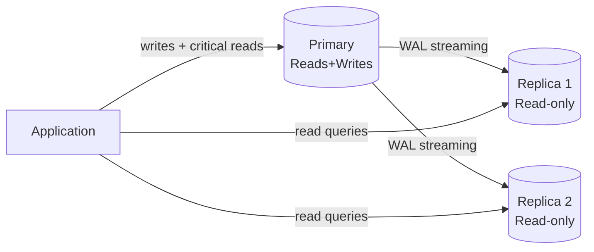
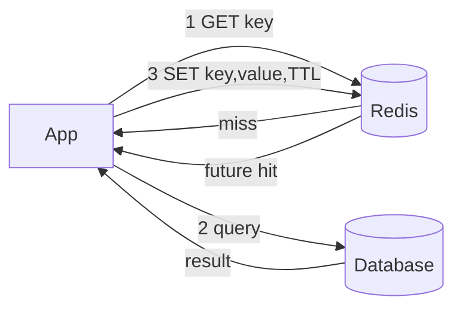

# Database & Caching

## Table of Contents
1. [SQL vs NoSQL](#sql-vs-nosql)
2. [Indexes Deep Dive](#indexes-deep-dive)
3. [Transactions & Isolation](#transactions--isolation)
4. [MVCC (Multi-Version Concurrency Control)](#mvcc)
5. [Sharding & Replication](#sharding--replication)
6. [Caching Strategies](#caching-strategies)
7. [Redis Deep Dive](#redis-deep-dive)
8. [Database Selection Guide](#database-selection-guide)

---

## SQL vs NoSQL

| | SQL (Relational) | Document (MongoDB) | Column (Cassandra) | Key-Value (Redis) | Graph (Neo4j) |
|---|---|---|---|---|---|
| Schema | Fixed, enforced | Flexible / schema-less | Column families | None | Nodes + edges |
| Transactions | Full ACID | Multi-doc ACID (4.0+) | Lightweight | Lua scripts | ACID |
| Scaling | Vertical + read replicas | Horizontal | Horizontal-first | Horizontal (cluster) | Vertical |
| Joins | Native | Avoided / $lookup | Not supported | N/A | Traversal |
| Query | SQL | MQL / aggregation | CQL | Key-based | Cypher |
| Best for | Complex queries, integrity | Variable-schema, docs | Time-series, write-heavy | Cache, sessions, counters | Social graphs, recommendations |

**When to choose what:**
- Complex transactions, relational integrity → **PostgreSQL / MySQL**
- Variable-schema, nested documents, flexible queries → **MongoDB**
- Time-series, massive write throughput → **Cassandra / ClickHouse**
- Caching, sessions, rate limiting, pub/sub → **Redis**
- Social/recommendation graphs → **Neo4j**
- Full-text search → **Elasticsearch**

---

## Indexes Deep Dive

### B-Tree Index (Default)

B-tree (Balanced Tree) is the default index structure in PostgreSQL, MySQL, Oracle.

```
B-Tree structure (height ~3-4 for millions of rows):
Root: [50 | 200]
├── [10 | 30]    ← internal nodes contain keys
│   ├── [1,5,9]  ← leaf nodes contain actual data pointers
│   └── [11,25]
└── [100 | 150]
```

**Properties:**
- Self-balancing: all leaf nodes at same depth
- O(log N) for point queries and range queries
- Good for: `=`, `<`, `>`, `BETWEEN`, `LIKE 'prefix%'`
- NOT good for: `LIKE '%suffix'`, full-text search

### Hash Index

- O(1) point lookup; does NOT support range queries
- PostgreSQL supports hash indexes; MySQL InnoDB only B-tree
- Good for: equality checks only (`=`)

### Index Types in PostgreSQL

| Type | Use Case |
|---|---|
| B-Tree | Default; equality and range queries |
| Hash | Equality only, faster than B-tree for = |
| GIN | Full-text search, arrays, JSONB |
| GiST | Geometric types, full-text |
| BRIN | Very large tables with natural ordering (time-series) |
| Partial | `WHERE` clause in index — smaller, faster |

### Composite Index & Leftmost Prefix Rule

```sql
-- Composite index: order MATTERS
CREATE INDEX idx_orders ON orders(customer_id, status, created_at);

-- Benefits from index (uses leftmost prefix):
WHERE customer_id = 5                                          -- ✅
WHERE customer_id = 5 AND status = 'PAID'                     -- ✅
WHERE customer_id = 5 AND status = 'PAID' AND created_at > ?  -- ✅

-- Does NOT benefit:
WHERE status = 'PAID'                                          -- ❌ skips customer_id
WHERE created_at > ?                                           -- ❌ skips first two
```

### Covering Index (Index-Only Scan)

```sql
-- All needed columns in index — avoids heap (table) lookup
CREATE INDEX idx_covering ON orders(customer_id, status, total_amount);

SELECT status, total_amount FROM orders WHERE customer_id = 5;
-- → Index-Only Scan (no table access needed)
```

### Index Selectivity & Cardinality

- **High cardinality** (many distinct values: user_id, email) → index is useful
- **Low cardinality** (few distinct values: boolean, status with 3 values) → table scan often faster
- Use `EXPLAIN ANALYZE` to verify query plan

```sql
-- Check index usage
EXPLAIN ANALYZE SELECT * FROM orders WHERE customer_id = 5;
-- Look for: Index Scan, Bitmap Index Scan (good) vs Seq Scan (bad for selective queries)

-- Check cardinality
SELECT customer_id, COUNT(*) FROM orders GROUP BY customer_id LIMIT 10;
```

### Partial Index

```sql
-- Index only active orders (not archived ones)
CREATE INDEX idx_active_orders ON orders(customer_id, created_at)
WHERE status != 'ARCHIVED';
-- Smaller, faster, less maintenance overhead
```

---

## Transactions & Isolation

### ACID Properties

| Property | Meaning | Mechanism |
|---|---|---|
| **Atomicity** | All-or-nothing | Transaction log / undo log |
| **Consistency** | Data remains valid (constraints hold) | Constraint checking |
| **Isolation** | Concurrent transactions don't interfere | Locks or MVCC |
| **Durability** | Committed data survives crashes | WAL (Write-Ahead Log) |

### Isolation Levels & Anomalies

| Level | Dirty Read | Non-Repeatable Read | Phantom Read | Implementation |
|---|---|---|---|---|
| READ UNCOMMITTED | ✅ possible | ✅ possible | ✅ possible | No locks |
| READ COMMITTED | ❌ | ✅ possible | ✅ possible | Lock released after read |
| REPEATABLE READ | ❌ | ❌ | ✅ possible (MySQL: ❌) | Lock held until commit |
| SERIALIZABLE | ❌ | ❌ | ❌ | Predicate locks / SSI |

**Anomaly definitions:**
- **Dirty read:** Read uncommitted data from another transaction
- **Non-repeatable read:** Same row read twice, different values (another tx committed between reads)
- **Phantom read:** Same query returns different rows (rows added/deleted by another tx)
- **Lost update:** Two transactions read-modify-write; one overwrites the other

**Defaults:**
- PostgreSQL: **READ COMMITTED** (default) — uses MVCC, no read locks
- MySQL InnoDB: **REPEATABLE READ** — uses gap locks to prevent phantoms
- SQL Server: READ COMMITTED (with RCSI snapshot by default in Azure SQL)

### Locking vs Optimistic Concurrency

```java
// Pessimistic locking — SELECT FOR UPDATE
@Lock(LockModeType.PESSIMISTIC_WRITE)
@Query("SELECT p FROM Product p WHERE p.id = :id")
Product findByIdForUpdate(@Param("id") Long id);

// Optimistic locking — @Version
@Entity
public class Product {
    @Version
    private Long version; // auto-incremented; JPA throws OptimisticLockException on conflict
}

// Handle optimistic lock conflict
@Retryable(value = OptimisticLockingFailureException.class, maxAttempts = 3)
public void updateStock(Long productId, int delta) {
    Product p = repo.findById(productId).orElseThrow();
    p.setStock(p.getStock() - delta);
    repo.save(p); // throws if version changed since read
}
```

---

## MVCC

**Multi-Version Concurrency Control** — readers don't block writers, writers don't block readers.

```
How PostgreSQL MVCC works:
Each row has hidden columns: xmin (created by tx), xmax (deleted by tx)

TX 100 inserts row: {xmin=100, xmax=null, data="Alice"}
TX 101 updates row: 
  - marks old: {xmin=100, xmax=101, data="Alice"}  ← invisible to tx >= 101 after commit
  - inserts new: {xmin=101, xmax=null, data="Alice Updated"}

TX 99 (started before 101): still sees {xmin=100, xmax=null, data="Alice"}
TX 102 (started after 101): sees {xmin=101, xmax=null, data="Alice Updated"}
```

**Consequence:** `VACUUM` needed to clean dead tuples (old versions). `autovacuum` runs periodically. Table bloat is a concern for write-heavy tables.

**Snapshot Isolation in PostgreSQL:**
- Each transaction gets a snapshot at start (READ COMMITTED: per statement; REPEATABLE READ: per transaction)
- No read locks needed — reads are always consistent without blocking

---

## Sharding & Replication

### Replication



| | Synchronous | Asynchronous |
|---|---|---|
| Durability | No data loss | Possible lag (seconds) |
| Write latency | Higher (waits for replica) | Lower |
| Failover | Zero data loss | RPO > 0 |
| Use case | Financial, critical data | Analytics reads, reporting |

**Replication lag** → read-your-writes problem: write to primary, immediate read from replica might not see your write. Fix: route user's own reads to primary (session stickiness), or use synchronous replication.

### Sharding Strategies

| Strategy | How | Pros | Cons |
|---|---|---|---|
| **Range** | `user_id 0-1M → Shard1`, `1M-2M → Shard2` | Simple, range queries work | Hotspots if traffic skews to range |
| **Hash** | `hash(user_id) % N → shard` | Even distribution | No range queries across shards |
| **Directory** | Lookup table: `user_id → shard_id` | Flexible, any distribution | Lookup table becomes SPOF |
| **Geo** | Users in US → US shard | Low latency for regional users | Uneven if regions have different sizes |
| **Consistent Hashing** | Virtual nodes on ring | Minimal remapping on add/remove | More complex |

**Cross-shard queries problem:**
- Queries that need data from multiple shards require scatter-gather → expensive
- Avoid: cross-shard joins, cross-shard transactions (use eventual consistency or denormalization)

### Consistent Hashing Deep Dive

```
Ring (0 to 2^32):
Nodes placed at multiple virtual positions (vnodes):
  Node A: positions 10, 45, 80
  Node B: positions 25, 60, 95
  Node C: positions 35, 75, 15

Key 27 → clockwise → Node B (at 60)
Key 50 → clockwise → Node B (at 60)
Key 72 → clockwise → Node C (at 75)

Remove Node B: only keys in B's ranges remapped to next node
Add Node D: only some ranges from neighbors remapped
```

**Why vnodes?** Avoids hot spots when a node has disproportionate range. Standard: 150-256 vnodes/node.

### Read Replicas for Scale

```sql
-- Spring Data JPA: route reads to replica
@Transactional(readOnly = true)
public List<Order> findByCustomer(Long customerId) {
    return orderRepo.findByCustomerId(customerId);
}
-- @Transactional(readOnly=true) + AbstractRoutingDataSource → route to replica
```

---

## Caching Strategies

### Cache-Aside (Lazy Loading) — Most Common



```java
// Spring @Cacheable implements cache-aside
@Cacheable(value = "products", key = "#id", unless = "#result == null")
public Product getProduct(Long id) {
    return repo.findById(id).orElse(null);
}

@CacheEvict(value = "products", key = "#product.id")
public Product updateProduct(Product product) {
    return repo.save(product);
}
```

### Write-Through

Write to cache and DB synchronously. Cache never stale, but doubles write latency. Use for: read-heavy, consistency critical.

### Write-Behind (Write-Back)

Write to cache immediately, flush to DB asynchronously. Lower write latency, risk of data loss on cache crash. Use for: write-heavy, can tolerate slight delay.

### Cache Stampede (Thundering Herd) Prevention

```java
// Problem: many threads miss cache simultaneously → DB overloaded
// Solution 1: probabilistic early expiration
public Product getWithPER(Long id) {
    CachedValue v = cache.get(id);
    if (v == null || shouldEarlyRefresh(v)) {
        // only one thread fetches, others wait
        return fetchAndCache(id);
    }
    return v.value();
}

// Solution 2: Redis lock (mutex)
public Product getWithLock(Long id) {
    String key = "product:" + id;
    Product cached = redis.get(key);
    if (cached != null) return cached;

    String lockKey = "lock:" + key;
    if (redis.setnx(lockKey, "1", Duration.ofSeconds(10))) {
        try {
            Product p = db.findById(id);
            redis.set(key, p, Duration.ofMinutes(5));
            return p;
        } finally {
            redis.del(lockKey);
        }
    } else {
        Thread.sleep(50); // wait and retry
        return getWithLock(id);
    }
}
```

### Cache Eviction Policies

| Policy | Description | Best For |
|---|---|---|
| **LRU** (Least Recently Used) | Evict oldest accessed item | General purpose |
| **LFU** (Least Frequently Used) | Evict least accessed item | Skewed access patterns |
| **TTL** | Evict after time expires | Time-sensitive data |
| **FIFO** | Evict oldest inserted item | Queue-like workloads |
| **Random** | Evict randomly | Simple, when access pattern unknown |

Redis default: **LRU** (configurable per policy).

---

## Redis Deep Dive

### Data Structures & Use Cases

| Structure | Commands | Use Case |
|---|---|---|
| **String** | GET, SET, INCR, EXPIRE | Cache, counters, sessions |
| **Hash** | HGET, HSET, HGETALL | User profile, shopping cart |
| **List** | LPUSH, RPOP, LRANGE | Message queue, activity feed |
| **Set** | SADD, SMEMBERS, SINTER | Unique visitors, tags, follows |
| **Sorted Set** | ZADD, ZRANGE, ZREVRANK | Leaderboard, rate limiting, priority queue |
| **HyperLogLog** | PFADD, PFCOUNT | Approximate unique count (~1.5% error) |
| **Stream** | XADD, XREAD, XGROUP | Message queue with consumer groups (Kafka-lite) |
| **Bitmap** | SETBIT, BITCOUNT | Feature flags, daily active users |

```java
// Sorted Set — leaderboard
redisTemplate.opsForZSet().add("leaderboard", "alice", 1500.0);
redisTemplate.opsForZSet().add("leaderboard", "bob", 2100.0);
// Top 10
Set<String> top10 = redisTemplate.opsForZSet()
    .reverseRange("leaderboard", 0, 9);

// Rate limiting with Sorted Set (sliding window)
// Add current timestamp, remove old ones, count
String key = "rate:" + userId;
long now = System.currentTimeMillis();
redisTemplate.opsForZSet().removeRangeByScore(key, 0, now - 60_000); // remove >1min old
redisTemplate.opsForZSet().add(key, String.valueOf(now), now);
long count = redisTemplate.opsForZSet().zCard(key);
if (count > 100) throw new RateLimitExceededException();

// Hash — user session
redisTemplate.opsForHash().put("session:" + token, "userId", userId.toString());
redisTemplate.opsForHash().put("session:" + token, "role", "ADMIN");
redisTemplate.expire("session:" + token, Duration.ofHours(1));
```

### Distributed Lock with Redisson

```java
RLock lock = redisson.getLock("lock:order:" + orderId);
boolean acquired = lock.tryLock(5, 30, TimeUnit.SECONDS); // wait 5s, expire 30s
if (!acquired) throw new LockAcquisitionException("...");
try {
    // critical section
    processOrder(orderId);
} finally {
    lock.unlock();
}
```

**Why not SETNX alone?** No automatic expiry on crash, no atomic acquire+expiry. Redisson uses Lua scripts for atomicity and Watchdog thread to extend TTL while held.

### Redis Persistence

| Mode | How | Data Loss Risk | Use Case |
|---|---|---|---|
| **RDB** | Periodic snapshot (BGSAVE) | Last snapshot's data | Cache (acceptable loss) |
| **AOF** | Log every write command | Minimal (last second) | Durable sessions |
| **AOF + RDB** | Both | Near zero | Critical data |
| **No persistence** | In-memory only | All data on restart | Pure ephemeral cache |

### Redis Cluster vs Sentinel

| | Redis Sentinel | Redis Cluster |
|---|---|---|
| Purpose | HA (failover) for single shard | Horizontal sharding + HA |
| Sharding | No | Yes (16384 hash slots) |
| Min nodes | 3 sentinels + 1 primary | 6 (3 primary + 3 replica) |
| Client support | Simple | Cluster-aware client needed |
| Use when | One dataset, HA needed | Dataset > single node RAM |

### Spring Boot Redis Config

```yaml
spring:
  cache:
    type: redis
  data:
    redis:
      host: localhost
      port: 6379
      timeout: 2000ms
      lettuce:
        pool:
          max-active: 20
          max-idle: 10
          min-idle: 5
```

```java
@Configuration
@EnableCaching
public class CacheConfig {
    @Bean
    public RedisCacheConfiguration cacheConfig() {
        return RedisCacheConfiguration.defaultCacheConfig()
            .entryTtl(Duration.ofMinutes(30))
            .disableCachingNullValues()
            .serializeValuesWith(
                RedisSerializationContext.SerializationPair.fromSerializer(
                    new GenericJackson2JsonRedisSerializer()
                )
            );
    }
}
```

---

## Database Selection Guide


### N+1 Query Problem (ORM)

```java
// BAD: 1 query to fetch orders + N queries for each customer
List<Order> orders = orderRepo.findAll();
orders.forEach(o -> System.out.println(o.getCustomer().getName())); // N lazy loads

// GOOD: JOIN FETCH — 1 query
@Query("SELECT o FROM Order o JOIN FETCH o.customer WHERE o.status = :status")
List<Order> findWithCustomer(@Param("status") OrderStatus status);

// OR: @EntityGraph
@EntityGraph(attributePaths = {"customer", "items"})
List<Order> findByStatus(OrderStatus status);

// OR: @BatchSize (multiple batches instead of N queries)
@BatchSize(size = 50)
@OneToMany
private List<OrderItem> items;
```

### Connection Pool Sizing (HikariCP)

```yaml
spring:
  datasource:
    hikari:
      maximum-pool-size: 10       # = CPU cores * 2 (I/O-heavy) or CPU cores (compute-heavy)
      minimum-idle: 5
      connection-timeout: 30000   # 30s before throwing exception
      idle-timeout: 600000        # 10min before closing idle connection
      max-lifetime: 1800000       # 30min — rotate to prevent stale connections
```

**Formula:** `pool_size = (core_count * 2) + effective_spindle_count`  
For most web apps: 5-20 connections per instance is usually sufficient. More connections ≠ more performance (DB has its own limits).
