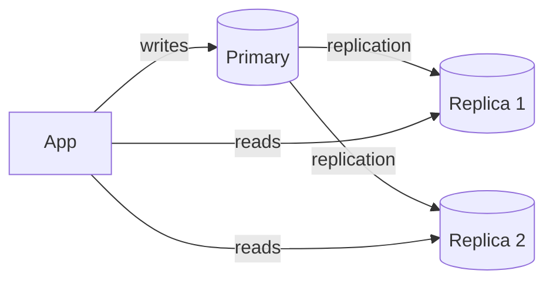
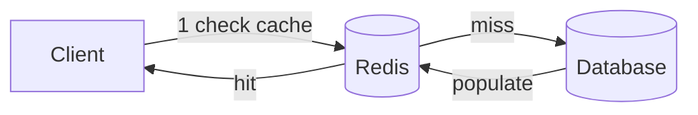

# Database & Caching

## Table of Contents
1. [SQL vs NoSQL](#sql-vs-nosql)
2. [Indexes](#indexes)
3. [Transactions & Isolation](#transactions--isolation)
4. [Sharding & Replication](#sharding--replication)
5. [Caching Strategies](#caching-strategies)
6. [Redis](#redis)

---

## SQL vs NoSQL

| | SQL (Relational) | NoSQL |
|---|---|---|
| Schema | Fixed, enforced | Flexible / schema-less |
| Transactions | ACID | Varies (BASE) |
| Scaling | Vertical + limited horizontal | Horizontal-first |
| Joins | Native | Avoided / denormalized |
| Use case | Complex queries, consistency | Scale, flexibility, varied data |

**When to use NoSQL:**
- Key-Value (Redis): sessions, caching, rate limiting
- Document (MongoDB): variable-schema data (e.g., product catalog)
- Column (Cassandra): time-series, write-heavy analytics
- Graph (Neo4j): relationship-heavy queries (social graphs)

---

## Indexes

An index is a **separate data structure** (B-tree or Hash) that speeds up reads at the cost of slower writes and extra storage.

```sql
-- Composite index: order matters (leftmost prefix rule)
CREATE INDEX idx_orders ON orders(customer_id, created_at);

-- Query benefits: WHERE customer_id = ? AND created_at > ?   ✓
-- Query benefits: WHERE customer_id = ?                       ✓
-- Query does NOT benefit: WHERE created_at > ?               ✗ (skips leftmost)
```

**Index on high-cardinality columns** (many distinct values). Index on low-cardinality (e.g., boolean) is usually useless.

**Covering index:** includes all columns the query needs → avoids table lookup entirely.

```sql
CREATE INDEX idx_covering ON orders(customer_id, status, total);
SELECT status, total FROM orders WHERE customer_id = ?;  -- index-only scan
```

---

## Transactions & Isolation

**ACID:**
- **Atomicity** — all or nothing
- **Consistency** — data remains valid
- **Isolation** — concurrent transactions don't interfere
- **Durability** — committed data persists

### Isolation Levels

| Level | Dirty Read | Non-Repeatable Read | Phantom Read |
|---|---|---|---|
| READ UNCOMMITTED | ✓ possible | ✓ possible | ✓ possible |
| READ COMMITTED | ✗ | ✓ possible | ✓ possible |
| REPEATABLE READ | ✗ | ✗ | ✓ possible |
| SERIALIZABLE | ✗ | ✗ | ✗ |

PostgreSQL default: **READ COMMITTED**. MySQL InnoDB default: **REPEATABLE READ**.

Use `SERIALIZABLE` only when absolutely required — it serializes all transactions and kills throughput.

---

## Sharding & Replication

### Replication



- **Sync replication** — write confirmed after replica acknowledges → no data loss, higher latency
- **Async replication** — write confirmed immediately → lower latency, possible lag/data loss

### Sharding

Partition data across multiple DBs. Each shard holds a subset of data.

**Shard key:** choose a key that distributes load evenly and is queried frequently.

- **Range sharding** — `user_id 0-1M → Shard 1` — simple but can hotspot
- **Hash sharding** — `hash(user_id) % N` — even distribution, no range queries
- **Consistent hashing** — minimizes remapping when adding/removing shards

---

## Caching Strategies



| Strategy | Write path | Consistency | Use case |
|---|---|---|---|
| **Cache-Aside** | App writes DB, invalidates cache | Eventual | General (most common) |
| **Write-Through** | Write to cache + DB synchronously | Strong | Read-heavy, consistency needed |
| **Write-Behind** | Write to cache; async flush to DB | Eventual | Write-heavy, tolerate slight lag |
| **Read-Through** | Cache fetches from DB on miss | Eventual | Transparent to app layer |

**Cache invalidation strategies:**
- **TTL** — simple, always works; stale data possible
- **Event-driven** — publish invalidation event on write; fresh data, more complex
- **Write-through** — always consistent; doubles write latency

---

## Redis

Redis is an **in-memory** data structure store used for caching, sessions, rate limiting, pub/sub, and distributed locks.

```java
// Spring Boot
@Cacheable(value = "products", key = "#id")
public Product getProduct(Long id) { return repo.findById(id).orElseThrow(); }

@CacheEvict(value = "products", key = "#product.id")
public void updateProduct(Product product) { repo.save(product); }
```

**Data structures:** String, Hash, List, Set, Sorted Set, HyperLogLog, Stream.

```java
// Sorted Set — leaderboard, rate limiting
redisTemplate.opsForZSet().add("leaderboard", "alice", 1500.0);
redisTemplate.opsForZSet().reverseRange("leaderboard", 0, 9); // top 10

// Atomic increment — counter, rate limiter
redisTemplate.opsForValue().increment("requests:user:42");

// Distributed lock
RLock lock = redisson.getLock("resource:" + id);
lock.lock(5, TimeUnit.SECONDS);
```

**Redis vs Memcached:**
- Redis: persistence, data structures, cluster, pub/sub
- Memcached: simpler, multi-threaded, pure cache (slightly faster for simple ops)
