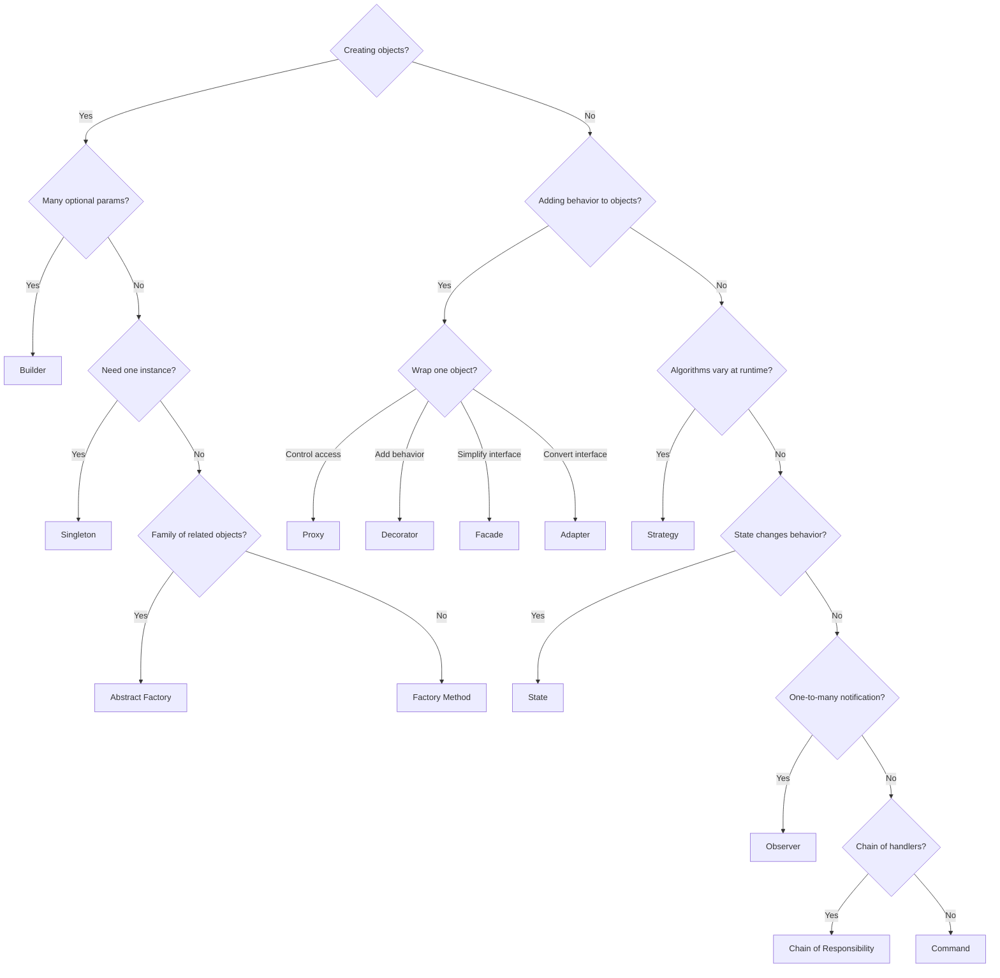

# Design Patterns & SOLID

## Table of Contents
1. [SOLID Principles](#solid-principles)
2. [Creational Patterns](#creational-patterns)
3. [Structural Patterns](#structural-patterns)
4. [Behavioral Patterns](#behavioral-patterns)
5. [Enterprise Patterns](#enterprise-patterns)
6. [Pattern Selection Guide](#pattern-selection-guide)

---

## SOLID Principles

| Principle | Rule | Violation Sign | Fix |
|---|---|---|---|
| **S**RP | One class, one reason to change | Class handles persistence, validation, notification | Split into focused classes |
| **O**CP | Extend via new code, not modifying existing | Adding feature requires editing switch/if chain | Strategy, Polymorphism |
| **L**SP | Subtypes substitutable for base type | Override throws `UnsupportedOperationException` | Redesign hierarchy |
| **I**SP | Small, focused interfaces | Interface forces implementing unused methods | Split into smaller interfaces |
| **D**IP | Depend on abstractions, not concretions | `new MySQLRepo()` inside service class | Constructor injection |

### SRP — Single Responsibility

```java
// BAD: UserService does everything
class UserService {
    public User createUser(UserDto dto) {
        validate(dto);          // validation logic
        User user = map(dto);
        repo.save(user);        // persistence
        emailService.send(...); // notification
        log.info("...");        // logging
        return user;
    }
}

// GOOD: separate responsibilities
class UserRegistrationUseCase {       // orchestrates only
    private final UserValidator validator;
    private final UserRepository repo;
    private final NotificationService notifications;

    public User register(UserDto dto) {
        validator.validate(dto);
        User user = User.fromDto(dto);
        repo.save(user);
        notifications.sendWelcome(user);
        return user;
    }
}
```

### OCP — Open/Closed

```java
// BAD: add new discount type → modify existing class
class DiscountCalculator {
    double calculate(Order order, String type) {
        if (type.equals("SEASONAL")) return order.total() * 0.1;
        if (type.equals("LOYALTY"))  return order.total() * 0.15;
        // Must edit here for every new type
        return 0;
    }
}

// GOOD: open for extension (new class), closed for modification
interface DiscountStrategy { double calculate(Order order); }

class SeasonalDiscount implements DiscountStrategy {
    public double calculate(Order o) { return o.total() * 0.1; }
}
class LoyaltyDiscount implements DiscountStrategy {
    public double calculate(Order o) { return o.total() * 0.15; }
}
// Add new type: just add new class, no existing code changes
```

### LSP — Liskov Substitution

```java
// BAD: Square extends Rectangle violates LSP
class Rectangle {
    protected int width, height;
    void setWidth(int w) { this.width = w; }
    void setHeight(int h) { this.height = h; }
    int area() { return width * height; }
}
class Square extends Rectangle {
    @Override void setWidth(int w)  { this.width = w; this.height = w; } // breaks expectations
    @Override void setHeight(int h) { this.width = h; this.height = h; }
}
// Code that works with Rectangle breaks with Square:
// rect.setWidth(5); rect.setHeight(3); assert rect.area() == 15; // FAILS for Square

// GOOD: common interface without the conflicting contract
interface Shape { int area(); }
class Rectangle implements Shape { ... }
class Square implements Shape { ... }
```

### ISP — Interface Segregation

```java
// BAD: fat interface forces implementation of unused methods
interface Worker {
    void work();
    void eat();   // robots don't eat!
    void sleep(); // robots don't sleep!
}

// GOOD: segregated interfaces
interface Workable  { void work(); }
interface Feedable  { void eat(); }
interface Restable  { void sleep(); }

class HumanWorker implements Workable, Feedable, Restable { ... }
class RobotWorker  implements Workable { ... }  // only what it needs
```

### DIP — Dependency Inversion

```java
// BAD: high-level depends on low-level detail
class OrderService {
    private MySQLOrderRepository repo = new MySQLOrderRepository(); // concrete
}

// GOOD: both depend on abstraction
interface OrderRepository { Order findById(Long id); Order save(Order o); }

class OrderService {
    private final OrderRepository repo; // abstraction

    // Spring injects the concrete implementation
    OrderService(OrderRepository repo) { this.repo = repo; }
}

// Can swap implementations without changing OrderService:
@Repository class JpaOrderRepository implements OrderRepository { ... }
@Repository class InMemoryOrderRepository implements OrderRepository { ... } // for tests
```

---

## Creational Patterns

### Singleton

Ensure exactly one instance exists. In Spring, all `@Bean` are singleton by default — **prefer that over manual Singleton**.

```java
// Thread-safe: double-checked locking (if you must do it manually)
public class ConfigManager {
    private static volatile ConfigManager instance;
    private ConfigManager() {}

    public static ConfigManager getInstance() {
        if (instance == null) {
            synchronized (ConfigManager.class) {
                if (instance == null) instance = new ConfigManager();
            }
        }
        return instance;
    }
}

// Better: enum Singleton (thread-safe, serialization-safe)
public enum AppConfig {
    INSTANCE;
    private final Properties props = new Properties();
    public String get(String key) { return props.getProperty(key); }
}
```

### Builder

Construct complex objects step-by-step; avoids telescoping constructors.

```java
// Lombok: @Builder generates this
@Builder
public class Order {
    private Long customerId;
    private List<OrderItem> items;
    private OrderStatus status;
    private LocalDate deliveryDate;
    @Builder.Default private Currency currency = Currency.USD;
}

Order order = Order.builder()
    .customerId(42L)
    .items(items)
    .status(OrderStatus.PENDING)
    .build();
```

**When to use:** Object has 4+ parameters, many optional. Immutable objects.

### Factory Method

Define an interface for creating an object; subclasses decide which class to instantiate.

```java
interface NotificationSender { void send(String to, String message); }
class EmailSender implements NotificationSender { ... }
class SmsSender implements NotificationSender { ... }
class PushSender implements NotificationSender { ... }

// Factory Method
class NotificationFactory {
    public static NotificationSender create(NotificationType type) {
        return switch (type) {
            case EMAIL -> new EmailSender();
            case SMS   -> new SmsSender();
            case PUSH  -> new PushSender();
        };
    }
}
```

**Spring variation:** `@Bean` methods in `@Configuration` are factory methods.

### Abstract Factory

Creates families of related objects without specifying concrete classes.

```java
interface UIFactory {
    Button createButton();
    Dialog createDialog();
}

class WindowsUIFactory implements UIFactory {
    public Button createButton() { return new WindowsButton(); }
    public Dialog createDialog() { return new WindowsDialog(); }
}
class MacUIFactory implements UIFactory {
    public Button createButton() { return new MacButton(); }
    public Dialog createDialog() { return new MacDialog(); }
}
// Client code uses UIFactory interface — no knowledge of Windows/Mac
```

### Prototype

Clone existing objects instead of constructing from scratch.

```java
@Entity
public class DocumentTemplate implements Cloneable {
    private String content;
    private List<Section> sections;

    @Override
    public DocumentTemplate clone() {
        try {
            DocumentTemplate copy = (DocumentTemplate) super.clone();
            copy.sections = new ArrayList<>(this.sections); // deep copy list
            return copy;
        } catch (CloneNotSupportedException e) {
            throw new AssertionError();
        }
    }
}
// Clone template to create a new document without reading from DB again
```

---

## Structural Patterns

### Adapter

Convert interface of a class into another interface the client expects.

```java
// External payment gateway returns LegacyPaymentResult
// Our system expects PaymentResult
interface PaymentResult { boolean isSuccess(); String transactionId(); }

class PaymentAdapter implements PaymentResult {
    private final LegacyPaymentResult legacy;
    PaymentAdapter(LegacyPaymentResult legacy) { this.legacy = legacy; }

    @Override public boolean isSuccess() { return legacy.getCode() == 200; }
    @Override public String transactionId() { return legacy.getTxRef(); }
}
```

### Decorator

Add behavior to objects dynamically; composable alternative to subclassing.

```java
interface DataProcessor { String process(String data); }

class CsvProcessor implements DataProcessor {
    public String process(String data) { return parseCsv(data); }
}
// Decorator: add encryption on top
class EncryptedProcessor implements DataProcessor {
    private final DataProcessor delegate;
    EncryptedProcessor(DataProcessor d) { this.delegate = d; }
    public String process(String data) { return encrypt(delegate.process(data)); }
}
// Decorator: add compression on top of that
class CompressedProcessor implements DataProcessor {
    private final DataProcessor delegate;
    CompressedProcessor(DataProcessor d) { this.delegate = d; }
    public String process(String data) { return compress(delegate.process(data)); }
}

// Compose decorators
DataProcessor pipeline = new CompressedProcessor(
    new EncryptedProcessor(
        new CsvProcessor()
    )
);
```

**In Spring:** `@Transactional`, `@Cacheable`, `@Async` — all implemented as decorators via AOP proxies.

### Proxy

Control access to an object (lazy init, access control, logging, remote).

```java
interface OrderRepository { Order findById(Long id); }

class CachingOrderRepositoryProxy implements OrderRepository {
    private final OrderRepository delegate;
    private final Map<Long, Order> cache = new ConcurrentHashMap<>();

    CachingOrderRepositoryProxy(OrderRepository delegate) {
        this.delegate = delegate;
    }

    public Order findById(Long id) {
        return cache.computeIfAbsent(id, delegate::findById);
    }
}
```

**Spring AOP** creates CGLIB/JDK dynamic proxies transparently for `@Transactional`, `@Cacheable`.

### Facade

Simplified interface over a complex subsystem.

```java
// Subsystem: complex interactions with inventory, payment, shipping
class OrderFacade {
    private final InventoryService inventory;
    private final PaymentService payment;
    private final ShippingService shipping;
    private final NotificationService notification;

    public OrderConfirmation placeOrder(OrderRequest request) {
        inventory.reserve(request.items());
        PaymentResult result = payment.charge(request.paymentInfo());
        ShipmentId shipmentId = shipping.schedule(request);
        notification.sendConfirmation(request.customerId(), shipmentId);
        return new OrderConfirmation(result.transactionId(), shipmentId);
    }
    // Client calls one method instead of 4 complex interactions
}
```

### Composite

Treat individual objects and compositions uniformly (tree structures).

```java
interface PricingComponent { BigDecimal price(); }

class Product implements PricingComponent {
    private BigDecimal price;
    public BigDecimal price() { return price; }
}

class Bundle implements PricingComponent {
    private List<PricingComponent> components = new ArrayList<>();
    public void add(PricingComponent c) { components.add(c); }
    public BigDecimal price() {
        return components.stream()
            .map(PricingComponent::price)
            .reduce(BigDecimal.ZERO, BigDecimal::add);
    }
}
// Bundle can contain Products or other Bundles — uniform interface
```

---

## Behavioral Patterns

### Strategy

Define a family of algorithms; make them interchangeable at runtime.

```java
@FunctionalInterface
interface PricingStrategy { BigDecimal calculate(Order order); }

// Different implementations
PricingStrategy regular  = order -> order.subtotal();
PricingStrategy vip      = order -> order.subtotal().multiply(BigDecimal.valueOf(0.85));
PricingStrategy employee = order -> order.subtotal().multiply(BigDecimal.valueOf(0.60));

class PricingService {
    BigDecimal price(Order order, PricingStrategy strategy) {
        return strategy.calculate(order);
    }
}

// Switch strategy based on user type
PricingStrategy strategy = switch (user.getType()) {
    case VIP      -> vip;
    case EMPLOYEE -> employee;
    default       -> regular;
};
```

### Observer (Event-Driven variant)

One-to-many dependency: when one object changes state, all dependents notified.

```java
// Spring ApplicationEvent (built-in observer)
public class OrderCreatedEvent extends ApplicationEvent {
    private final Order order;
    public OrderCreatedEvent(Object source, Order order) {
        super(source);
        this.order = order;
    }
    public Order getOrder() { return order; }
}

// Publisher
@Service class OrderService {
    @Autowired ApplicationEventPublisher publisher;

    public Order createOrder(OrderRequest req) {
        Order order = orderRepo.save(Order.from(req));
        publisher.publishEvent(new OrderCreatedEvent(this, order));
        return order;
    }
}

// Multiple listeners — decoupled
@Component class InventoryListener {
    @EventListener
    public void onOrderCreated(OrderCreatedEvent e) {
        inventory.reserve(e.getOrder().getItems());
    }
}
@Component class NotificationListener {
    @EventListener
    @Async  // non-blocking
    public void onOrderCreated(OrderCreatedEvent e) {
        emailService.sendConfirmation(e.getOrder());
    }
}
```

### Command

Encapsulate a request as an object — enables undo, queuing, logging, retry.

```java
interface Command<T> { T execute(); }

record TransferCommand(
    AccountId from, AccountId to, Money amount,
    AccountRepository repo
) implements Command<TransferResult> {
    public TransferResult execute() {
        Account source = repo.findById(from);
        Account target = repo.findById(to);
        source.debit(amount);
        target.credit(amount);
        repo.save(source);
        repo.save(target);
        return TransferResult.success(from, to, amount);
    }
}

// Command Bus
class CommandBus {
    private final Map<Class<?>, CommandHandler<?>> handlers;
    @SuppressWarnings("unchecked")
    public <R> R dispatch(Command<R> command) {
        return ((CommandHandler<Command<R>>) handlers.get(command.getClass()))
            .handle(command);
    }
}
```

### Template Method

Define skeleton of algorithm in base class; subclasses fill in specific steps.

```java
abstract class DataImporter {
    // Template method
    public final void importData(String source) {
        byte[] raw = readData(source);       // step 1
        Object[] parsed = parseData(raw);    // step 2 — abstract
        validate(parsed);                    // step 3 — has default
        persist(parsed);                     // step 4 — abstract
    }

    protected abstract Object[] parseData(byte[] raw);
    protected abstract void persist(Object[] data);

    protected void validate(Object[] data) {
        // default: no validation; subclass can override
    }

    private byte[] readData(String source) { /* file reading */ return new byte[0]; }
}

class CsvImporter extends DataImporter {
    protected Object[] parseData(byte[] raw) { /* CSV parsing */ return new Object[0]; }
    protected void persist(Object[] data) { /* batch insert */ }
}

class JsonImporter extends DataImporter {
    protected Object[] parseData(byte[] raw) { /* JSON parsing */ return new Object[0]; }
    protected void persist(Object[] data) { /* upsert */ }
}
```

### Chain of Responsibility

Pass request through a chain of handlers; each decides to handle or pass on.

```java
abstract class RequestHandler {
    protected RequestHandler next;
    public RequestHandler setNext(RequestHandler next) {
        this.next = next;
        return next;
    }
    public abstract void handle(HttpRequest request);
}

class AuthHandler extends RequestHandler {
    public void handle(HttpRequest req) {
        if (!req.hasValidToken()) { req.reject(401); return; }
        if (next != null) next.handle(req);
    }
}
class RateLimitHandler extends RequestHandler {
    public void handle(HttpRequest req) {
        if (rateLimiter.isExceeded(req.getIp())) { req.reject(429); return; }
        if (next != null) next.handle(req);
    }
}
class LoggingHandler extends RequestHandler {
    public void handle(HttpRequest req) {
        log.info("Request: {}", req);
        if (next != null) next.handle(req);
    }
}

// Spring: javax.servlet.Filter chain implements this pattern
```

### State

Object changes behavior when its internal state changes.

```java
interface OrderState {
    void pay(Order order);
    void ship(Order order);
    void cancel(Order order);
}

class PendingState implements OrderState {
    public void pay(Order o) { o.setState(new PaidState()); }
    public void ship(Order o) { throw new IllegalStateException("Must pay first"); }
    public void cancel(Order o) { o.setState(new CancelledState()); }
}
class PaidState implements OrderState {
    public void pay(Order o) { throw new IllegalStateException("Already paid"); }
    public void ship(Order o) { o.setState(new ShippedState()); }
    public void cancel(Order o) {
        // refund logic
        o.setState(new CancelledState());
    }
}
class ShippedState implements OrderState {
    public void pay(Order o) { throw new IllegalStateException("..."); }
    public void ship(Order o) { throw new IllegalStateException("Already shipped"); }
    public void cancel(Order o) { throw new IllegalStateException("Cannot cancel shipped order"); }
}
```

---

## Enterprise Patterns

### Repository

Abstracts persistence; domain code talks to interface only.

```java
public interface OrderRepository {
    Optional<Order> findById(OrderId id);
    List<Order> findByCustomerId(CustomerId customerId);
    List<Order> findByStatus(OrderStatus status);
    Order save(Order order);
    void delete(OrderId id);
}

// Spring Data implementation (auto-generated)
public interface JpaOrderRepository extends JpaRepository<Order, Long>,
                                             JpaSpecificationExecutor<Order> {}

// Adapter wrapping Spring Data
@Repository
class OrderRepositoryAdapter implements OrderRepository {
    private final JpaOrderRepository jpa;
    // map domain Order ↔ JPA entity, delegate to jpa
}
```

### Unit of Work

Tracks object changes and flushes them in a single transaction. JPA `EntityManager` implements this — you don't need to implement it yourself.

```java
// JPA EntityManager IS a Unit of Work:
@Transactional
public void processOrder(Long id) {
    Order order = em.find(Order.class, id);
    order.markPaid(); // change tracked automatically
    // No explicit save() needed — flush happens on transaction commit
}
```

### Specification

Encapsulate query predicates as composable, reusable objects.

```java
public class OrderSpecifications {
    public static Specification<Order> byCustomer(Long customerId) {
        return (root, query, cb) -> cb.equal(root.get("customerId"), customerId);
    }
    public static Specification<Order> withStatus(OrderStatus status) {
        return (root, query, cb) -> cb.equal(root.get("status"), status);
    }
    public static Specification<Order> placedAfter(LocalDate date) {
        return (root, query, cb) -> cb.greaterThan(root.get("createdAt"), date);
    }
}

// Compose with .and() .or() .not()
Specification<Order> spec = byCustomer(42L)
    .and(withStatus(PENDING))
    .and(placedAfter(LocalDate.now().minusDays(7)));

List<Order> orders = orderRepo.findAll(spec);
```

### CQRS (Command Query Responsibility Segregation)

Separate read and write models for scalability and clarity.

```java
// Write side: commands
@Service
class OrderCommandService {
    public OrderId createOrder(CreateOrderCommand cmd) {
        Order order = Order.create(cmd);
        orderRepo.save(order);
        eventPublisher.publish(new OrderCreatedEvent(order));
        return order.getId();
    }
}

// Read side: queries (optimized view model, different DB if needed)
@Service
class OrderQueryService {
    public OrderSummaryDto getOrderSummary(Long orderId) {
        return orderViewRepo.findSummaryById(orderId); // denormalized, fast
    }
    public List<OrderListItem> listByCustomer(Long customerId, Pageable p) {
        return orderViewRepo.findByCustomerId(customerId, p);
    }
}
```

### Event Sourcing

Store state as sequence of events; derive current state by replaying.

```java
// Store events, not state
public class OrderAggregate {
    private OrderId id;
    private OrderStatus status;
    private Money total;
    private final List<DomainEvent> uncommittedEvents = new ArrayList<>();

    // Reconstitute from event history
    public static OrderAggregate reconstitute(List<DomainEvent> events) {
        OrderAggregate order = new OrderAggregate();
        events.forEach(order::apply);
        return order;
    }

    public void placeOrder(List<OrderItem> items) {
        OrderCreated event = new OrderCreated(OrderId.generate(), items, Instant.now());
        apply(event);
        uncommittedEvents.add(event);
    }

    private void apply(DomainEvent event) {
        switch (event) {
            case OrderCreated e -> { this.id = e.orderId(); this.status = PENDING; }
            case PaymentProcessed e -> this.status = PAID;
            case OrderShipped e -> this.status = SHIPPED;
            default -> {}
        }
    }
}
```

---

## Pattern Selection Guide



### When to Use What — Quick Reference

| Pattern | Best For | Spring Example |
|---|---|---|
| Singleton | Shared resource, stateless service | Every `@Service/@Repository` |
| Builder | Complex object construction | Lombok `@Builder` |
| Factory Method | Create objects without specifying exact class | `@Bean` methods |
| Strategy | Swappable algorithms | Pluggable pricing, sorting |
| Observer | Decouple event production from handling | `@EventListener` |
| Decorator | Add cross-cutting behavior | `@Transactional`, `@Cacheable` |
| Proxy | Control access, lazy loading | Spring AOP |
| Chain of Responsibility | Sequential processing pipeline | Filter chains, interceptors |
| Command | Undo, queuing, audit trail | CQRS commands |
| Template Method | Skeleton algorithm, vary steps | `JdbcTemplate`, `RestTemplate` |
| Facade | Simplify complex subsystem | Service class over multiple repos |
| Repository | Decouple domain from persistence | Spring Data repositories |
| Specification | Composable query predicates | JPA `Specification<T>` |
