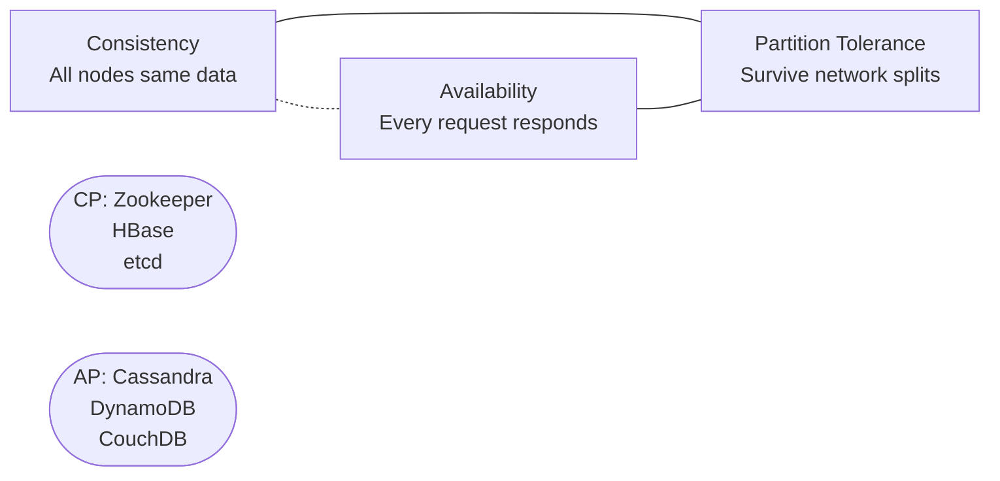
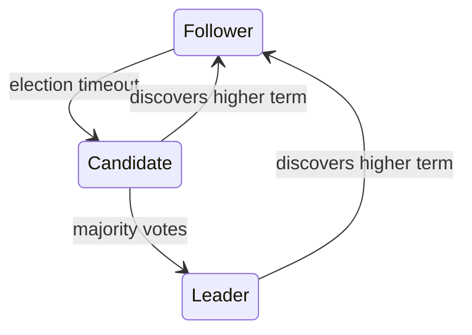
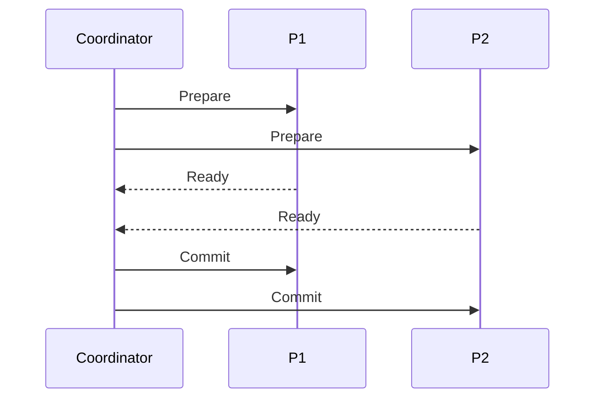
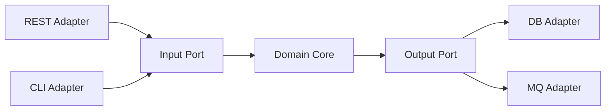

# Distributed Systems & Architecture

## Table of Contents
1. [Fundamentals](#fundamentals)
2. [CAP & Consistency Models](#cap--consistency-models)
3. [Consensus](#consensus)
4. [Fault Tolerance](#fault-tolerance)
5. [Distributed Transactions](#distributed-transactions)
6. [Architectural Patterns](#architectural-patterns)

---

## Fundamentals

### Why distributed systems are hard

- **Partial failure** — some nodes die, others don't; hard to detect
- **No global clock** — can't rely on time ordering across nodes
- **Network unreliability** — messages can be lost, delayed, or duplicated
- **No shared memory** — communication only via messages

### Fallacies of Distributed Computing

The network is **not** reliable, latency is **not** zero, bandwidth is **not** infinite, the network is **not** secure, topology **does** change, and there is **not** one administrator.

---

## CAP & Consistency Models

A distributed system can guarantee at most 2 of 3: **Consistency**, **Availability**, **Partition Tolerance**.

Since partitions happen, the real choice is **CP vs AP**:



**PACELC** extension: even without partitions, there's a **Latency vs Consistency** trade-off.

### Consistency Levels

| Level | Description |
|---|---|
| **Strong** | Read always sees latest write |
| **Linearizable** | Operations appear instantaneous |
| **Sequential** | Operations ordered, but not real-time |
| **Eventual** | Replicas converge given no new writes |
| **Read-your-writes** | You always see your own writes |

---

## Consensus

### Raft (simplified)

Used in etcd, CockroachDB. Three roles: **Leader**, **Follower**, **Candidate**.



1. Leader elected by majority vote
2. All writes go through leader
3. Leader replicates to followers; commits when majority acknowledges
4. If leader fails, new election after timeout

**Why Raft over Paxos?** Raft is designed to be understandable. Same safety guarantees, simpler to implement.

---

## Fault Tolerance

### Failure Detection

- **Heartbeat** — periodic signals; no heartbeat = suspected failure
- **Gossip Protocol** — nodes exchange state with random peers; eventual consistency of membership
- **Phi Accrual** — continuous failure probability instead of binary healthy/unhealthy

### Bulkhead Pattern

Isolate failures by separating thread pools per dependency.

```java
// Separate thread pools prevent one slow dependency from exhausting all threads
@Bulkhead(name = "inventory", type = Bulkhead.Type.THREADPOOL)
public Product getInventory(Long id) { ... }
```

### Timeout + Retry Hierarchy

```
Timeout → Retry (with exponential backoff + jitter) → Circuit Breaker → Fallback
```

Always add jitter to retries to avoid thundering herd:

```java
long delay = baseDelay * Math.pow(2, attempt) + random.nextInt(1000);
```

---

## Distributed Transactions

### 2-Phase Commit (2PC)



**Problem:** if coordinator fails after Prepare but before Commit, participants block indefinitely. 2PC is a blocking protocol — not suitable for microservices.

### Saga Pattern (preferred for microservices)

See `microservices-patterns.md` — choreography or orchestration with compensating transactions.

### TCC (Try-Confirm-Cancel)

Each operation has three phases: **Try** (reserve resources), **Confirm** (commit), **Cancel** (release). More complex but no global lock.

---

## Architectural Patterns

### Hexagonal Architecture (Ports & Adapters)



Domain core has zero infrastructure dependencies. Adapters implement ports. Enables easy testing and swappable infrastructure.

### Clean Architecture Dependency Rule

Dependencies point **inward only**: Entities ← Use Cases ← Interface Adapters ← Frameworks/Drivers.

### SOLID Applied

| Principle | Quick Rule |
|---|---|
| **S**RP | One reason to change |
| **O**CP | Open for extension, closed for modification |
| **L**SP | Subtypes substitutable for base types |
| **I**SP | Small, focused interfaces |
| **D**IP | Depend on abstractions, not concretions |
