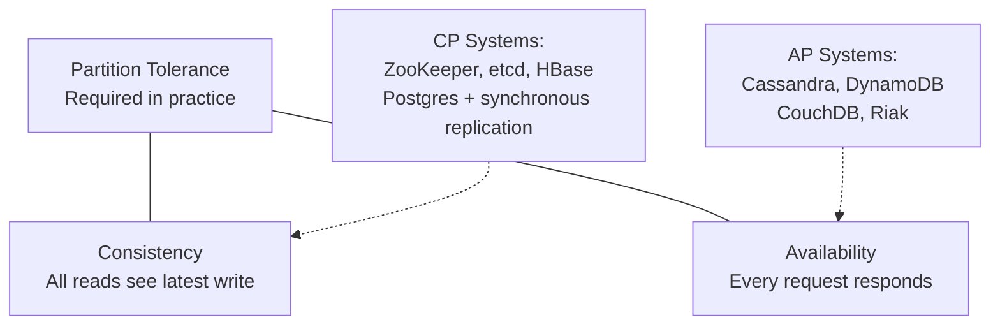
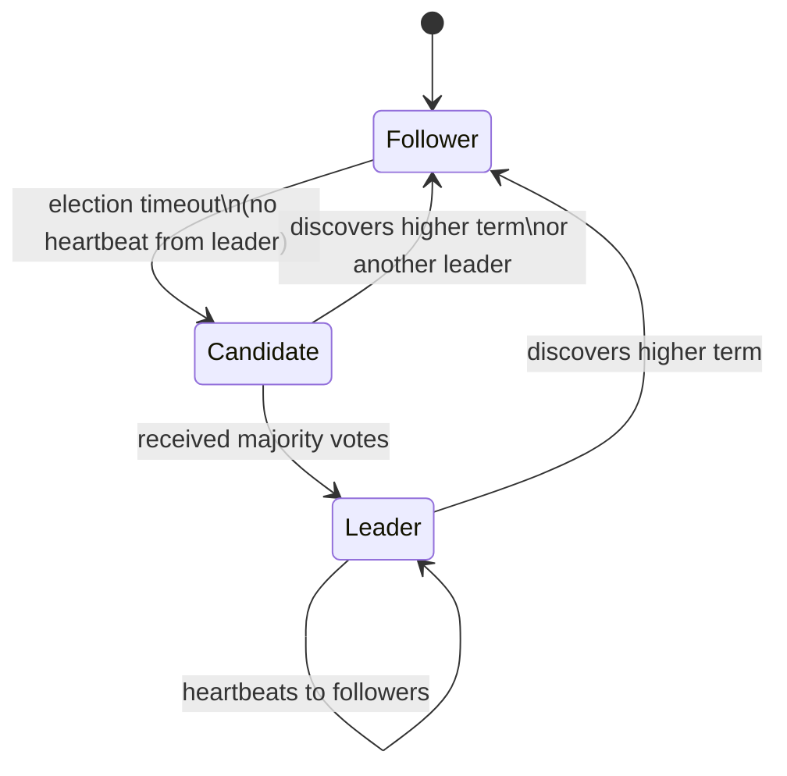
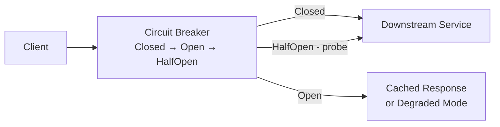
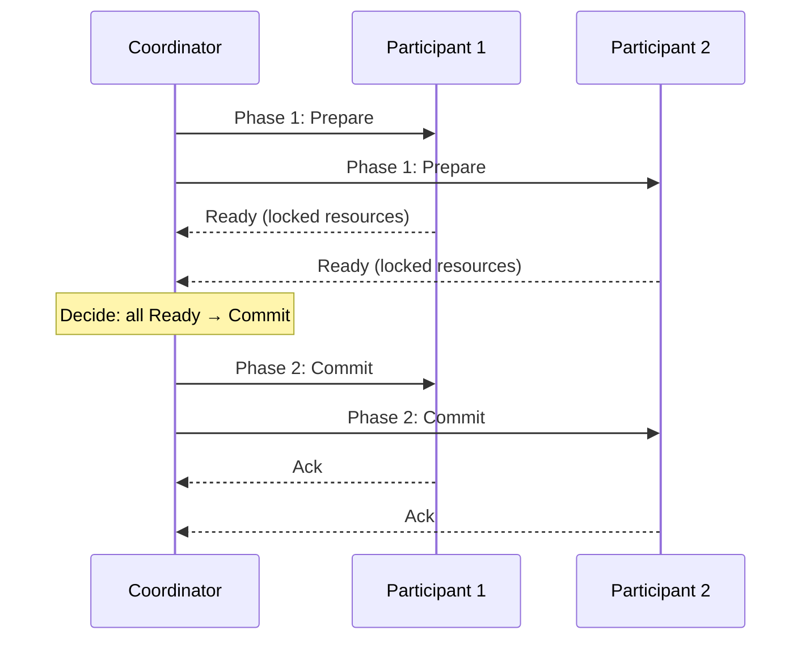
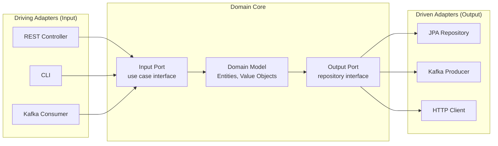
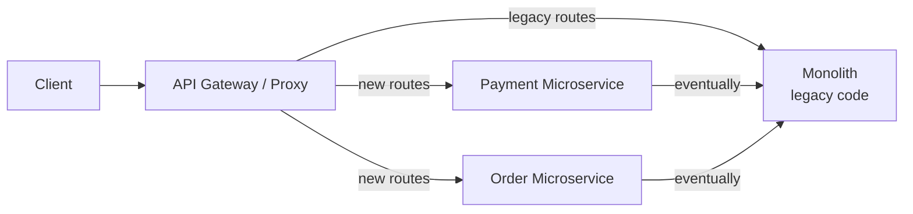

# Distributed Systems & Architecture

## Table of Contents
1. [Fundamentals](#fundamentals)
2. [CAP, PACELC & Consistency Models](#cap-pacelc--consistency-models)
3. [Consensus Algorithms](#consensus-algorithms)
4. [Time & Ordering](#time--ordering)
5. [Fault Tolerance](#fault-tolerance)
6. [Distributed Transactions](#distributed-transactions)
7. [Data Structures for Distribution](#data-structures-for-distribution)
8. [Architectural Patterns](#architectural-patterns)

---

## Fundamentals

### Why Distributed Systems Are Hard

| Problem | Description |
|---|---|
| **Partial failure** | Some nodes die, others don't; caller can't distinguish slow from dead |
| **No global clock** | Can't rely on timestamps to order events across nodes |
| **Network unreliability** | Messages lost, duplicated, delayed, reordered |
| **No shared memory** | Coordination only via message passing |
| **Byzantine faults** | Nodes can lie/send incorrect data (rare, but exists in blockchains) |

### Fallacies of Distributed Computing (Deutsch, 1994)
1. The network is reliable
2. Latency is zero
3. Bandwidth is infinite
4. The network is secure
5. Topology doesn't change
6. There is one administrator
7. Transport cost is zero
8. The network is homogeneous

**Practical implication:** Design for failure at every layer — retries, timeouts, circuit breakers, idempotency.

### The 8 Key Metrics

| Metric | Definition |
|---|---|
| Latency | Time for one operation (p50/p95/p99 matter more than average) |
| Throughput | Operations per second |
| Availability | % of time system responds correctly |
| Durability | Probability data survives hardware failure |
| Consistency | Whether all nodes see the same data |
| Scalability | Ability to handle increased load |
| Fault tolerance | Ability to continue despite failures |
| Partition tolerance | Ability to work despite network splits |

---

## CAP, PACELC & Consistency Models

### CAP Theorem

In the presence of a **network partition**, a system must choose between **Consistency** (all nodes return same value) and **Availability** (every request gets a response).



### PACELC Extension

Even **without** partition, there's still a trade-off:  
**P**artition → **A**vailability vs **C**onsistency  
**E**lse (no partition) → **L**atency vs **C**onsistency

| System | Partition Choice | Normal Choice |
|---|---|---|
| DynamoDB | AP | EL (low latency) |
| Cassandra | AP | EL |
| PostgreSQL | CP | EC (strong consistency) |
| CockroachDB | CP | EC |
| MongoDB | CP (default) | EC |

### Consistency Models (weakest → strongest)

| Model | Description | Example |
|---|---|---|
| **Eventual** | Replicas converge given no new writes | Cassandra default, DNS |
| **Monotonic reads** | You never read older data after reading newer | Cassandra sessions |
| **Read-your-writes** | You always see your own writes | After POST, GET shows it |
| **Session consistency** | Within a session: monotonic reads + read-your-writes | Mongo session |
| **Sequential** | Operations ordered globally but not real-time | Multi-leader replication |
| **Linearizable** | Operations appear instantaneous; strongest | Single-leader sync |
| **Serializability** | Transactions equivalent to some serial order | ACID databases |
| **Strict serializability** | Linearizable + serializable | Spanner, FoundationDB |

---

## Consensus Algorithms

### Why Consensus?

Needed when multiple nodes must agree on a value (leader election, distributed lock, config changes). Must tolerate up to f failures with 2f+1 nodes.

### Raft

Used in: **etcd**, CockroachDB, TiKV. Designed for understandability.



**Raft Log Replication Flow:**
1. Client sends write to **Leader**
2. Leader appends to its log (uncommitted)
3. Leader sends `AppendEntries` RPC to all followers
4. When majority (quorum) ack → **commit** + apply to state machine
5. Leader notifies followers of commit in next heartbeat

**Split Brain prevention:** At most one leader per term. A node only votes once per term. Requires majority (quorum) to elect → guarantees no two leaders.

### Paxos (simplified)

Two phases: **Prepare** (get promise not to accept older proposals) → **Accept** (propose value). Multi-Paxos adds leader to reduce round trips. More powerful but harder to implement/understand than Raft.

### Practical Quorum

With N replicas, write to W, read from R. **R + W > N** guarantees strong consistency:
- N=3, W=2, R=2 → strong (overlap guaranteed)
- N=3, W=1, R=1 → eventual (no overlap guarantee)
- N=5, W=3, R=3 → strong, tolerates 2 failures

---

## Time & Ordering

### Logical Clocks

**Lamport Clock:** Each event increments counter. `send(max(local, received) + 1)`. Establishes **happened-before** partial ordering — if a→b then L(a) < L(b), but NOT vice versa.

**Vector Clock:** Each node maintains a vector `[n1, n2, n3]`. Captures causality:
```
Node A: [1,0,0] → sends to B
Node B: [1,1,0] → receives from A, merges max of each element
```
If `VC(a) < VC(b)` → a happened before b. If neither ≤ other → concurrent.

### Hybrid Logical Clocks (HLC)

Combines physical clock + logical clock. Used in CockroachDB. Provides causality without losing real-time ordering.

### Google Spanner TrueTime

Uses GPS clocks + atomic clocks. Provides bounded uncertainty window `[earliest, latest]`. Waits out the uncertainty before committing → **external consistency** (strictest).

### Why Not NTP for Ordering?

NTP accuracy: ±10-500ms. Not sufficient for distributed ordering. Clock skew can cause events to appear out of order. Never use `System.currentTimeMillis()` for distributed sequencing.

---

## Fault Tolerance

### Failure Detection

| Mechanism | How | Drawback |
|---|---|---|
| **Heartbeat** | Periodic signals; missing = suspected dead | Binary: healthy or dead |
| **Phi Accrual** | Continuous suspicion level (0.0–∞) | More complex to implement |
| **Gossip Protocol** | Nodes share state with random peers; converges O(log N) | Eventual, not instant |
| **SWIM Protocol** | Membership via indirect probing | Default in HashiCorp tools |

### Bulkhead Pattern

Isolate thread pools per dependency to prevent cascade failures:

```java
// Without bulkhead: one slow dependency exhausts all 200 threads
// With bulkhead: inventory gets 20 threads, payment gets 20 threads
@Bulkhead(name = "inventory", type = Bulkhead.Type.THREADPOOL,
          fallbackMethod = "inventoryFallback")
public CompletableFuture<Inventory> getInventory(Long id) {
    return CompletableFuture.supplyAsync(() -> inventoryClient.get(id));
}

public CompletableFuture<Inventory> inventoryFallback(Long id, Exception e) {
    return CompletableFuture.completedFuture(Inventory.unavailable());
}
```

### Retry + Backoff + Jitter

```java
// Exponential backoff with full jitter
long delay = (long)(Math.pow(2, attempt) * baseDelayMs * Math.random());
delay = Math.min(delay, maxDelayMs);
Thread.sleep(delay);
```

**Without jitter:** all retried requests arrive simultaneously → **thundering herd**  
**With jitter:** spread over time window → graceful recovery

### Timeout Hierarchy

```
Connect timeout (fast) < Read timeout < Circuit breaker threshold
```

Always set both: `connectTimeout` (TCP SYN→SYN-ACK) and `readTimeout` (first byte of response).

### Cascade Failure Prevention



See `microservices-patterns.md` for Resilience4j implementation.

---

## Distributed Transactions

### 2-Phase Commit (2PC)



**Fatal flaw:** Coordinator fails after Phase 1 but before Phase 2 → participants **block indefinitely** (holding locks). 2PC is a **blocking protocol**.

**Why not in microservices:** Tight coupling, blocks resources, coordinator SPOF, network failures leave system in doubt.

### XA Transactions

Standard protocol for 2PC across multiple resource managers (DBs, MQ). Supported by JTA/Atomikos in Java. Same blocking problem as 2PC.

### Saga Pattern (Preferred)

Sequence of local transactions; each publishes an event or sends a message. On failure, **compensating transactions** undo completed steps.

```
OrderCreated → ReserveInventory → ProcessPayment → ShipOrder
                              ↓ (payment fails)
              ReleaseInventory ← (compensation)
```

Key difference from 2PC: **no locking**, eventual consistency, compensations are business logic.

### TCC (Try-Confirm-Cancel)

Each service implements 3 operations:
- **Try:** Reserve/validate resources (but don't commit)
- **Confirm:** Finalize the reservation
- **Cancel:** Release the reservation

More code per service but avoids long-held locks.

---

## Data Structures for Distribution

### CRDTs (Conflict-Free Replicated Data Types)

Data structures that can be merged without conflict — no coordination needed:

| CRDT | Behavior | Example |
|---|---|---|
| G-Counter | Increment only | Distributed like counts |
| PN-Counter | Increment + decrement | Inventory count |
| LWW-Register | Last-write-wins (by timestamp) | Profile updates |
| OR-Set | Add/remove with tags | Shopping cart |
| 2P-Set | Add/remove (once) | Tombstone-based deletion |

Used in: Redis, Cassandra counters, collaborative editing (CRDTs power Google Docs-style sync).

### Bloom Filters

Probabilistic data structure: test if element **might be** in set (false positives possible, no false negatives). Space-efficient.

```
Use cases:
- Check if user exists before DB lookup (avoid unnecessary queries)
- Cassandra/HBase use bloom filters per SSTable to avoid disk reads
- URL deduplication in crawlers
- Chrome's safe browsing list
```

### HyperLogLog

Estimate cardinality (count distinct) with ~1.5% error using only ~1.5KB of memory.  
`PFADD` / `PFCOUNT` in Redis. Used for: unique visitor counts, distinct query values.

### Consistent Hashing

See `system-design.md` for full explanation. Used in: Cassandra, Dynamo, Memcached, load balancers.

Key property: adding/removing a node only remaps K/N keys (not all keys).

---

## Architectural Patterns

### Hexagonal Architecture (Ports & Adapters)



**Benefits:** Domain has zero infrastructure dependencies. Adapters are swappable. Testing the domain is pure unit tests — no mocks of infrastructure.

### Clean Architecture Dependency Rule

```
[Frameworks/Drivers] → [Interface Adapters] → [Use Cases] → [Entities]
```

Dependencies **always point inward**. Inner layers never depend on outer layers. Business rules (use cases, entities) are independent of UI, DB, and external services.

### Domain-Driven Design (DDD) Key Concepts

| Concept | Description |
|---|---|
| **Bounded Context** | Explicit boundary where a model applies; each service owns its context |
| **Aggregate** | Cluster of objects treated as a unit; one root entity guards consistency |
| **Domain Event** | Something that happened in the domain; triggers side effects |
| **Value Object** | Immutable; defined by its attributes, not identity (e.g., Money, Address) |
| **Repository** | Abstraction for accessing aggregates |
| **Anti-Corruption Layer** | Translates between bounded contexts to prevent model leakage |

```java
// Aggregate root — guards invariants
public class Order {
    private OrderId id;
    private List<OrderItem> items;   // child entities
    private Money totalAmount;       // value object
    private OrderStatus status;

    public void addItem(Product product, int qty) {
        if (status != OrderStatus.DRAFT) throw new IllegalStateException("...");
        items.add(new OrderItem(product, qty));
        this.totalAmount = calculateTotal();
    }
    // Only Order can modify its items — external code cannot directly touch items
}
```

### Event-Driven Architecture vs Request/Response

| Aspect | Request/Response | Event-Driven |
|---|---|---|
| Coupling | Temporal (must both be running) | Loose (async) |
| Complexity | Simple | Higher (eventual consistency) |
| Scalability | Limited by slowest service | High (buffer in broker) |
| Consistency | Strong (synchronous) | Eventual |
| Observability | Easier (request trace) | Requires correlation IDs |
| Best for | User queries, CRUD | State changes, workflows |

### Strangler Fig Pattern

Gradually migrate a monolith to microservices:



Route specific paths to new services, gradually. Monolith shrinks (strangled) until fully replaced.

### Anti-Patterns in Distributed Systems

| Anti-Pattern | Problem | Fix |
|---|---|---|
| **Distributed Monolith** | Microservices with tight coupling / shared DB | Proper bounded contexts, DB per service |
| **Chatty Services** | Too many small inter-service calls | Aggregate in API gateway or use BFF |
| **Synchronous Everything** | All calls sync → cascade failures | Mix with async/events where appropriate |
| **Shared Database** | Services share a schema → coupling | Each service owns its data |
| **Mega-Service** | Service grows back into monolith | Enforce single responsibility |
