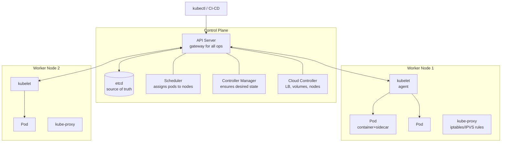
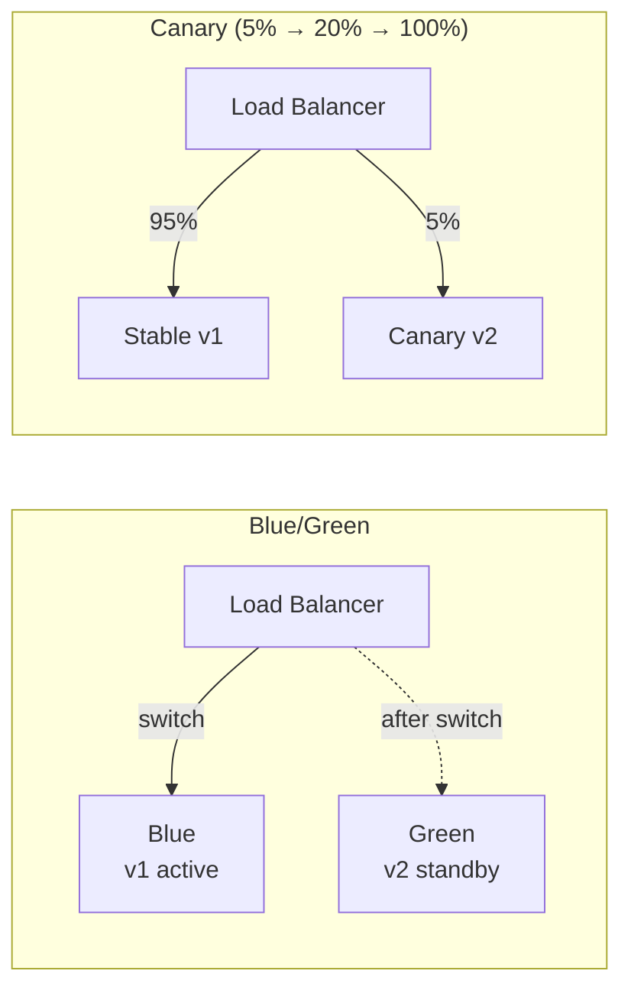

# Docker & Kubernetes

## Table of Contents
1. [Docker Internals](#docker-internals)
2. [Dockerfile Best Practices](#dockerfile-best-practices)
3. [Docker Networking & Storage](#docker-networking--storage)
4. [Kubernetes Architecture](#kubernetes-architecture)
5. [Workloads & Services](#workloads--services)
6. [Configuration & Secrets](#configuration--secrets)
7. [Scaling, Health & Scheduling](#scaling-health--scheduling)
8. [Kubernetes Networking & Ingress](#kubernetes-networking--ingress)
9. [Helm & Service Mesh](#helm--service-mesh)

---

## Docker Internals

Docker solves the "works on my machine" problem by packaging the application, its runtime, libraries, and configuration into a single portable **image**. At runtime, Docker creates a **container** — an isolated process on the host OS, sharing the host kernel but with its own filesystem, network stack, and process space. This isolation is achieved through Linux kernel primitives (namespaces and cgroups) rather than hardware virtualization, making containers start in milliseconds and consume megabytes rather than gigabytes. The layered filesystem (OverlayFS) is what makes image builds fast: unchanged layers are reused from cache.

**Docker** packages an application and all its dependencies into a portable **image** that runs identically in any environment.

### Container vs VM

| | Container | Virtual Machine |
|---|---|---|
| Isolation | Process-level (namespaces + cgroups) | Full OS virtualization (hypervisor) |
| Startup | Milliseconds | Minutes |
| Size | MBs | GBs |
| Overhead | Near-zero | Significant |
| Kernel | Shared with host | Separate guest kernel |
| Use case | App packaging, microservices | Full OS isolation, legacy apps |

### Linux Primitives Used by Docker

| Feature | What it does |
|---|---|
| **Namespaces** | Isolate: PID, network, mount, UTS (hostname), IPC, user |
| **cgroups** | Limit CPU, memory, I/O, network bandwidth per container |
| **Union FS (OverlayFS)** | Layer filesystem — each instruction creates a layer |
| **seccomp** | Restrict syscalls (security hardening) |

### Image Layers & Caching

```
Image = stack of read-only layers + writable container layer on top

Layer 1: FROM eclipse-temurin:21-jre    (base OS + JRE)
Layer 2: WORKDIR /app                   (tiny)
Layer 3: COPY *.jar app.jar             (your JAR)
Layer 4: ENTRYPOINT [...]               (metadata)

Container: writable layer on top (deleted on container removal)
```

**Cache invalidation:** A layer is rebuilt when its instruction or any preceding layer changes. Order instructions from least-changing to most-changing.

---

## Dockerfile Best Practices

A poorly written Dockerfile leads to large images (slow to push/pull), slow builds (no cache reuse), security vulnerabilities (running as root), and JVM misconfiguration (reading wrong memory limits). The multi-stage build pattern solves the image size problem: the build stage uses a full JDK but its output is discarded; only the compiled JAR is copied into a lean JRE-only runtime image. **Layer ordering matters for caching**: copy `pom.xml` and download dependencies before copying source code — so a code-only change doesn't invalidate the expensive dependency download layer.

### Multi-Stage Build (Java Spring Boot)

```dockerfile
# Stage 1: Build
FROM eclipse-temurin:21-jdk AS build
WORKDIR /app

# Copy dependency descriptors first (cache layer if pom.xml unchanged)
COPY pom.xml .
COPY .mvn .mvn
COPY mvnw .
RUN ./mvnw dependency:go-offline -q

# Then copy source (this layer busts on code changes)
COPY src ./src
RUN ./mvnw package -DskipTests

# Stage 2: Layered runtime (Spring Boot 2.3+ layered JAR)
FROM eclipse-temurin:21-jre AS runtime
WORKDIR /app

# Create non-root user
RUN addgroup --system appgroup && adduser --system --ingroup appgroup appuser

# Spring Boot layered JAR: extract layers for better caching
COPY --from=build /app/target/*.jar app.jar
RUN java -Djarmode=layertools -jar app.jar extract

# dependencies layer (changes rarely) cached separately from app layer
COPY --from=build /app/target/extracted/dependencies/ ./
COPY --from=build /app/target/extracted/spring-boot-loader/ ./
COPY --from=build /app/target/extracted/snapshot-dependencies/ ./
COPY --from=build /app/target/extracted/application/ ./

USER appuser
EXPOSE 8080

ENTRYPOINT ["java",
  "-XX:+UseContainerSupport",
  "-XX:MaxRAMPercentage=75.0",
  "-Djava.security.egd=file:/dev/./urandom",
  "org.springframework.boot.loader.launch.JarLauncher"]
```

### Key Dockerfile Principles

| Practice | Why |
|---|---|
| `UseContainerSupport` | JVM respects container CPU/memory limits (default since Java 10) |
| `MaxRAMPercentage=75.0` | Leave 25% for OS, off-heap, GC overhead |
| Non-root user | Security — principle of least privilege |
| `.dockerignore` | Exclude `target/`, `.git/`, `*.md` → smaller build context, faster builds |
| Fixed image tags | Never use `latest` in production — non-reproducible builds |
| Minimal base image | Use JRE not JDK at runtime; consider distroless for smaller attack surface |

### .dockerignore

```
target/
.git/
*.md
*.log
.env
node_modules/
```

---

## Docker Networking & Storage

Docker's default bridge network gives each container its own virtual NIC and IP, isolated from the host. Containers on the same user-defined bridge network can reach each other by **container name** as a DNS hostname — critical for multi-container setups (app → database). The `host` network mode removes isolation entirely and shares the host's network stack, eliminating NAT overhead (useful for latency-sensitive workloads). For data persistence, **volumes** (Docker-managed) survive container deletion and are portable across machines; **bind mounts** (host path → container path) are simpler for development (live code reload).

### Network Modes

| Mode | Description | Use Case |
|---|---|---|
| `bridge` (default) | Private network; containers communicate by name | Most containers |
| `host` | Container shares host network stack | High-performance, when port mapping overhead matters |
| `none` | No networking | Batch processing, offline jobs |
| `overlay` | Multi-host networking (Swarm/K8s) | Distributed deployments |

```bash
# Create custom bridge network (containers can reach each other by name)
docker network create my-app-net
docker run --network my-app-net --name postgres postgres:15
docker run --network my-app-net --name app my-app  # can reach postgres:5432
```

### Volumes vs Bind Mounts

| | Volume | Bind Mount |
|---|---|---|
| Managed by | Docker | Host OS |
| Location | Docker storage dir | Any host path |
| Portability | High | Low (path-dependent) |
| Use case | Production persistence | Dev (live code reload) |

```bash
docker run -v my-data:/var/lib/postgresql/data postgres  # named volume
docker run -v $(pwd)/src:/app/src my-app  # bind mount for dev
```

---

## Kubernetes Architecture

Kubernetes automates the deployment, scaling, and self-healing of containerized applications. Its control plane maintains the **desired state** (what you declared in YAML) and continuously reconciles it with **actual state** (what's running on nodes). The API Server is the single gateway to the cluster — all tools (kubectl, CI/CD, controllers) communicate through it. `etcd` is the ground truth — the entire cluster state is stored there. Worker nodes run the actual containers, with `kubelet` ensuring pods match their specification and `kube-proxy` maintaining network rules for Services. Understanding this separation (control plane vs data plane) is fundamental.



### Control Plane Components

| Component | Role |
|---|---|
| **API Server** | Single entry point; validates, authenticates, persists to etcd |
| **etcd** | Distributed KV store; only API server reads/writes etcd |
| **Scheduler** | Watches unscheduled pods; assigns to node based on resources, affinity, taints |
| **Controller Manager** | Runs controllers: ReplicaSet, Deployment, Node, Job... ensures actual = desired |
| **Cloud Controller** | Provisions cloud LBs, persistent volumes, node lifecycle |

### Worker Node Components

| Component | Role |
|---|---|
| **kubelet** | Talks to API server; ensures containers in pods are running and healthy |
| **kube-proxy** | Implements Service abstraction via iptables/IPVS; routes traffic to pod IPs |
| **Container runtime** | containerd / CRI-O — pulls images, starts/stops containers |

---

## Workloads & Services

Kubernetes provides specialized workload types for different scenarios. A **Deployment** manages stateless replicas — it handles rolling updates, rollbacks, and automatic rescheduling if a pod fails. A **StatefulSet** is for stateful applications (databases, Kafka) — it assigns stable pod names, stable DNS entries, and dedicated persistent volumes that survive pod restarts. Choosing the wrong type is a common mistake: running a database as a Deployment means it might be rescheduled to a different node and lose its data. **Services** are the stable virtual IPs and DNS names that abstract over the ephemeral pod IPs that change on every restart.

### Deployment (stateless apps)

```yaml
apiVersion: apps/v1
kind: Deployment
metadata:
  name: order-service
  labels:
    app: order-service
spec:
  replicas: 3
  selector:
    matchLabels:
      app: order-service
  strategy:
    type: RollingUpdate
    rollingUpdate:
      maxSurge: 1          # allow 1 extra pod during update
      maxUnavailable: 0    # never go below replica count
  template:
    metadata:
      labels:
        app: order-service
    spec:
      containers:
      - name: app
        image: my-registry/order-service:1.2.0  # always pin version
        ports:
        - containerPort: 8080
        resources:
          requests:             # guaranteed
            cpu: "250m"
            memory: "256Mi"
          limits:               # hard cap (OOMKilled if exceeded)
            cpu: "500m"
            memory: "512Mi"
        livenessProbe:
          httpGet: { path: /actuator/health/liveness, port: 8080 }
          initialDelaySeconds: 45
          periodSeconds: 10
          failureThreshold: 3
        readinessProbe:
          httpGet: { path: /actuator/health/readiness, port: 8080 }
          periodSeconds: 5
          failureThreshold: 3
```

### StatefulSet (stateful apps — databases, Kafka)

```yaml
apiVersion: apps/v1
kind: StatefulSet
metadata:
  name: postgres
spec:
  serviceName: postgres-headless  # required: headless service
  replicas: 3
  template:
    spec:
      containers:
      - name: postgres
        image: postgres:15
        volumeMounts:
        - name: data
          mountPath: /var/lib/postgresql/data
  volumeClaimTemplates:
  - metadata:
      name: data
    spec:
      storageClassName: gp2
      accessModes: [ReadWriteOnce]
      resources:
        requests:
          storage: 20Gi
```

**StatefulSet guarantees:**
- Stable pod names: `postgres-0`, `postgres-1`, `postgres-2`
- Stable DNS: `postgres-0.postgres-headless.namespace.svc.cluster.local`
- Ordered start/stop (postgres-0 starts first, stops last)
- Persistent volumes survive pod restart

### Other Workload Types

| Kind | Use Case |
|---|---|
| **Job** | Run once to completion (batch, migration) |
| **CronJob** | Scheduled recurring jobs |
| **DaemonSet** | One pod per node (log shippers, monitoring agents) |
| **Deployment** | Stateless apps |
| **StatefulSet** | Stateful apps with stable identity |

### Service Types

```yaml
# ClusterIP — internal traffic only (default)
spec:
  type: ClusterIP
  selector: { app: order-service }
  ports: [{ port: 80, targetPort: 8080 }]

# NodePort — exposes on each node's IP:port (dev/testing)
spec:
  type: NodePort
  ports: [{ port: 80, targetPort: 8080, nodePort: 30080 }]

# LoadBalancer — provisions cloud LB (production external access)
spec:
  type: LoadBalancer
  ports: [{ port: 80, targetPort: 8080 }]
```

---

## Configuration & Secrets

Kubernetes separates configuration from the container image (12-factor app principle). `ConfigMap` stores non-sensitive key-value pairs; `Secret` stores sensitive data base64-encoded (note: base64 is *encoding*, not *encryption* — anyone with cluster access can decode it). For true secrets management in production, use **External Secrets Operator** to sync from AWS Secrets Manager, HashiCorp Vault, or GCP Secret Manager into Kubernetes Secrets. Secrets can be injected as environment variables or mounted as files — file mounting is preferable because the app can detect changes without restarting.

```yaml
# ConfigMap — non-sensitive configuration
apiVersion: v1
kind: ConfigMap
metadata:
  name: app-config
data:
  SPRING_PROFILES_ACTIVE: "prod"
  DB_HOST: "postgres-service"
  LOG_LEVEL: "INFO"
---
# Secret — base64 encoded at rest (NOT encrypted by default)
# Use Vault, AWS Secrets Manager, or Sealed Secrets for real encryption
apiVersion: v1
kind: Secret
metadata:
  name: app-secrets
type: Opaque
data:
  DB_PASSWORD: cGFzc3dvcmQ=    # echo -n "password" | base64
  JWT_SECRET: c2VjcmV0a2V5...
```

```yaml
# Reference in pod spec
spec:
  containers:
  - name: app
    envFrom:
    - configMapRef:
        name: app-config
    - secretRef:
        name: app-secrets
    # Or as files mounted in volume
    volumeMounts:
    - name: secrets
      mountPath: /etc/secrets
      readOnly: true
  volumes:
  - name: secrets
    secret:
      secretName: app-secrets
```

**Security best practices:**
- Never store secrets in ConfigMaps
- Use external secret management: HashiCorp Vault, AWS Secrets Manager + External Secrets Operator
- Enable etcd encryption at rest
- Limit Secret access via RBAC (least privilege)

---

## Scaling, Health & Scheduling

Kubernetes scaling and health management are tightly coupled. The **HPA** watches metrics (CPU, memory, custom metrics via KEDA) and adjusts replica count automatically. But scaling is only effective if **readiness probes** correctly reflect when a pod is ready to serve traffic — a pod that's starting up but not yet warm should not receive requests. **Liveness probes** detect a deadlocked or corrupted process and trigger a restart. **Resource requests and limits** are the foundation: requests enable the scheduler to make intelligent placement decisions; limits prevent one runaway pod from starving its neighbors.

### Horizontal Pod Autoscaler (HPA)

```yaml
apiVersion: autoscaling/v2
kind: HorizontalPodAutoscaler
metadata:
  name: order-service-hpa
spec:
  scaleTargetRef:
    apiVersion: apps/v1
    kind: Deployment
    name: order-service
  minReplicas: 2
  maxReplicas: 20
  metrics:
  - type: Resource
    resource:
      name: cpu
      target:
        type: Utilization
        averageUtilization: 70
  - type: Resource
    resource:
      name: memory
      target:
        type: Utilization
        averageUtilization: 80
  # Custom metric (e.g., Kafka consumer lag via KEDA)
  - type: External
    external:
      metric:
        name: kafka_consumer_lag
      target:
        type: AverageValue
        averageValue: "1000"
  behavior:
    scaleDown:
      stabilizationWindowSeconds: 300  # wait 5min before scaling down
```

### Probes

| Probe | Failure Action | Use Case |
|---|---|---|
| **Liveness** | Restart container | App is deadlocked or in bad state |
| **Readiness** | Remove from Service endpoints | App is starting up or temporarily overloaded |
| **Startup** | Allow slow startup before liveness kicks in | Slow-starting apps (migrations, etc.) |

```yaml
startupProbe:
  httpGet: { path: /actuator/health, port: 8080 }
  failureThreshold: 30   # allow up to 30 * 10s = 5min to start
  periodSeconds: 10

livenessProbe:
  httpGet: { path: /actuator/health/liveness, port: 8080 }
  initialDelaySeconds: 0  # startupProbe guards this
  periodSeconds: 10
  failureThreshold: 3

readinessProbe:
  httpGet: { path: /actuator/health/readiness, port: 8080 }
  periodSeconds: 5
  failureThreshold: 3
```

### Resource Requests vs Limits

```
Requests: guaranteed resources — used for scheduling decisions
Limits: hard cap — container killed/throttled when exceeded

OOMKilled: container exceeded memory limit
CPU throttle: container can't burst above CPU limit (not killed, just throttled)

Best practice:
  requests = average expected usage
  limits = 2-3x requests (allow bursting but cap runaway processes)
```

### Pod Scheduling Controls

```yaml
# Node affinity — prefer or require specific nodes
affinity:
  nodeAffinity:
    requiredDuringSchedulingIgnoredDuringExecution:
      nodeSelectorTerms:
      - matchExpressions:
        - key: node-type
          operator: In
          values: [high-memory]

# Pod anti-affinity — spread across nodes for HA
  podAntiAffinity:
    preferredDuringSchedulingIgnoredDuringExecution:
    - weight: 100
      podAffinityTerm:
        labelSelector:
          matchLabels: { app: order-service }
        topologyKey: kubernetes.io/hostname  # different nodes

# Taints & Tolerations — reserve nodes for specific workloads
# Taint node: kubectl taint nodes node1 dedicated=gpu:NoSchedule
tolerations:
- key: dedicated
  value: gpu
  effect: NoSchedule
```

---

## Kubernetes Networking & Ingress

Kubernetes networking has a flat model: every pod gets its own IP and can reach any other pod directly, regardless of which node it's on. This is implemented by a **CNI plugin** (Calico, Flannel, Cilium). **Services** abstract over pod IPs with a stable virtual IP (ClusterIP), load-balanced across healthy pods. **Ingress** exposes Services to external traffic with path-based routing and TLS termination — it requires an **Ingress Controller** (nginx, Traefik, AWS ALB) to actually implement it. **NetworkPolicy** adds firewall rules at the pod level — by default all pods can talk to all pods, which is a security risk in production.

### Service DNS

Every Service gets a DNS entry: `<service>.<namespace>.svc.cluster.local`

```
order-service.default.svc.cluster.local → ClusterIP → Pod IPs
```

Pod-to-pod communication uses this DNS — no hardcoded IPs.

### Ingress

```yaml
apiVersion: networking.k8s.io/v1
kind: Ingress
metadata:
  name: api-ingress
  annotations:
    nginx.ingress.kubernetes.io/rewrite-target: /
    cert-manager.io/cluster-issuer: letsencrypt-prod
spec:
  ingressClassName: nginx
  tls:
  - hosts: [api.example.com]
    secretName: api-tls
  rules:
  - host: api.example.com
    http:
      paths:
      - path: /orders
        pathType: Prefix
        backend:
          service:
            name: order-service
            port: { number: 80 }
      - path: /payments
        pathType: Prefix
        backend:
          service:
            name: payment-service
            port: { number: 80 }
```

### NetworkPolicy (micro-segmentation)

```yaml
apiVersion: networking.k8s.io/v1
kind: NetworkPolicy
metadata:
  name: order-service-netpol
spec:
  podSelector:
    matchLabels: { app: order-service }
  policyTypes: [Ingress, Egress]
  ingress:
  - from:
    - podSelector: { matchLabels: { app: api-gateway } }
    ports: [{ port: 8080 }]
  egress:
  - to:
    - podSelector: { matchLabels: { app: postgres } }
    ports: [{ port: 5432 }]
```

---

## Helm & Service Mesh

**Helm** is the package manager for Kubernetes — it templates YAML manifests with Go templating and values files, making it possible to deploy the same application to dev/staging/prod with different configurations by overriding values. A **service mesh** (Istio, Linkerd) injects a sidecar proxy (Envoy) into every pod, creating a transparent network layer that handles mTLS, canary traffic splitting, circuit breaking, and distributed tracing — all without any application code changes. The trade-off: service meshes add operational complexity and latency (sidecar processing). Worth it for large microservices systems needing strong security and observability.

### Helm

Kubernetes package manager — templates + values files:

```bash
helm install order-service ./helm/order-service \
  --set image.tag=1.2.0 \
  --set replicas=3 \
  -f values-prod.yaml

helm upgrade order-service ./helm/order-service --set image.tag=1.3.0
helm rollback order-service 1  # rollback to revision 1
```

**Chart structure:**
```
my-chart/
  Chart.yaml         # metadata
  values.yaml        # default values
  templates/
    deployment.yaml  # uses {{ .Values.image.tag }}
    service.yaml
    hpa.yaml
    ingress.yaml
```

### Service Mesh (Istio / Linkerd)

Sidecar proxy (Envoy) injected into each pod — handles:

| Feature | Benefit |
|---|---|
| mTLS | Automatic encryption between services |
| Traffic management | Canary deployments, traffic splitting, retries |
| Observability | Distributed tracing, metrics, dashboards (Kiali) |
| Circuit breaking | At the network level, no app code changes |
| Rate limiting | Per-service or per-endpoint |

```yaml
# Istio: traffic splitting (canary — 90% v1, 10% v2)
apiVersion: networking.istio.io/v1alpha3
kind: VirtualService
metadata:
  name: order-service
spec:
  hosts: [order-service]
  http:
  - route:
    - destination: { host: order-service, subset: v1 }
      weight: 90
    - destination: { host: order-service, subset: v2 }
      weight: 10
```

### Kubernetes Deployment Strategies

| Strategy | Zero Downtime | Risk | Use Case |
|---|---|---|---|
| **Rolling Update** | ✅ | Low | Default; works for backward-compatible changes |
| **Blue/Green** | ✅ | Medium | Switch all traffic at once; instant rollback |
| **Canary** | ✅ | Low | Gradual traffic shift; test with real users |
| **Recreate** | ❌ | High | Simple apps; acceptable downtime |


