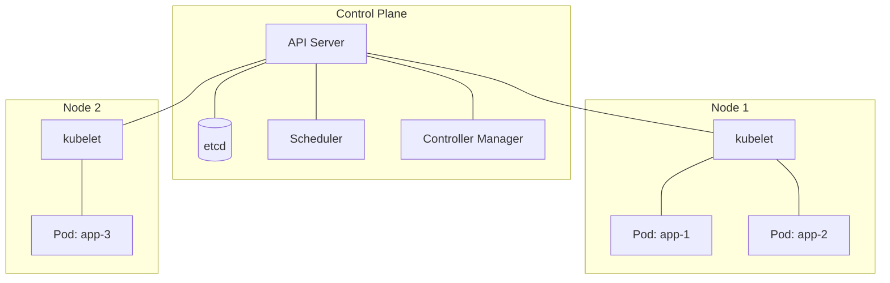

# Docker & Kubernetes

## Table of Contents
1. [Docker Fundamentals](#docker-fundamentals)
2. [Dockerfile Best Practices](#dockerfile-best-practices)
3. [Kubernetes Architecture](#kubernetes-architecture)
4. [Deployments & Services](#deployments--services)
5. [Configuration & Secrets](#configuration--secrets)
6. [Scaling & Health](#scaling--health)

---

## Docker Fundamentals

**Docker** packages an application and all its dependencies into a portable **image** that runs identically in any environment.

| Concept | Description |
|---|---|
| **Image** | Immutable blueprint (layers) |
| **Container** | Running instance of an image |
| **Registry** | Image storage (DockerHub, ECR, GCR) |
| **Layer** | Cached filesystem snapshot; shared across images |

**How it works:** Docker uses Linux **namespaces** (process, network, mount isolation) and **cgroups** (CPU, memory limits) — lighter than VMs (no guest OS).

---

## Dockerfile Best Practices

```dockerfile
# Multi-stage build: separate build env from runtime
FROM eclipse-temurin:21-jdk AS build
WORKDIR /app
COPY pom.xml .
RUN mvn dependency:go-offline -q       # cache deps layer separately
COPY src ./src
RUN mvn package -DskipTests

FROM eclipse-temurin:21-jre            # lean runtime image
WORKDIR /app
COPY --from=build /app/target/*.jar app.jar
EXPOSE 8080
ENTRYPOINT ["java", "-XX:+UseContainerSupport", "-jar", "app.jar"]
```

**Why `COPY pom.xml` before `COPY src`?** Docker caches each layer. If only source changes, the dependency download layer is reused — much faster builds.

**`UseContainerSupport`** — JVM respects Docker memory/CPU limits (default since Java 10+).

---

## Kubernetes Architecture



- **API Server** — single entry point; validates and persists to etcd
- **etcd** — distributed KV store; source of truth for cluster state
- **Scheduler** — assigns Pods to Nodes based on resource availability
- **Controller Manager** — ensures desired state (ReplicaSet maintains N replicas)
- **kubelet** — agent on each node; ensures containers are running

---

## Deployments & Services

```yaml
# Deployment
apiVersion: apps/v1
kind: Deployment
metadata:
  name: order-service
spec:
  replicas: 3
  selector:
    matchLabels:
      app: order-service
  template:
    spec:
      containers:
      - name: app
        image: my-registry/order-service:1.2.0
        ports:
        - containerPort: 8080
        resources:
          requests: { cpu: "250m", memory: "256Mi" }
          limits:   { cpu: "500m", memory: "512Mi" }
```

```yaml
# Service — stable DNS + load balancing to pods
apiVersion: v1
kind: Service
metadata:
  name: order-service
spec:
  selector:
    app: order-service
  ports:
  - port: 80
    targetPort: 8080
  type: ClusterIP   # internal only
```

**Service types:**
- `ClusterIP` — internal cluster traffic
- `NodePort` — exposes on each node's IP
- `LoadBalancer` — creates cloud LB (AWS ELB)
- `Ingress` — HTTP routing, TLS termination (preferred for production)

---

## Configuration & Secrets

```yaml
# ConfigMap — non-sensitive config
apiVersion: v1
kind: ConfigMap
data:
  SPRING_PROFILES_ACTIVE: "prod"
  DB_HOST: "postgres-service"

# Secret — base64 encoded (not encrypted by default; use Vault or AWS Secrets Manager)
apiVersion: v1
kind: Secret
data:
  DB_PASSWORD: cGFzc3dvcmQ=   # base64
```

```yaml
# Reference in pod
envFrom:
- configMapRef:
    name: app-config
- secretRef:
    name: app-secrets
```

---

## Scaling & Health

### Horizontal Pod Autoscaler (HPA)

```yaml
apiVersion: autoscaling/v2
kind: HorizontalPodAutoscaler
spec:
  scaleTargetRef:
    kind: Deployment
    name: order-service
  minReplicas: 2
  maxReplicas: 10
  metrics:
  - type: Resource
    resource:
      name: cpu
      target:
        type: Utilization
        averageUtilization: 70
```

### Probes

```yaml
livenessProbe:   # Is the container alive? (restart if fails)
  httpGet:
    path: /actuator/health/liveness
    port: 8080
  initialDelaySeconds: 30
  periodSeconds: 10

readinessProbe:  # Is the container ready to receive traffic? (remove from LB if fails)
  httpGet:
    path: /actuator/health/readiness
    port: 8080
  periodSeconds: 5
```

**Rolling Update** — default strategy; gradually replaces old pods. Zero-downtime if readiness probes are configured correctly.

```yaml
strategy:
  rollingUpdate:
    maxSurge: 1         # extra pods during update
    maxUnavailable: 0   # never take pods below replicas count
```
