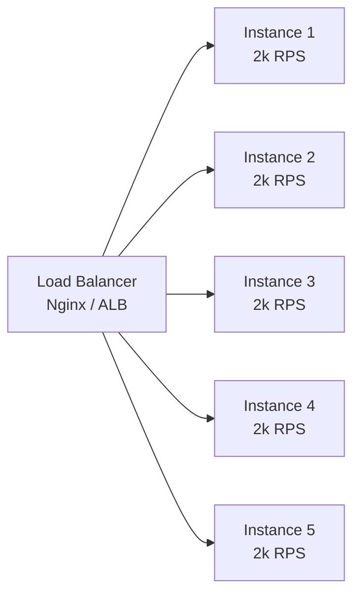

# Java Multithreading & Concurrency

## Table of Contents
1. [Thread Lifecycle](#thread-lifecycle)
2. [Creating Threads](#creating-threads)
3. [synchronized & Locks](#synchronized--locks)
4. [Thread Contention](#thread-contention)
5. [Java Memory Model (JMM)](#java-memory-model-jmm)
6. [volatile & Atomic](#volatile--atomic)
7. [CountDownLatch, CyclicBarrier, Semaphore, Phaser](#countdownlatch-cyclicbarrier-semaphore-phaser)
8. [Executor Framework & Thread Pools](#executor-framework--thread-pools)
9. [CompletableFuture](#completablefuture)
10. [Concurrent Collections](#concurrent-collections)
11. [Deadlocks](#deadlocks)
12. [Handle 10,000 Requests in a Java Microservice](#handle-10000-requests-in-a-java-microservice)
13. [Race Conditions in Distributed Environments](#race-conditions-in-distributed-environments)
14. [Fork/Join Framework](#forkjoin-framework)

---

## Thread Lifecycle

Understanding thread states is essential for diagnosing concurrency issues with tools like `jstack` or VisualVM. A thread in BLOCKED state is waiting for a monitor lock (another thread holds `synchronized`). WAITING means it called `wait()`, `join()`, or `park()` — indefinitely waiting for a signal. TIMED_WAITING is similar but with a deadline. High counts of BLOCKED threads in `jstack` output indicate contention on a lock — a classic symptom of thread contention.

```
NEW ──► RUNNABLE ──► RUNNING
                        │
              ┌─────────┼─────────────┐
              ▼         ▼             ▼
           BLOCKED   WAITING    TIMED_WAITING
              │         │             │
              └─────────┴─────────────┘
                         │
                         ▼
                     TERMINATED
```

| State | Cause |
|---|---|
| NEW | `new Thread()` — not started |
| RUNNABLE | `start()` called — eligible to run, may be waiting for CPU |
| BLOCKED | Waiting to acquire a `synchronized` lock held by another thread |
| WAITING | `wait()`, `join()`, `LockSupport.park()` — indefinite wait |
| TIMED_WAITING | `sleep(ms)`, `wait(ms)`, `tryLock(timeout)`, `join(ms)` |
| TERMINATED | `run()` completed or exception thrown |

**Key distinction:** BLOCKED = waiting for a lock. WAITING = waiting for a notification/join.

---

## Creating Threads

In practice, you should almost never create raw threads directly. Use the Executor framework (`ExecutorService`, `ThreadPoolExecutor`) or CompletableFuture — they manage thread lifecycle, handle exceptions, and allow proper shutdown. The four methods below exist for historical completeness; method 4 (Executor) is what you use in real code. Java 21's Virtual Threads are the new paradigm for I/O-bound concurrency.

```java
// 1. Extend Thread (avoid — ties behavior to threading)
class MyThread extends Thread {
    @Override public void run() { doWork(); }
}
new MyThread().start();

// 2. Implement Runnable (preferred for tasks)
Runnable task = () -> doWork();
new Thread(task).start();

// 3. Callable — returns a result, throws checked exceptions
Callable<Integer> callable = () -> computeResult();
FutureTask<Integer> future = new FutureTask<>(callable);
new Thread(future).start();
int result = future.get(); // blocks until done

// 4. ExecutorService (best practice in production)
ExecutorService executor = Executors.newFixedThreadPool(4);
Future<Integer> f = executor.submit(() -> computeResult());
```

---

## synchronized & Locks

`synchronized` is the simplest Java locking mechanism — it ensures mutual exclusion (only one thread executes the block at a time) and memory visibility (changes are flushed to main memory and visible to other threads). However, it has limitations: no timeout, no interruption, and always exclusive (even reads block each other). `ReentrantLock` adds these capabilities. `ReadWriteLock` is the right choice when reads vastly outnumber writes — multiple readers can proceed in parallel, only writers are exclusive.

### synchronized
```java
class SafeCounter {
    private int count = 0;

    public synchronized void increment() { count++; }          // lock on 'this'
    public synchronized int get() { return count; }

    // Block-level — better for fine-grained control
    private final Object writeLock = new Object();
    public void add(int delta) {
        synchronized (writeLock) { count += delta; }
    }
}
```

**How `count++` fails without sync (race condition):**
- `count++` compiles to: READ → INCREMENT → WRITE (3 operations, not atomic)
- Thread A reads count=5, Thread B reads count=5, both write 6 — lost update

### ReentrantLock
```java
ReentrantLock lock = new ReentrantLock(true); // fair=true: longest-waiting thread gets lock

lock.lock();
try {
    criticalSection();
} finally {
    lock.unlock(); // MUST be in finally
}

// tryLock — avoid indefinite blocking
if (lock.tryLock(500, TimeUnit.MILLISECONDS)) {
    try { criticalSection(); }
    finally { lock.unlock(); }
} else {
    handleTimeout();
}
```

### ReadWriteLock — concurrent reads, exclusive writes
```java
ReadWriteLock rwLock = new ReentrantReadWriteLock();

// Multiple threads can read simultaneously
rwLock.readLock().lock();
try { return data.get(key); }
finally { rwLock.readLock().unlock(); }

// Only one thread writes, and no reader allowed during write
rwLock.writeLock().lock();
try { data.put(key, value); }
finally { rwLock.writeLock().unlock(); }
```

**`StampedLock` (Java 8+):** even more efficient for read-heavy workloads. Supports optimistic reads (no lock acquisition) + conversion to write lock.

---

## Thread Contention

Thread contention is one of the most common causes of performance degradation in multi-threaded Java applications. It happens when threads spend more time *waiting for a lock* than *doing actual work*. The symptom is counterintuitive: adding more threads makes the system *slower* because the increased competition for the shared resource amplifies contention. The key insight for resolution: make critical sections as short as possible, push I/O outside locks, and prefer lock-free data structures (`ConcurrentHashMap`, `AtomicInteger`) over coarse-grained `synchronized` blocks.

**Thread contention** occurs when multiple threads compete for the same shared resource (lock, I/O, CPU), causing threads to **block and wait**, degrading throughput.

**Symptoms:**
- High lock-wait time in profiler
- Many threads in BLOCKED state (`jstack <pid>` shows threads blocking on same monitor)
- Low throughput despite available CPU

**Causes & solutions:**

| Cause | Solution |
|---|---|
| Coarse-grained lock (global lock for everything) | Segment locks, `ConcurrentHashMap`, per-key locks |
| Long critical section (I/O inside lock) | Move I/O outside lock, minimize work inside sync block |
| Hot singleton / shared cache | `ConcurrentHashMap`, lock striping, atomic operations |
| DB connection pool exhaustion | Tune pool size, use async/reactive |
| Thread pool too small | Size pool based on `CPU cores × (1 + wait_time/compute_time)` |

```java
// Bad: single lock for all operations
synchronized(this) {
    String data = fetchFromDatabase(); // I/O INSIDE LOCK — blocks everyone
    cache.put(key, data);
}

// Good: minimize lock scope
String data = fetchFromDatabase();    // I/O outside lock
synchronized(this) {
    cache.put(key, data);             // only state mutation inside
}

// Better: use ConcurrentHashMap (no explicit locking needed)
ConcurrentHashMap<String, String> cache = new ConcurrentHashMap<>();
cache.computeIfAbsent(key, k -> fetchFromDatabase());
```

**Diagnosis tools:**
- `jstack <pid>` — thread dump, shows BLOCKED threads and monitor addresses
- `VisualVM` / `JMC` (Java Mission Control) — lock contention profiling
- `jcmd <pid> Thread.print` — same as jstack, no tool install needed

---

## Java Memory Model (JMM)

Modern CPUs have per-core caches (L1, L2) and can reorder instructions for performance. This means one thread's writes may not be immediately visible to other threads — a counterintuitive source of bugs that are very hard to reproduce. The JMM defines exactly when writes become visible to other threads via the "happens-before" relationship. `volatile` and `synchronized` both establish happens-before guarantees, which is why removing them can introduce subtle visibility bugs that appear only under load.

JMM defines rules for how threads interact with memory. Without it: CPU caches, instruction reordering → visibility bugs.

**Happens-Before guarantee:** if action A happens-before action B, then A's results are visible to B.

**Happens-before relationships:**
- `synchronized`: unlock HB → subsequent lock
- `volatile`: write HB → subsequent read
- `Thread.start()` HB → all actions in the started thread
- `Thread.join()`: all actions in joined thread HB → join returns

```java
// Visibility problem WITHOUT volatile
boolean running = true;
// Thread A:
while (running) { doWork(); } // may loop forever — CPU caches 'running'

// Thread B:
running = false; // write not visible to Thread A's cache

// Fix: volatile ensures write immediately visible across threads
volatile boolean running = true;
```

---

## volatile & Atomic

`volatile` and atomic classes both address visibility — ensuring a thread sees the most recent value written by another thread — but they solve different problems. `volatile` is appropriate for a simple flag (one writer, many readers) because reads and writes are atomic at the variable level. But `volatile` doesn't help for *compound operations* like `counter++` (read-modify-write), which are three separate operations. For those, use `AtomicInteger`/`AtomicLong` (CAS-based, lock-free) or `LongAdder` (which reduces CAS contention under high load by maintaining per-thread cells).

### volatile
- Guarantees **visibility** — writes immediately visible to all threads
- Guarantees **ordering** — no instruction reordering around volatile access
- Does **NOT** guarantee atomicity for compound operations (`count++` is still 3 ops)

```java
volatile boolean shutdown = false; // flag — safe for simple read/write
```

### AtomicInteger, AtomicLong, AtomicReference
Lock-free, CAS-based (Compare-And-Swap). Atomic compound operations.

```java
AtomicInteger counter = new AtomicInteger(0);
counter.incrementAndGet();                    // atomic ++
counter.addAndGet(5);                         // atomic +=
counter.compareAndSet(expected, newValue);    // CAS

// AtomicReference for atomic object replacement
AtomicReference<Config> configRef = new AtomicReference<>(initialConfig);
Config oldConfig, newConfig;
do {
    oldConfig = configRef.get();
    newConfig = computeNewConfig(oldConfig);
} while (!configRef.compareAndSet(oldConfig, newConfig)); // retry until succeeds
```

**LongAdder** — better than `AtomicLong` under high contention. Maintains multiple cells, sums on `sum()` call.

```java
LongAdder hitCounter = new LongAdder();
hitCounter.increment();           // fast under contention (no CAS retry loops)
long total = hitCounter.sum();
```

**Choice guide:**
- Simple flag: `volatile`
- Single counter under moderate load: `AtomicLong`
- High-contention counter: `LongAdder`
- Multiple variables must be updated atomically: `synchronized` or `Lock`

---

## CountDownLatch, CyclicBarrier, Semaphore, Phaser

The `java.util.concurrent` package provides synchronization primitives for common coordination patterns. `CountDownLatch` is the simplest — a one-time gate that opens when a count reaches zero. `CyclicBarrier` is similar but reusable and symmetric — all participating threads wait for each other, making it ideal for iterative parallel algorithms (map-reduce phases). `Semaphore` is a concurrency throttle — it limits the number of threads that can access a resource simultaneously (think database connection pool, rate limiter). Knowing which to reach for in which scenario is what separates a senior from a junior.

### CountDownLatch — wait for N events (one-time)
```java
CountDownLatch ready = new CountDownLatch(3);

// 3 workers signal they're ready
executor.submit(() -> { initialize(); ready.countDown(); });
executor.submit(() -> { initialize(); ready.countDown(); });
executor.submit(() -> { initialize(); ready.countDown(); });

ready.await(10, TimeUnit.SECONDS); // main thread waits
startProcessing();
```

### CyclicBarrier — N threads wait for each other at a checkpoint (reusable)
```java
CyclicBarrier barrier = new CyclicBarrier(3, () -> processPhaseResults()); // action when all arrive

Runnable phaseWorker = () -> {
    for (int phase = 0; phase < 5; phase++) {
        processPhase(phase);
        barrier.await(); // wait for all threads to finish this phase
    }
};
```

### Semaphore — control number of concurrent accesses
```java
Semaphore semaphore = new Semaphore(10); // max 10 concurrent DB connections

semaphore.acquire(); // blocks if 10 already acquired
try {
    useResource();
} finally {
    semaphore.release(); // always release
}
```

### Exchanger — pair of threads exchange objects
```java
Exchanger<DataBuffer> exchanger = new Exchanger<>();
// Producer thread:
DataBuffer filled = produceData();
DataBuffer empty = exchanger.exchange(filled); // waits for consumer, swaps buffers

// Consumer thread:
DataBuffer toProcess = exchanger.exchange(new DataBuffer()); // gets filled buffer
```

---

## Executor Framework & Thread Pools

The Executor framework decouples task submission from execution. Instead of managing thread lifecycle manually, you submit tasks (`Runnable` or `Callable`) to a pool and it handles threading. `ThreadPoolExecutor` is the core implementation — understanding its parameters (core size, max size, queue type) is critical for production tuning. An undersized pool with a bounded queue will reject tasks under load; an oversized pool wastes memory and causes context-switch overhead. For I/O-bound workloads in Java 21+, Virtual Threads eliminate pool sizing concerns entirely.

```java
// 1. Fixed — N threads. Good for CPU-bound work.
ExecutorService fixed = Executors.newFixedThreadPool(
    Runtime.getRuntime().availableProcessors()
);

// 2. Cached — grows/shrinks as needed. Good for I/O-bound, many short tasks.
ExecutorService cached = Executors.newCachedThreadPool();

// 3. Single — guarantees sequential execution of tasks.
ExecutorService single = Executors.newSingleThreadExecutor();

// 4. Scheduled — cron-like, fixed-rate, fixed-delay.
ScheduledExecutorService scheduler = Executors.newScheduledThreadPool(2);
scheduler.scheduleAtFixedRate(task, 0, 30, TimeUnit.SECONDS);
scheduler.scheduleWithFixedDelay(task, 0, 30, TimeUnit.SECONDS); // delay after completion

// 5. Virtual Threads (Java 21) — lightweight, thousands per service
ExecutorService vt = Executors.newVirtualThreadPerTaskExecutor();
```

**Custom thread pool (production):**
```java
ThreadPoolExecutor executor = new ThreadPoolExecutor(
    corePoolSize,         // always-alive threads
    maximumPoolSize,      // max threads when queue full
    keepAliveTime,        // idle thread TTL
    TimeUnit.SECONDS,
    new ArrayBlockingQueue<>(queueCapacity),       // bounded queue
    new ThreadFactory() { ... },                   // custom thread names
    new ThreadPoolExecutor.CallerRunsPolicy()       // rejection: caller executes task
);
```

**Rejection policies when queue full + max threads reached:**
- `AbortPolicy` — throws `RejectedExecutionException` (default)
- `CallerRunsPolicy` — caller thread executes task (natural backpressure)
- `DiscardPolicy` — silently drops task
- `DiscardOldestPolicy` — drops oldest queued task, retries

**Proper shutdown:**
```java
executor.shutdown();                           // no new tasks; finish existing
if (!executor.awaitTermination(60, SECONDS)) {
    executor.shutdownNow();                    // interrupt running tasks
}
```

**Thread pool sizing:**
- CPU-bound: `N = number of CPU cores`
- I/O-bound: `N = CPU cores × (1 + wait_time / compute_time)`
- Mixed: profile and benchmark

---

## CompletableFuture

`CompletableFuture` is Java's answer to callback-based async programming, offering a fluent API for composing async operations without nested callbacks ("callback hell"). It represents a value that will be available in the future, and provides operators to transform it (`thenApply`), chain dependent async operations (`thenCompose` — the flatMap equivalent), combine two independent futures (`thenCombine`), or wait for all/any of a set (`allOf`/`anyOf`). Critical distinction: `thenApply` runs on the completing thread (possibly the common pool); `thenApplyAsync` explicitly schedules on an executor. Always pass an explicit executor in production — don't share the common ForkJoinPool with application I/O.

Non-blocking async composition without writing callbacks or blocking threads.

```java
// Chain async operations
CompletableFuture<OrderConfirmation> result = CompletableFuture
    .supplyAsync(() -> fetchUser(userId), executor)           // async start
    .thenApplyAsync(user -> createOrder(user, cart), executor) // transform
    .thenComposeAsync(order -> chargePayment(order), executor) // flat-map (returns CF)
    .thenApplyAsync(payment -> sendConfirmation(payment))
    .exceptionally(ex -> {                                     // error handling
        log.error("Order failed", ex);
        return OrderConfirmation.failed();
    });

// Wait for result (blocking — avoid in reactive code)
OrderConfirmation confirmation = result.get(5, TimeUnit.SECONDS);
```

```java
// Combine multiple futures
CompletableFuture<User> userFuture = fetchUserAsync(id);
CompletableFuture<List<Order>> ordersFuture = fetchOrdersAsync(id);
CompletableFuture<Promotions> promoFuture = fetchPromosAsync(id);

// Wait for all, then combine
CompletableFuture.allOf(userFuture, ordersFuture, promoFuture)
    .thenApply(v -> buildDashboard(
        userFuture.join(),
        ordersFuture.join(),
        promoFuture.join()
    ));

// Wait for first to complete
CompletableFuture.anyOf(primaryFuture, fallbackFuture)
    .thenAccept(result -> respond(result));
```

**Key methods:**
| Method | Description |
|---|---|
| `supplyAsync(Supplier)` | Start async task that returns a value |
| `thenApply(Function)` | Transform result (like `map`) |
| `thenApplyAsync(Function)` | Transform on different thread |
| `thenCompose(Function→CF)` | Flat-map (avoid nested CF) |
| `thenCombine(CF, BiFunction)` | Combine two futures when both complete |
| `allOf(CF...)` | Wait for all — returns `CF<Void>` |
| `anyOf(CF...)` | Complete when first finishes |
| `exceptionally(Function)` | Handle exception, return fallback |
| `handle(BiFunction)` | Always called: (result, exception) |
| `whenComplete(BiConsumer)` | Side-effect on complete (no transform) |

---

## Concurrent Collections

Standard Java collections (`ArrayList`, `HashMap`) are not thread-safe — concurrent modification causes `ConcurrentModificationException` or data corruption. `Collections.synchronizedList/Map` wraps them with a single global lock — simple but creates contention. The `java.util.concurrent` package provides purpose-built thread-safe collections that are far more efficient. `ConcurrentHashMap` uses segment-level locking (and CAS in Java 8+) for near-concurrent access. `CopyOnWriteArrayList` creates a fresh copy on every write — ideal when reads vastly outnumber writes (listeners, configuration). `BlockingQueue` is the backbone of producer-consumer patterns.

| Collection | Use case | Key feature |
|---|---|---|
| `ConcurrentHashMap` | Concurrent read-heavy map | Segment-level locking; `computeIfAbsent` atomic |
| `CopyOnWriteArrayList` | Rare writes, frequent reads | Write creates copy; reads never lock |
| `BlockingQueue` (LinkedBlockingQueue, ArrayBlockingQueue) | Producer-consumer | `put` blocks when full, `take` blocks when empty |
| `PriorityBlockingQueue` | Priority task processing | Unbounded, ordered by comparator |
| `ConcurrentSkipListMap` | Sorted concurrent map | O(log n); replaces `Collections.synchronizedSortedMap` |
| `LinkedTransferQueue` | Handoff pattern | Producer waits until consumer takes item |

```java
// Producer-Consumer with BlockingQueue
BlockingQueue<Task> queue = new ArrayBlockingQueue<>(100);

// Producer thread
queue.put(newTask); // blocks if queue full

// Consumer thread
Task task = queue.take(); // blocks if queue empty
process(task);

// ConcurrentHashMap atomic operations
ConcurrentHashMap<String, AtomicInteger> counters = new ConcurrentHashMap<>();
counters.computeIfAbsent("hits", k -> new AtomicInteger()).incrementAndGet();
```

---

## Deadlocks

A deadlock is a permanent standstill where a set of threads are each waiting for a resource held by another in the set — forming a cycle of dependency from which no thread can escape. All four Coffman conditions must hold simultaneously for deadlock to occur; breaking any one of them prevents it. In practice, the most effective prevention strategies are: (1) **consistent lock ordering** — always acquire locks in the same global order to eliminate cycles; (2) **tryLock with timeout** — detect and back off rather than wait forever; (3) **avoid holding locks while calling external code** — third-party code may acquire its own locks.

A deadlock occurs when two or more threads each hold a resource the other needs, and neither can proceed.

**Conditions (all 4 must hold):**
1. Mutual exclusion — resource is non-sharable
2. Hold and wait — thread holds resources while waiting for more
3. No preemption — resources can't be forcibly taken
4. Circular wait — A waits for B, B waits for A

```java
// Classic deadlock
synchronized(accountA) {
    synchronized(accountB) { transfer(accountA, accountB); }
}

// Thread 2 locks in opposite order → deadlock
synchronized(accountB) {
    synchronized(accountA) { transfer(accountB, accountA); }
}
```

**Prevention:**

```java
// 1. Consistent lock ordering — always lock by ID to break circular wait
private void transfer(Account from, Account to, BigDecimal amount) {
    Account first  = from.getId() < to.getId() ? from : to;
    Account second = from.getId() < to.getId() ? to : from;
    synchronized(first) {
        synchronized(second) {
            from.debit(amount);
            to.credit(amount);
        }
    }
}

// 2. tryLock with timeout — detect and recover
if (lockA.tryLock(100, MILLISECONDS)) {
    try {
        if (lockB.tryLock(100, MILLISECONDS)) {
            try { doWork(); }
            finally { lockB.unlock(); }
        }
    } finally { lockA.unlock(); }
}

// 3. Lock-free data structures (AtomicReference, CAS) — avoid locks entirely
```

**Detection:** `jstack <pid>` prints "Found one Java-level deadlock" with the full thread dump.

---

## Handle 10,000 Requests in a Java Microservice

This is a classic senior interview question that tests your understanding of the C10K problem and modern Java concurrency. The traditional Tomcat thread-per-request model breaks down at scale because OS threads are expensive (~1 MB stack each). Handling 10k concurrent requests with blocking I/O would require 10k threads, consuming 10 GB of RAM just for stacks. The modern answers are: **Virtual Threads** (Java 21, Project Loom) — lightweight JVM-managed threads that block on I/O without tying up an OS thread; **reactive programming** (WebFlux + R2DBC) — event loop with non-blocking I/O; or **horizontal scaling** — stateless service scaled out across multiple instances behind a load balancer.

**The core problem:** traditional thread-per-request model. Each request = 1 OS thread (1-2 MB stack). 10k concurrent = 10-20 GB RAM just for threads + context switching overhead.

### Strategy 1: Non-blocking Reactive (WebFlux + Netty)

```java
// application.properties
# Remove spring-boot-starter-web, add spring-boot-starter-webflux

@RestController
public class OrderController {
    @GetMapping("/orders/{id}")
    public Mono<Order> getOrder(@PathVariable Long id) {
        return orderRepository.findById(id)    // reactive DB driver (R2DBC)
            .switchIfEmpty(Mono.error(new NotFoundException(id)))
            .onErrorResume(ex -> Mono.error(new ServiceException(ex)));
    }

    @GetMapping("/orders")
    public Flux<Order> streamOrders() {
        return orderRepository.findAll()
            .delayElements(Duration.ofMillis(100)); // streaming response
    }
}
```
One event-loop thread handles thousands of requests — no blocking.

### Strategy 2: Virtual Threads — Project Loom (Java 21)

```java
// application.properties (Spring Boot 3.2+)
spring.threads.virtual.enabled=true

// Or programmatically:
try (ExecutorService exec = Executors.newVirtualThreadPerTaskExecutor()) {
    for (int i = 0; i < 10_000; i++) {
        exec.submit(() -> handleRequest()); // each on a virtual thread
    }
}
```
Virtual threads are JVM-managed (~few KB each). When they block on I/O, the carrier OS thread is released to handle another virtual thread. **10k virtual threads is trivial.**

### Strategy 3: Tune Thread Pool + Connection Pool

```yaml
# application.properties
server.tomcat.threads.max=500             # default 200
server.tomcat.accept-count=300            # queue for incoming connections
spring.datasource.hikari.maximum-pool-size=100
spring.datasource.hikari.minimum-idle=20
spring.datasource.hikari.connection-timeout=3000
```

### Strategy 4: Async Processing — Return 202 Immediately

```java
@PostMapping("/orders")
public ResponseEntity<Void> createOrder(@RequestBody OrderRequest req) {
    String correlationId = UUID.randomUUID().toString();
    kafkaTemplate.send("orders.create", correlationId, req); // async, non-blocking
    return ResponseEntity.accepted()
        .header("X-Correlation-Id", correlationId)
        .build(); // 202 — client polls or subscribes for result
}
```

### Strategy 5: Horizontal Scaling + Load Balancer


10k RPS ÷ 5 instances = 2k each. Stateless app + Redis for sessions.

### Strategy 6: Caching to Reduce Backend Load
```java
@Cacheable(value = "products", key = "#id", unless = "#result == null")
public Product getProduct(Long id) { return repo.findById(id).orElseThrow(); }
```
Cache hit = no DB round-trip = can handle 10× more requests.

**Combined approach (production):**  
Virtual Threads or WebFlux + HikariCP tuning + Redis caching + Horizontal scaling + Async for write-heavy ops.

---

## Race Conditions in Distributed Environments

A race condition in a distributed system is harder to prevent than in a single-process system because you can't use `synchronized` or `AtomicInteger` across service boundaries. Multiple instances of the same service, or multiple different services, may concurrently read-modify-write shared state (a database row, a Redis key, an inventory count). The solutions range from **optimistic locking** (`@Version` in JPA — lightweight, retry on conflict) to **pessimistic locking** (`SELECT FOR UPDATE` — strong, higher contention) to **distributed locks** (Redis Redisson — cross-service, but introduces distributed system complexity). Idempotency keys address the related problem of duplicate API calls causing duplicate side effects.

**Race condition:** two processes read, compute, and write shared state concurrently → corrupted result.

```
Process A: read balance=1000 → compute 1000-200=800 → write 800
Process B: read balance=1000 → compute 1000-300=700 → write 700
Expected: 500. Actual: 700 (Process A's update lost)
```

### Solution 1: Optimistic Locking (DB `@Version`)
```java
@Entity
public class Account {
    @Id private Long id;
    @Version private Long version;   // JPA checks on UPDATE: WHERE version=?
    private BigDecimal balance;
}

// Service
@Transactional
public void debit(Long accountId, BigDecimal amount) {
    Account account = repo.findById(accountId).orElseThrow();
    if (account.getBalance().compareTo(amount) < 0) throw new InsufficientFundsException();
    account.setBalance(account.getBalance().subtract(amount));
    repo.save(account); // throws OptimisticLockException if version changed
}

// With retry
@Retryable(value = OptimisticLockException.class, maxAttempts = 3, backoff = @Backoff(delay = 50))
public void debitWithRetry(Long accountId, BigDecimal amount) { ... }
```

### Solution 2: Pessimistic Locking (DB `SELECT FOR UPDATE`)
```java
@Lock(LockModeType.PESSIMISTIC_WRITE)
@Query("SELECT a FROM Account a WHERE a.id = :id")
Optional<Account> findByIdForUpdate(@Param("id") Long id);

// Acquires DB row lock; other transactions block on SELECT FOR UPDATE
@Transactional
public void transfer(Long fromId, Long toId, BigDecimal amount) {
    Account from = repo.findByIdForUpdate(fromId).orElseThrow(); // locks row
    Account to   = repo.findByIdForUpdate(toId).orElseThrow();   // locks row
    from.setBalance(from.getBalance().subtract(amount));
    to.setBalance(to.getBalance().add(amount));
}
```

### Solution 3: Distributed Lock (Redis / Redisson)
```java
RLock lock = redissonClient.getLock("account:lock:" + accountId);
boolean acquired = lock.tryLock(3, 5, TimeUnit.SECONDS); // waitTime=3s, leaseTime=5s
if (!acquired) throw new ResourceLockedException(accountId);
try {
    Account account = repo.findById(accountId).orElseThrow();
    account.setBalance(account.getBalance().subtract(amount));
    repo.save(account);
} finally {
    lock.unlock();
}
```

**Important:** Use `leaseTime` to auto-expire lock if the process crashes (prevents deadlock).

### Solution 4: Atomic Redis Operations (CAS-like)
```java
// Redis DECRBY is atomic — no race condition
String balanceKey = "balance:" + accountId;
Long newBalance = redisTemplate.opsForValue().decrement(balanceKey, amount.longValue());
if (newBalance < 0) {
    redisTemplate.opsForValue().increment(balanceKey, amount.longValue()); // rollback
    throw new InsufficientFundsException();
}
// For complex operations use Lua scripts (executed atomically on Redis)
```

### Solution 5: Idempotency Key
```java
@PostMapping("/payments")
public ResponseEntity<PaymentResult> pay(@RequestBody PaymentRequest req,
                                          @RequestHeader("Idempotency-Key") String key) {
    // Check if this key was already processed
    Optional<PaymentResult> existing = idempotencyStore.find(key);
    if (existing.isPresent()) return ResponseEntity.ok(existing.get()); // return same result

    PaymentResult result = paymentService.process(req);
    idempotencyStore.save(key, result, Duration.ofHours(24)); // store result
    return ResponseEntity.ok(result);
}
```

### Solution 6: Event Sourcing + Saga
No shared mutable state. All state derived from immutable event log. Each service's state only mutated by its own commands. Compensating transactions handle rollback.

**Choice guide:**

| Scenario | Solution |
|---|---|
| Low contention, single DB | Optimistic locking (`@Version`) |
| High contention, single DB | Pessimistic locking (SELECT FOR UPDATE) |
| Cross-service shared resource | Distributed lock (Redis) |
| Simple counters / balances | Atomic Redis operations |
| Duplicate API calls | Idempotency key |
| Complex distributed flow | Saga + Outbox pattern |

---

## Fork/Join Framework

The Fork/Join framework implements the divide-and-conquer parallel pattern. A large task is recursively split ("forked") into smaller subtasks until each piece is small enough to compute sequentially; results are then merged ("joined") back up the tree. The key innovation is **work-stealing**: idle threads steal tasks from the queues of busy threads, keeping all processors busy without manual load balancing. Java's Parallel Streams use the common `ForkJoinPool` internally. Avoid it for I/O-bound tasks (it blocks carrier threads, defeating the purpose) and be careful with the shared common pool — task blocking in one application can starve another.

Divide-and-conquer for CPU-intensive tasks. Uses work-stealing to keep all threads busy.

```java
class SumTask extends RecursiveTask<Long> {
    private static final int THRESHOLD = 10_000;
    private final long[] array;
    private final int start, end;

    @Override
    protected Long compute() {
        if (end - start <= THRESHOLD) {
            return sequentialSum(array, start, end);
        }
        int mid = (start + end) / 2;
        SumTask left  = new SumTask(array, start, mid);
        SumTask right = new SumTask(array, mid, end);
        left.fork();                 // async submit to ForkJoinPool
        long rightResult = right.compute(); // run right in current thread
        long leftResult  = left.join();     // wait for left
        return leftResult + rightResult;
    }
}

ForkJoinPool pool = ForkJoinPool.commonPool();
long total = pool.invoke(new SumTask(bigArray, 0, bigArray.length));
```

**Parallel Streams** use `ForkJoinPool.commonPool()` internally:
```java
long sum = LongStream.rangeClosed(1, 1_000_000_000L)
    .parallel()
    .sum();
```
Avoid parallel streams for I/O-bound tasks or when tasks are too short (overhead > gain). Use when: CPU-bound, large data, no shared mutable state.
