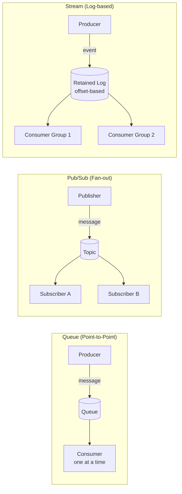
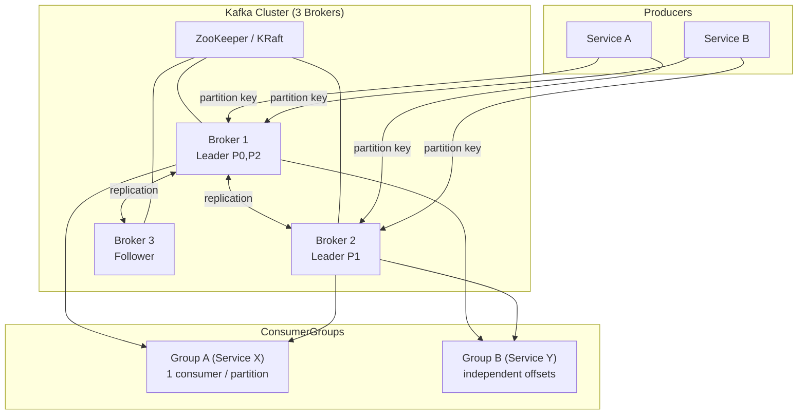
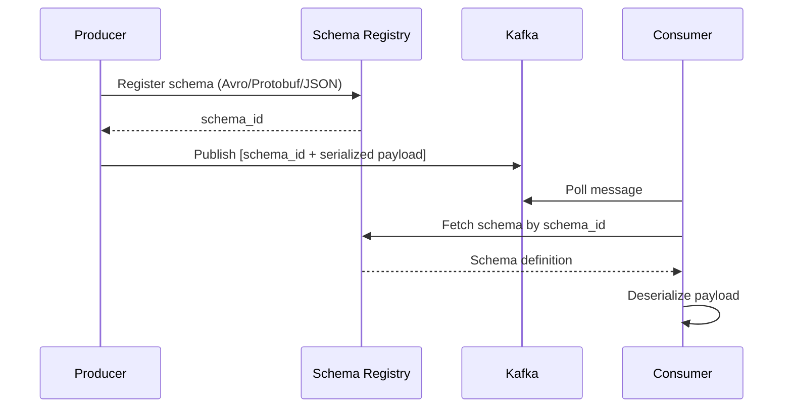
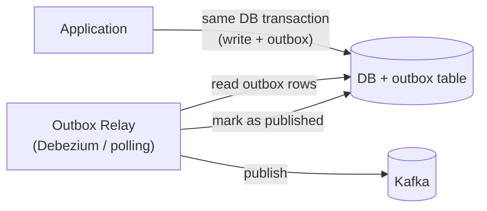
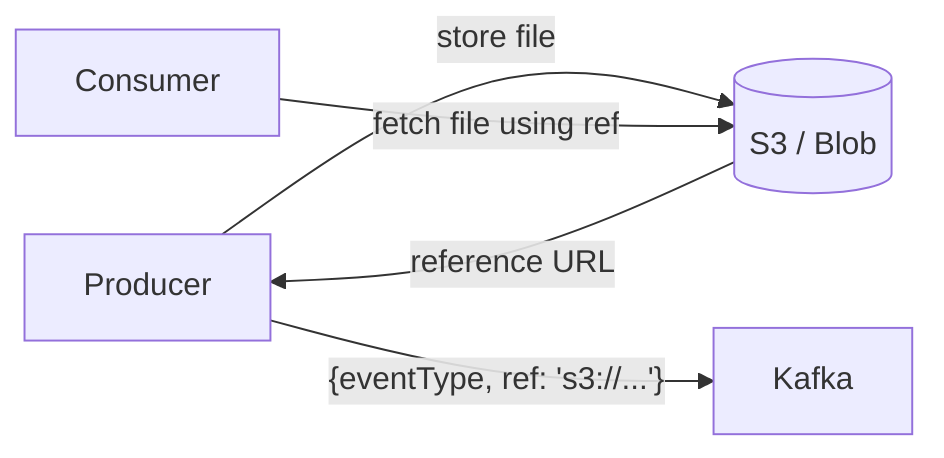
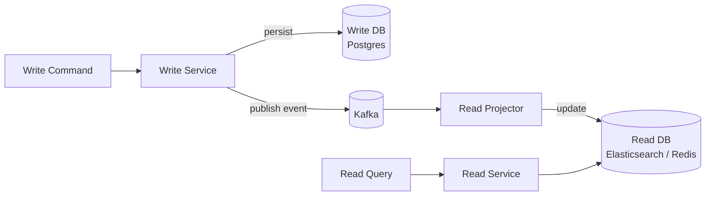

# Messaging & Event-Driven Architecture

## Table of Contents
1. [Core Concepts](#core-concepts)
2. [Message Queues vs Event Brokers](#message-queues-vs-event-brokers)
3. [Kafka Deep Dive](#kafka-deep-dive)
4. [Delivery Guarantees & Idempotency](#delivery-guarantees--idempotency)
5. [Schema Management](#schema-management)
6. [Event-Driven Patterns](#event-driven-patterns)
7. [EDA in Microservices](#eda-in-microservices)
8. [EDA Design Principles](#eda-design-principles)

---

## Core Concepts

### Commands vs Events

| | Command | Event |
|---|---|---|
| Meaning | "Do this" — directive | "This happened" — fact |
| Direction | Targeted (one receiver) | Broadcast (any consumer) |
| Coupling | Sender knows receiver | Sender doesn't know consumers |
| Naming | Imperative: `ProcessPayment` | Past tense: `PaymentProcessed` |
| Failure | Sender must handle | Consumer's responsibility |
| Example | `ReserveInventory` | `InventoryReserved` |

### Message vs Event vs Query

- **Message** — generic data unit; can be command, event, or query
- **Event** — notification that something happened; immutable fact
- **Query** — request for data; no side effects (e.g., Request/Reply pattern)

### Queues vs Pub/Sub vs Streams



| Model | Consumed by | Replay | Storage | Examples |
|---|---|---|---|---|
| Queue | One consumer | No | Deleted after ack | RabbitMQ, SQS, ActiveMQ |
| Pub/Sub | All subscribers | No | Transient | SNS, Redis Pub/Sub, GCP Pub/Sub |
| Stream | Consumer groups | Yes — any offset | Retained log | Kafka, Kinesis, Pulsar |

---

## Message Queues vs Event Brokers

| Feature | RabbitMQ / SQS | Apache Kafka |
|---|---|---|
| Storage model | Message deleted after consumption | Retained log (configurable TTL or size) |
| Replay | Not possible | Yes — seek to any offset |
| Ordering | Per queue | Per partition |
| Throughput | Thousands/sec | Millions/sec |
| Consumer model | Push (broker pushes to consumer) | Pull (consumer polls) |
| Routing | Exchange + binding rules | Topic + partition key |
| Use case | Task queues, work distribution, RPC | Event streaming, audit, analytics, CDC |
| Horizontal scale | Clustering | Partitions across brokers |

**When to choose RabbitMQ:** Complex routing logic, task queues, legacy systems, simpler ops.  
**When to choose Kafka:** High throughput, event replay, multiple consumer groups reading same data, event sourcing.

---

## Kafka Deep Dive

### Architecture



### Core Concepts

| Concept | Description |
|---|---|
| **Topic** | Logical channel; split into partitions for parallelism |
| **Partition** | Ordered, immutable, append-only log; unit of parallelism |
| **Offset** | Position of a message within a partition (monotonically increasing) |
| **Consumer Group** | Logical subscriber; each partition assigned to exactly one consumer in a group |
| **Leader/Follower** | Each partition has one leader (handles reads/writes) and N followers (replicas) |
| **ISR** | In-Sync Replicas — followers that are caught up; leader waits for ISR acks |
| **Retention** | Messages kept by time (`log.retention.hours`) or size (`log.retention.bytes`) |
| **Compaction** | Keep only the latest value per key (useful for state topics) |

### Partition Assignment & Ordering

- **Ordering guaranteed only within a partition** — not across partitions
- Use the same partition key (e.g., `orderId`) to ensure all events for an entity go to the same partition
- Default partitioner: `hash(key) % numPartitions`
- No key → round-robin across partitions

```java
// Producer with explicit partition key
ProducerRecord<String, OrderEvent> record = new ProducerRecord<>(
    "orders",
    order.getId(),   // partition key — all events for same order → same partition
    orderEvent
);
producer.send(record, (metadata, ex) -> {
    if (ex != null) log.error("Failed", ex);
    else log.info("Sent to partition {} offset {}", metadata.partition(), metadata.offset());
});
```

### Consumer Group Rebalancing

- Adding/removing consumers triggers a **rebalance** (brief pause)
- **Cooperative Incremental Rebalance** (Kafka 2.4+) avoids stop-the-world
- `max.poll.interval.ms` — max time between polls before consumer is considered dead
- `session.timeout.ms` — heartbeat timeout

```java
// Spring Kafka consumer
@KafkaListener(topics = "orders", groupId = "order-processor",
               concurrency = "3") // one thread per partition up to 3
public void consume(ConsumerRecord<String, OrderEvent> record,
                    Acknowledgment ack) {
    try {
        orderService.process(record.value());
        ack.acknowledge(); // manual commit after successful processing
    } catch (RetryableException e) {
        // don't ack — will be redelivered
        throw e;
    }
}
```

### Producer Reliability Settings

```yaml
# application.yml
spring:
  kafka:
    producer:
      acks: all          # wait for all ISR to acknowledge (strongest guarantee)
      retries: 3
      properties:
        enable.idempotence: true         # exactly-once semantics at producer level
        max.in.flight.requests.per.connection: 5  # safe with idempotence=true
        linger.ms: 5                     # batch for 5ms before sending
        batch-size: 32768                # 32KB batch
    consumer:
      auto-offset-reset: earliest        # start from beginning if no committed offset
      enable-auto-commit: false          # manual commit for at-least-once
      max-poll-records: 500
```

### Kafka Transactions (Exactly-Once)

```java
// Producer transaction — write to multiple partitions atomically
producer.initTransactions();
try {
    producer.beginTransaction();
    producer.send(new ProducerRecord<>("orders", key, event1));
    producer.send(new ProducerRecord<>("audit", key, event2));
    producer.sendOffsetsToTransaction(offsets, consumerGroupMetadata);
    producer.commitTransaction();
} catch (ProducerFencedException | OutOfOrderSequenceException e) {
    producer.close(); // fatal — cannot recover
} catch (KafkaException e) {
    producer.abortTransaction();
}
```

### Lag Monitoring

- **Consumer lag** = latest offset − committed offset per partition
- High lag → consumers can't keep up → scale out consumers or optimize processing
- Monitor with: `kafka-consumer-groups.sh --describe`, Kafka Exporter + Prometheus, Burrow

---

## Delivery Guarantees & Idempotency

| Guarantee | How | Risk | Use Case |
|---|---|---|---|
| At-most-once | Commit offset before processing | Message loss on crash | Metrics, logs where loss is acceptable |
| At-least-once | Commit offset after processing | Duplicate delivery | Most business events (handle with idempotency) |
| Exactly-once | Kafka transactions + idempotent producer | Complexity, performance cost | Financial transactions, inventory |

**Standard approach:** at-least-once + idempotent consumers.

```java
// Idempotent consumer — database-level deduplication
@Transactional
public void processPayment(PaymentEvent event) {
    // Unique constraint on event_id prevents duplicate processing
    if (outboxRepo.existsByEventId(event.getId())) {
        log.warn("Duplicate event {}, skipping", event.getId());
        return;
    }
    paymentService.execute(event);
    // Mark as processed
    processedEventRepo.save(new ProcessedEvent(event.getId(), Instant.now()));
}

// Or: INSERT ... ON CONFLICT DO NOTHING (PostgreSQL)
// INSERT INTO payments (event_id, amount, ...) VALUES (?, ?, ...)
// ON CONFLICT (event_id) DO NOTHING
```

### Idempotency Key Pattern

For HTTP APIs that trigger events:

```
POST /payments
Idempotency-Key: uuid-v4-from-client

Server: stores (idempotency_key → response) in Redis/DB
  - First request: process + store result
  - Duplicate: return stored result without reprocessing
```

---

## Schema Management

### Schema Registry (Confluent / AWS Glue)

Prevents breaking schema changes from crashing consumers.



### Schema Evolution Rules

| Change | Backward Compatible | Forward Compatible | Full Compatible |
|---|---|---|---|
| Add optional field with default | ✅ | ✅ | ✅ |
| Remove optional field | ✅ | ❌ | ❌ |
| Add required field (no default) | ❌ | ✅ | ❌ |
| Rename field | ❌ | ❌ | ❌ |
| Change field type | ❌ | ❌ | ❌ |

**Avro example:**
```json
{
  "type": "record",
  "name": "OrderEvent",
  "namespace": "com.example.events",
  "fields": [
    {"name": "orderId", "type": "string"},
    {"name": "amount",  "type": "double"},
    {"name": "currency","type": "string", "default": "USD"}
  ]
}
```

---

## Event-Driven Patterns

### Outbox Pattern (Dual-Write Problem)

**Problem:** Writing to DB and publishing to Kafka are two separate operations — either can fail independently, leaving state inconsistent.



```java
@Transactional
public void createOrder(Order order) {
    orderRepo.save(order);  // business write
    // Write event in the SAME transaction
    outboxRepo.save(OutboxEvent.builder()
        .eventId(UUID.randomUUID().toString())
        .aggregateType("Order")
        .eventType("OrderCreated")
        .payload(toJson(order))
        .createdAt(Instant.now())
        .build());
    // No Kafka publish here — relay handles it asynchronously
}
```

**Relay options:**
- **Debezium** (CDC) — reads Postgres WAL, zero-polling overhead, sub-second latency
- **Polling relay** — simple but adds latency and DB load

### Saga Pattern

See also: `microservices-patterns.md` for full Mermaid diagrams.

**Choreography — via events:**
```
OrderService: OrderCreated →
  PaymentService: PaymentProcessed →
    InventoryService: StockReserved →
      ShippingService: ShipmentScheduled
```
Failure triggers compensating events in reverse.

**Orchestration — via saga orchestrator:**
```
SagaOrchestrator:
  1. Command: ProcessPayment → PaymentService
  2. On PaymentProcessed: Command: ReserveStock → InventoryService
  3. On StockReservationFailed: Command: RefundPayment → PaymentService (compensation)
```

### Claim Check Pattern

For large payloads (>1MB Kafka default):



```json
{
  "eventType": "DocumentUploaded",
  "documentRef": "s3://bucket/2024/contracts/abc123.pdf",
  "metadata": { "size": 2048000, "contentType": "application/pdf" }
}
```

### Dead Letter Queue (DLQ)

Messages that fail after N retries go to a DLQ for manual inspection/replay.

```yaml
# Spring Kafka DLQ config
spring:
  kafka:
    consumer:
      properties:
        spring.kafka.listener.ack-mode: manual
    listener:
      # After 3 failed attempts, send to .DLT topic
      # Topic: orders → orders.DLT
```

```java
@Bean
public DefaultErrorHandler errorHandler(KafkaOperations<String, ?> template) {
    var recoverer = new DeadLetterPublishingRecoverer(template,
        (record, ex) -> new TopicPartition(record.topic() + ".DLT", -1));
    var backoff = new FixedBackOff(1000L, 3L); // 3 retries, 1s interval
    return new DefaultErrorHandler(recoverer, backoff);
}
```

### Event Sourcing

Instead of storing current state, store the sequence of events that led to it.

```java
// Event store
public class OrderAggregate {
    private String orderId;
    private OrderStatus status;
    private List<OrderEvent> events = new ArrayList<>();

    public void apply(OrderCreated event) {
        this.orderId = event.orderId();
        this.status = OrderStatus.PENDING;
        events.add(event);
    }

    public void apply(PaymentProcessed event) {
        this.status = OrderStatus.PAID;
        events.add(event);
    }

    // Rebuild state by replaying events
    public static OrderAggregate reconstitute(List<OrderEvent> history) {
        var aggregate = new OrderAggregate();
        history.forEach(aggregate::apply);
        return aggregate;
    }
}
```

**Benefits:** Full audit log, temporal queries ("what was state at T?"), event replay, debug production issues.  
**Drawbacks:** Complexity, eventual consistency, snapshot needed for long-lived aggregates.

### Content-Based Router

Route events to different handlers based on content:

```java
@KafkaListener(topics = "orders")
public void route(OrderEvent event) {
    switch (event.getType()) {
        case INTERNATIONAL -> internationalHandler.handle(event);
        case DOMESTIC      -> domesticHandler.handle(event);
        case URGENT        -> urgentHandler.handle(event);
    }
}
```

### CQRS + Event-Driven Read Models



Write side optimized for consistency; read side optimized for query performance. Eventual consistency between write and read.

---

## EDA in Microservices

### Inter-Service Communication Comparison

| Aspect | REST / gRPC (Sync) | Kafka (Async) |
|---|---|---|
| Coupling | Temporal (both must be up) | Decoupled (producer/consumer independent) |
| Latency | Low (direct call) | Higher (async) |
| Backpressure | Caller waits | Consumer controls pace |
| Failure handling | Circuit breaker needed | Messages buffered in Kafka |
| Tracing | Easier (request/response) | Need correlation IDs in headers |
| Use case | Read queries, user-facing sync ops | State changes, notifications, analytics |

### Correlation ID Propagation

```java
// Producer: inject correlation ID into Kafka headers
@KafkaListener(topics = "orders")
public void handle(ConsumerRecord<String, OrderEvent> record) {
    String correlationId = new String(
        record.headers().lastHeader("X-Correlation-ID").value()
    );
    MDC.put("correlationId", correlationId);
    // propagate to next downstream event
    ProducerRecord<String, PaymentCommand> next = new ProducerRecord<>(...);
    next.headers().add("X-Correlation-ID", correlationId.getBytes());
    producer.send(next);
}
```

### Back-Pressure & Consumer Scaling

```
Symptom: consumer lag growing → consumers can't keep up
Solutions:
  1. Increase partition count (allows more consumers in group)
  2. Scale out consumer instances (up to partition count)
  3. Optimize consumer logic (batch processing, async DB writes)
  4. Increase max.poll.records (process more per poll, if processing is fast)
  5. Use parallel processing within consumer (careful with ordering!)
```

```java
// Batch consumer for higher throughput
@KafkaListener(topics = "events", groupId = "processor",
               batch = "true", concurrency = "6")
public void processBatch(List<ConsumerRecord<String, Event>> records,
                          Acknowledgment ack) {
    List<Event> events = records.stream()
        .map(ConsumerRecord::value)
        .collect(toList());
    eventService.processBatch(events);  // batch DB insert
    ack.acknowledge();
}
```

---

## EDA Design Principles

**1. Events are facts — immutable and in past tense.**  
Name: `OrderShipped`, not `ShipOrder`. Never mutate published events.

**2. Events should be self-contained (thin vs fat events).**
- **Thin event:** just the ID → consumer must query back → creates coupling  
- **Fat event:** includes all relevant data → consumer can act independently  
- Balance: include enough data, but don't expose internal implementation details

**3. Design for schema evolution from day one.**  
- Add optional fields (with defaults) — backward compatible  
- Never remove or rename fields in a published schema  
- Use Avro/Protobuf + Schema Registry for enforcement  
- Version your events: `v1/OrderCreated`, `v2/OrderCreated`

**4. Public vs private events.**  
- **Internal events:** implementation details (can change freely)  
- **Public events:** contract with other teams/services (require coordination to change)  
- Document public events with AsyncAPI or EventCatalog

**5. Idempotent consumers are mandatory with at-least-once delivery.**  
Use: unique constraint on `event_id`, Redis SET NX, or database upsert.

**6. Plan for failure paths.**  
- DLQ for poison messages  
- Retry with exponential backoff + jitter  
- Saga compensation for distributed transactions  
- Monitor consumer lag as a key metric

**7. Avoid event chains (event storms).**  
When A → B → C → D... a failure mid-chain is hard to debug. Consider orchestration for complex workflows.

**8. Trace across service boundaries.**  
Always propagate `correlationId` (or W3C `traceparent`) in Kafka headers and HTTP headers.
