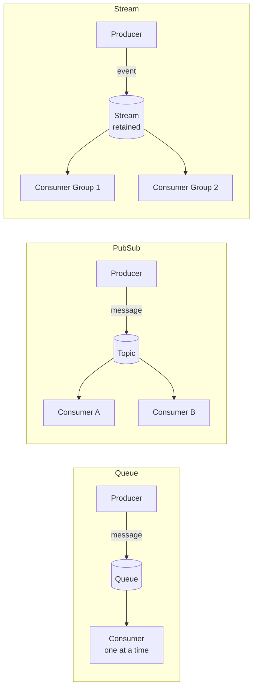
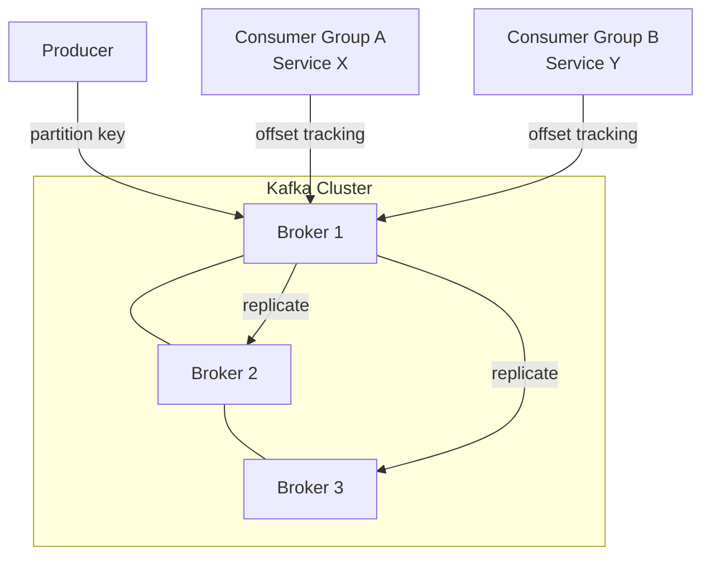
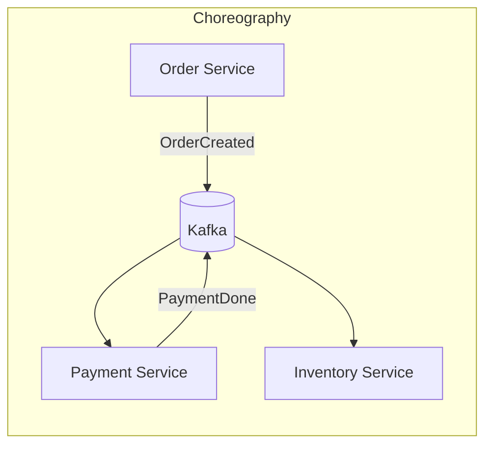
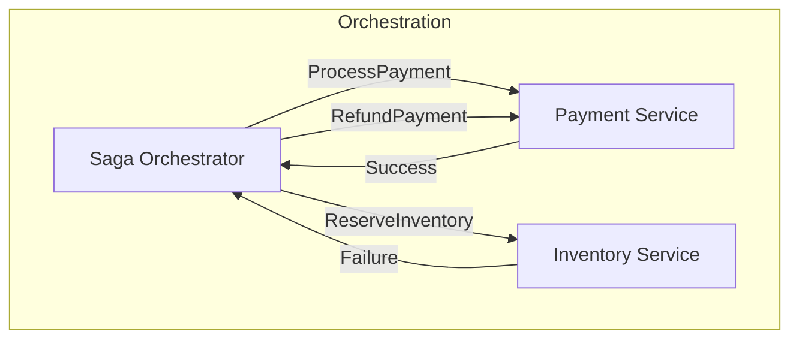
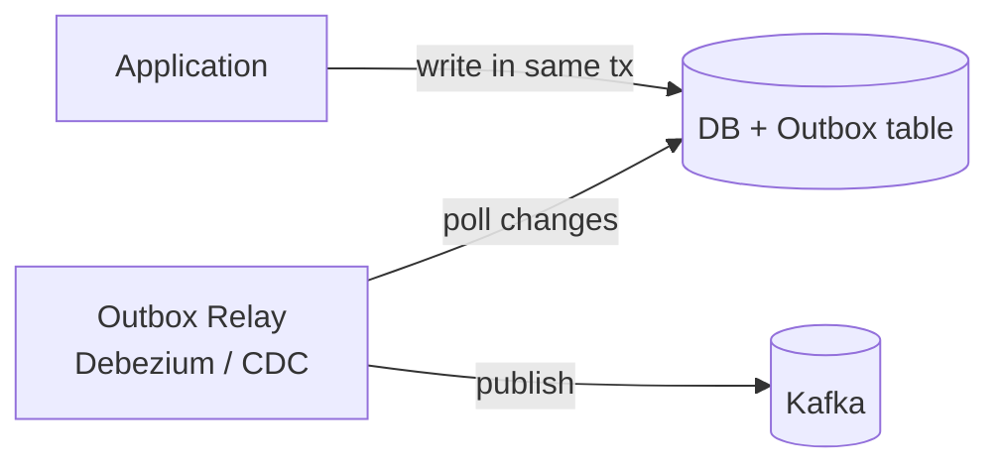

# Messaging & Event-Driven Architecture

## Table of Contents
1. [Core Concepts](#core-concepts)
2. [Message Queues vs Event Brokers](#message-queues-vs-event-brokers)
3. [Kafka Deep Dive](#kafka-deep-dive)
4. [Delivery Guarantees & Idempotency](#delivery-guarantees--idempotency)
5. [Event-Driven Patterns](#event-driven-patterns)
6. [EDA Design Principles](#eda-design-principles)

---

## Core Concepts

### Commands vs Events

| | Command | Event |
|---|---|---|
| Meaning | "Do this" — directive | "This happened" — fact |
| Direction | Targeted (one receiver) | Broadcast (any consumer) |
| Coupling | Sender knows receiver | Sender doesn't know consumers |
| Example | `ProcessPayment` | `PaymentProcessed` |

### Queues vs Streams vs Pub/Sub



- **Queue** — point-to-point, consumed once (RabbitMQ, SQS)
- **Pub/Sub** — fan-out to all subscribers (SNS, Redis Pub/Sub)
- **Stream** — ordered, retained log; consumers replay at any offset (Kafka)

---

## Message Queues vs Event Brokers

| | RabbitMQ / SQS | Kafka |
|---|---|---|
| Storage | Deleted after consumption | Retained (configurable days/forever) |
| Replay | Not possible | Yes — seek to any offset |
| Ordering | Per queue | Per partition |
| Throughput | Thousands/sec | Millions/sec |
| Use case | Task queues, RPC | Event streaming, audit, analytics |

---

## Kafka Deep Dive



**Key concepts:**
- **Topic** — logical channel; split into **partitions** for parallelism
- **Partition** — ordered, immutable log; one consumer per partition per group
- **Consumer Group** — each group gets a full copy; within a group, partitions are distributed across consumers
- **Offset** — position in a partition; consumer controls when to commit

```java
// Spring Kafka consumer
@KafkaListener(topics = "orders", groupId = "order-processor")
public void consume(ConsumerRecord<String, OrderEvent> record) {
    OrderEvent event = record.value();
    orderService.process(event);
    // Offset committed after successful processing (manual ack preferred)
}
```

**Kafka guarantees ordering only within a partition.** Use the same partition key (e.g., `orderId`) to ensure all events for the same order are processed in order.

---

## Delivery Guarantees & Idempotency

| Guarantee | Description | Risk |
|---|---|---|
| At-most-once | Commit before process | Message loss |
| At-least-once | Commit after process | Duplicates |
| Exactly-once | Transactional (Kafka 0.11+) | Complexity |

**At-least-once is the standard.** Make consumers **idempotent** to handle duplicates safely.

```java
// Idempotent consumer — check if already processed
public void processPayment(PaymentEvent event) {
    if (processedEvents.contains(event.getId())) return; // already handled
    
    paymentService.execute(event);
    processedEvents.add(event.getId()); // mark as done
}

// Or: use DB UPSERT with unique constraint on eventId
INSERT INTO payments (event_id, ...) VALUES (?, ...)
ON CONFLICT (event_id) DO NOTHING;
```

---

## Event-Driven Patterns

### Choreography vs Orchestration





| | Choreography | Orchestration |
|---|---|---|
| Coupling | Loose | Centralized |
| Visibility | Hard to follow | Easy to trace |
| Failure handling | Compensating events | Orchestrator manages |
| Use when | Simple, few services | Complex workflows |

### Outbox Pattern

Prevents the dual-write problem (DB update + message publish in two separate operations that can fail independently).



Write to the DB and the **outbox table** in the same transaction. A relay process publishes outbox rows to Kafka. Guarantees the message is published if and only if the DB commit succeeds.

### Claim Check Pattern

For large payloads: store in S3/blob storage, put only a reference in the event.

```json
{ "eventType": "DocumentUploaded", "documentRef": "s3://bucket/file.pdf" }
```

### Content-Based Router

Route events to different consumers based on their content.

```java
@KafkaListener(topics = "orders")
public void route(OrderEvent event) {
    if (event.getType() == INTERNATIONAL) internationalHandler.handle(event);
    else domesticHandler.handle(event);
}
```

---

## EDA Design Principles

**1. Events are facts, not commands.** Name them in past tense: `OrderShipped`, not `ShipOrder`.

**2. Events should be self-contained.** Include enough data so consumers don't need to call back.

**3. Avoid exposing too much.** Internal implementation details shouldn't leak into public events.

**4. Design for schema evolution.** Use backward-compatible changes (add fields, never remove/rename). Use Avro + Schema Registry for enforcement.

**5. Governance matters.** Undocumented events become a maintenance nightmare. Document your event contracts (EventCatalog, AsyncAPI).

**6. Coupling spectrum.** EDA reduces temporal coupling but can introduce schema coupling. Be intentional about public vs internal events.
