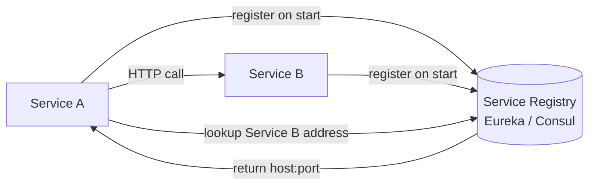
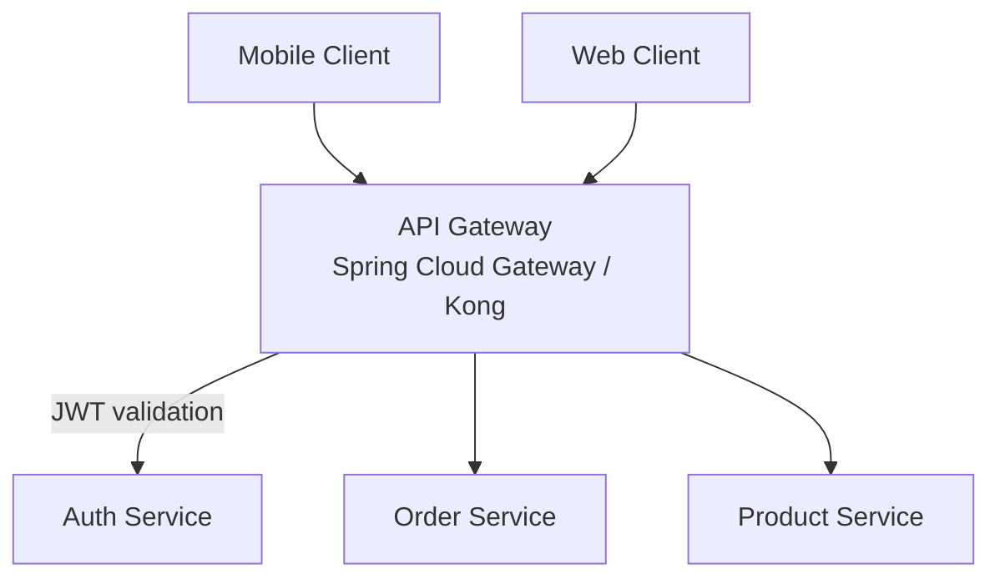
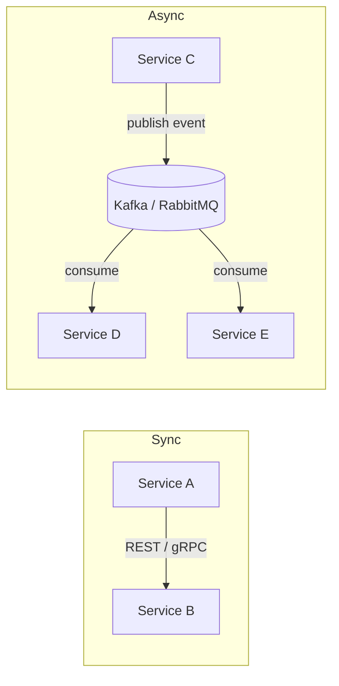
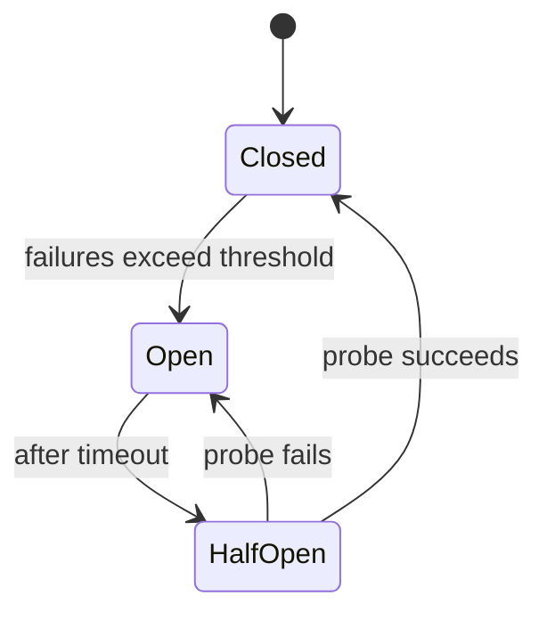
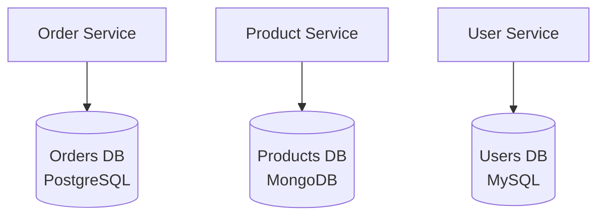
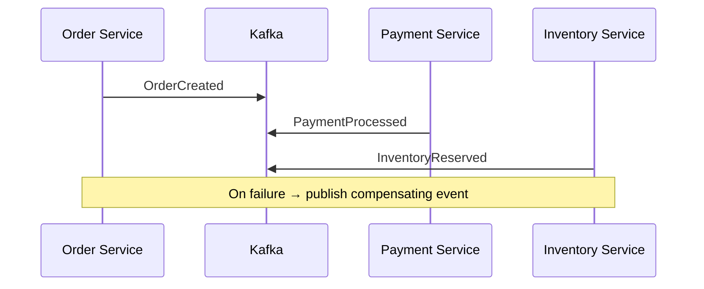
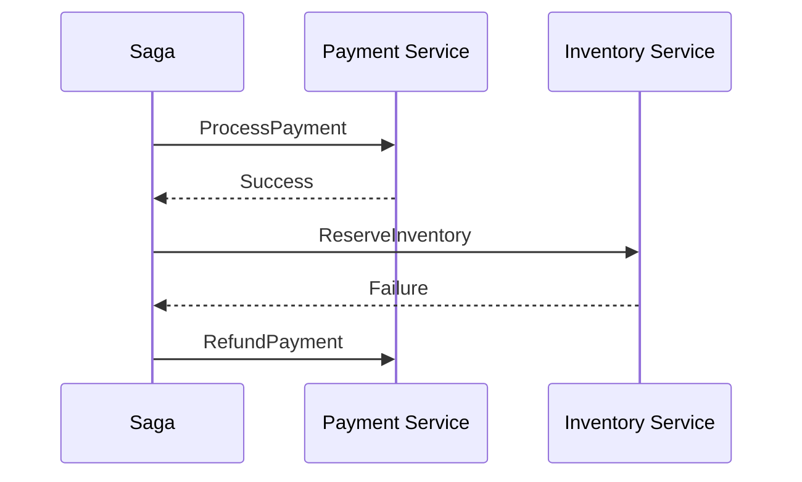
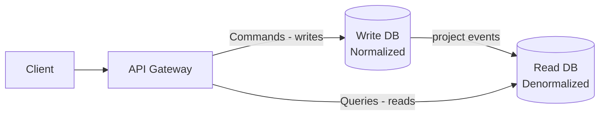

# Microservices Architecture & Patterns

## Table of Contents
1. [Advantages of Microservices](#advantages-of-microservices)
2. [Service Discovery](#service-discovery)
3. [API Gateway](#api-gateway)
4. [Auto-scaling & Traffic Routing](#auto-scaling--traffic-routing)
5. [Communication Patterns](#communication-patterns)
6. [Resilience Patterns](#resilience-patterns)
7. [Data Patterns](#data-patterns)
8. [Saga Pattern](#saga-pattern)
9. [CQRS & Event Sourcing](#cqrs--event-sourcing)

---

## Advantages of Microservices

| Advantage | Why it matters |
|---|---|
| Independent deployment | Ship faster; one team doesn't block another |
| Isolated failures | One service crash doesn't take down the system |
| Independent scaling | Scale only what's under load |
| Technology flexibility | Choose the best tool per service |
| Small, focused teams | Conway's Law alignment |

**Trade-offs:** distributed system complexity, network latency, eventual consistency, operational overhead.

---

## Service Discovery

Services need to find each other without hardcoded IPs.



**Two models:**

**Client-side discovery** (Netflix Eureka): the client queries the registry and picks an instance (load balancing in the client).

**Server-side discovery** (AWS ALB, Consul + Envoy): the load balancer queries the registry; client just calls a stable endpoint.

```yaml
# Spring Boot — application.yml
eureka:
  client:
    service-url:
      defaultZone: http://eureka-server:8761/eureka/
spring:
  application:
    name: order-service
```

---

## API Gateway

The API Gateway is the **single entry point** for all client traffic.



**Responsibilities:** routing, authentication, rate limiting, SSL termination, request aggregation.

### How does the Gateway detect a new microservice instance automatically?

When a new instance of `order-service` starts:
1. It registers itself in **Eureka** with its `host:port`
2. The gateway refreshes its route table from the registry periodically
3. Incoming requests to `/orders/**` are load-balanced across **all registered instances**
4. No client-side change needed

```yaml
spring:
  cloud:
    gateway:
      discovery:
        locator:
          enabled: true
          lower-case-service-id: true
```

---

## Communication Patterns



| | REST | gRPC | Async (Kafka) |
|---|---|---|---|
| Coupling | Temporal | Temporal | Decoupled |
| Latency | ~ms | < REST | Higher (eventual) |
| Use case | Public APIs | Internal high-throughput | Event-driven, fan-out |

**Rule:** sync for user-facing reads; async for state-changing operations that don't need an immediate response.

---

## Resilience Patterns

### Circuit Breaker

Prevents cascading failures by "opening" the circuit after repeated failures.



```java
@CircuitBreaker(name = "inventory", fallbackMethod = "fallback")
public Product getProduct(Long id) {
    return inventoryClient.findById(id);
}

public Product fallback(Long id, Throwable t) {
    return Product.unknown(id);
}
```

---

## Data Patterns

### Database per Service

Each service owns its data. No direct DB cross-access.



Cross-service queries use **API composition** or **CQRS read models**.

---

## Saga Pattern

Coordinates distributed transactions without a 2-phase commit lock.

### Choreography (event-driven, no central coordinator)



### Orchestration (central saga controller)



**Choose orchestration** when the workflow is complex and you need one place to observe and debug.

---

## CQRS & Event Sourcing

### CQRS — Command Query Responsibility Segregation

Separate the **write model** from the **read model**.



**Why:** write model can be strongly consistent; read model shaped for query patterns.

### Event Sourcing

Store every state change as an **immutable event**.

```
Events: OrderCreated → PaymentReceived → ItemShipped → OrderCompleted
Current state = replay all events
```

**Benefits:** full audit log, time-travel debugging, any read model can be rebuilt.  
**Cost:** query complexity, event schema evolution overhead.
