# Microservices Architecture & Patterns

## Table of Contents
1. [Advantages of Microservices](#advantages-of-microservices)
2. [Service Discovery](#service-discovery)
3. [API Gateway](#api-gateway)
4. [Auto-scaling & New Instance Detection](#auto-scaling--new-instance-detection)
5. [Communication Patterns](#communication-patterns)
6. [Resilience Patterns](#resilience-patterns)
7. [Data Management](#data-management)
8. [Saga Pattern](#saga-pattern)
9. [CQRS & Event Sourcing](#cqrs--event-sourcing)
10. [Distributed Tracing & Observability](#distributed-tracing--observability)
11. [Security in Microservices](#security-in-microservices)

---

## Advantages of Microservices

Microservices decompose a large system into small, independently deployable services — each owning its domain, its data, and its deployment pipeline. The main gains are organizational as much as technical: Conway's Law states that systems mirror the communication structure of the teams that build them. Small teams with clear boundaries ship faster. But microservices are not a silver bullet — they introduce distributed systems complexity (network failures, eventual consistency, distributed tracing) that a monolith simply doesn't have. Choose them when the team and operational maturity justify it.

| Advantage | Detail |
|---|---|
| Independent deployment | Each service has its own CI/CD. Ship `OrderService` without touching `UserService`. |
| Independent scaling | Scale only what's under load. `PaymentService` under Black Friday, not everything. |
| Fault isolation | `InventoryService` crash doesn't take down `OrderService` (with circuit breakers). |
| Technology diversity | Python ML service, Java backend, Node.js BFF — choose the right tool per domain. |
| Team autonomy | Conway's Law: org structure → system architecture. One team, one service, one domain. |
| Smaller codebases | Easier to understand, test, and onboard new devs. |

**Trade-offs (be ready to discuss):**
- Distributed systems complexity (network latency, partial failures)
- Eventual consistency — no simple ACID across services
- Operational overhead — N services = N deployments, N log streams, N dashboards
- Data duplication — no foreign keys across service boundaries
- Testing complexity — integration tests are hard

**When NOT to use microservices:** small teams, MVP, tight data consistency needs, limited DevOps maturity.

---

## Service Discovery

In a dynamic environment (containers starting and stopping, auto-scaling, rolling deployments), IP addresses and ports change constantly. Service discovery solves this by having each service register itself with a registry on startup and deregister on shutdown. The caller queries the registry for current instances instead of a hardcoded IP. *Client-side* discovery (Eureka + Ribbon/Spring Cloud LoadBalancer) puts the routing logic in the client; *server-side* discovery (AWS ALB, Kubernetes Service) puts it in the infrastructure.

Without service discovery, services hardcode each other's IPs — brittle and unmanageable.

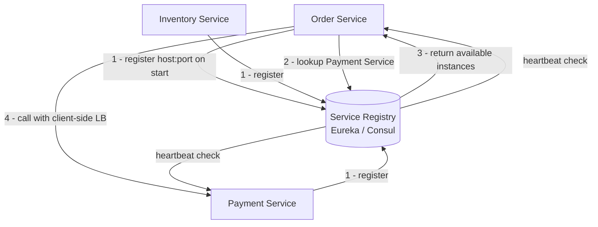

### Client-Side Discovery (Netflix Eureka)
```java
// application.yml — register with Eureka
eureka:
  client:
    service-url:
      defaultZone: http://eureka-server:8761/eureka/
  instance:
    prefer-ip-address: true
    lease-renewal-interval-in-seconds: 10
    lease-expiration-duration-in-seconds: 30
spring:
  application:
    name: order-service  # service ID in registry

// Caller uses service name, Spring Cloud LB resolves
@LoadBalanced  // adds RestTemplate interceptor for client-side LB
@Bean
RestTemplate restTemplate() { return new RestTemplate(); }

// Usage
restTemplate.getForObject("http://payment-service/api/payments", PaymentDto.class);
```

### Server-Side Discovery (AWS ALB + ECS, Consul + Envoy)
Client calls stable DNS name → Load Balancer queries registry → routes to healthy instance. Client knows nothing about instances.

**Health checks:** each service exposes `/actuator/health`. Registry removes unhealthy instances automatically.

---

## API Gateway

An API Gateway solves the problem of exposing many internal services to external clients. Without it, clients must know the address of every service, handle auth for each, and deal with CORS from multiple origins. The gateway centralizes cross-cutting concerns: authentication/authorization (validate JWT once, forward user context downstream), rate limiting, request routing, SSL termination, request/response transformation, and observability. It's the boundary between the public internet and the internal service mesh.

The API Gateway is the **single entry point** for all external traffic.

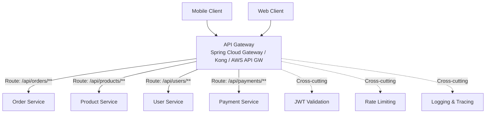

**Responsibilities:**
- **Routing** — path-based routing to backend services
- **Authentication** — validate JWT/API keys before forwarding
- **Rate limiting** — protect backends from abuse
- **SSL termination** — one certificate to manage at the edge
- **Request/response transformation** — header manipulation, response aggregation
- **Circuit breaking** — don't forward to unhealthy backends
- **Observability** — centralized access logs, distributed trace injection

```yaml
# Spring Cloud Gateway configuration
spring:
  cloud:
    gateway:
      routes:
        - id: order-service
          uri: lb://order-service          # lb:// = load-balanced via Eureka
          predicates:
            - Path=/api/orders/**
          filters:
            - StripPrefix=0
            - name: RequestRateLimiter
              args:
                redis-rate-limiter.replenishRate: 100
                redis-rate-limiter.burstCapacity: 200

      # Auth filter applied globally
      default-filters:
        - TokenRelay=              # forward JWT downstream
        - name: CircuitBreaker
          args:
            name: myCircuitBreaker
            fallbackUri: forward:/fallback
```

---

## Auto-scaling & New Instance Detection

Auto-scaling is what makes microservices truly elastic. When traffic spikes, the orchestration platform (Kubernetes HPA or AWS Auto Scaling) creates new instances — but those instances are worthless unless traffic actually reaches them. The mechanism that makes this seamless is the combination of service registration (the new instance announces itself), health checking (the registry validates it's ready), and cache refresh (the gateway or load balancer picks it up within seconds). Understanding this flow is critical for designing zero-downtime deployments.

**Question: "5 microservices running. We deploy one more instance of `order-service`. How does the system detect it and route traffic without client-side changes?"**

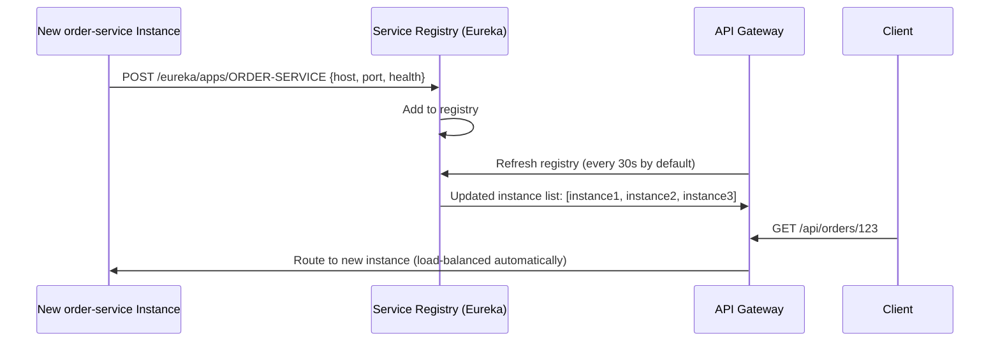

**Step by step:**
1. New instance starts → registers with Eureka (`spring.application.name: order-service`)
2. Sends heartbeat every 10s (configurable)
3. API Gateway periodically refreshes its local cache of instances from Eureka (every 30s)
4. Spring Cloud LoadBalancer distributes requests across all healthy instances
5. Client calls same URL — completely unaware of new instance
6. If new instance fails health check → Eureka removes it → Gateway stops routing to it

**With Spring Cloud Gateway + Discovery Locator:**
```yaml
spring:
  cloud:
    gateway:
      discovery:
        locator:
          enabled: true                   # auto-creates routes for all Eureka services
          lower-case-service-id: true     # /order-service/** routes auto-created
```
Zero manual configuration needed for new services.

---

## Communication Patterns

Choosing the right communication pattern is one of the most consequential microservices decisions. Synchronous patterns (REST, gRPC) are simple and give immediate feedback, but create **temporal coupling** — both services must be up simultaneously. Asynchronous patterns (Kafka, SQS) decouple services in time but introduce eventual consistency and require more careful error handling. A pragmatic rule: use synchronous for read queries and user-facing operations where you need an immediate response; use async messaging for state-changing events that can be processed independently.

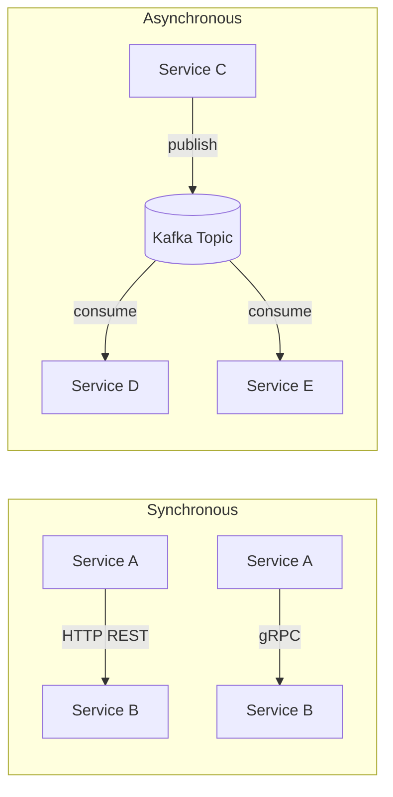

| | REST | gRPC | Kafka |
|---|---|---|---|
| Protocol | HTTP/1.1 or HTTP/2 | HTTP/2 + Protobuf | TCP (own protocol) |
| Coupling | Temporal | Temporal | Decoupled |
| Latency | Medium | Low (~3× faster than REST) | Higher (eventual) |
| Schema | OpenAPI (optional) | `.proto` (enforced) | Avro/JSON Schema Registry |
| Streaming | Limited (SSE/WebSocket) | Native bidirectional | Replayed, retained |
| Use case | Public APIs, CRUD | Internal, high-throughput | Events, fan-out, audit |

**Feign Client (declarative REST):**
```java
@FeignClient(name = "payment-service", fallback = PaymentFallback.class)
public interface PaymentClient {
    @PostMapping("/api/payments")
    PaymentResponse charge(@RequestBody PaymentRequest request);
}

@Component
class PaymentFallback implements PaymentClient {
    @Override
    public PaymentResponse charge(PaymentRequest request) {
        return PaymentResponse.pending("Payment service unavailable");
    }
}
```

---

## Resilience Patterns

In microservices, one slow or failing service can exhaust the thread pool of its callers — triggering a cascade failure that brings down the entire system. Resilience patterns break this cascade. The Circuit Breaker detects repeated failures and "trips open" — immediately rejecting calls with a fallback instead of queuing up slow requests. Bulkhead isolates dependencies into separate thread pools. Retry with jitter handles transient failures. Together, they implement the key principle: *fail fast and degrade gracefully*.

### Circuit Breaker

Prevents cascade failures by stopping calls to a failing service. The state machine has three states: **Closed** (normal operation, calls pass through), **Open** (calls fail immediately with fallback — no load on the downstream service), and **Half-Open** (probe requests to test if downstream recovered).

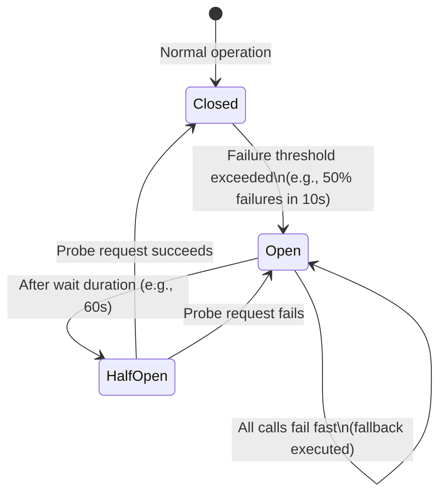

```java
// application.yml (Resilience4j)
resilience4j:
  circuitbreaker:
    instances:
      payment-service:
        sliding-window-size: 10
        minimum-number-of-calls: 5
        failure-rate-threshold: 50
        wait-duration-in-open-state: 60s
        permitted-number-of-calls-in-half-open-state: 3

// Usage
@CircuitBreaker(name = "payment-service", fallbackMethod = "paymentFallback")
@Retry(name = "payment-service", fallbackMethod = "paymentFallback")
@TimeLimiter(name = "payment-service")
public CompletableFuture<PaymentResponse> charge(PaymentRequest request) {
    return CompletableFuture.supplyAsync(() -> paymentClient.charge(request));
}

private CompletableFuture<PaymentResponse> paymentFallback(PaymentRequest req, Throwable t) {
    log.warn("Payment service unavailable, using fallback", t);
    return CompletableFuture.completedFuture(PaymentResponse.queued());
}
```

### Bulkhead

Isolate failures by limiting concurrent calls per dependency.
```java
@Bulkhead(name = "payment-service", type = Bulkhead.Type.THREADPOOL)
public CompletableFuture<PaymentResponse> charge(PaymentRequest req) { ... }
```

### Retry with Exponential Backoff + Jitter
```java
@Retry(name = "external-api")
// application.yml:
# max-attempts: 3
# wait-duration: 500ms
# exponential-backoff-multiplier: 2   → waits 500ms, 1000ms, 2000ms
# randomized-wait-factor: 0.5         → adds jitter (prevents thundering herd)
```

### Timeout
Always set timeouts. A service waiting forever degrades the whole system.
```java
// Feign client timeout
feign:
  client:
    config:
      payment-service:
        connect-timeout: 1000
        read-timeout: 5000
```

---

## Data Management

The "database per service" rule is the heart of microservices data independence. If two services share a database, they implicitly share their deployment — a schema change in one service can break the other, and you can't independently scale or evolve them. The trade-off is that cross-service queries become expensive (API composition) and you lose ACID transactions across service boundaries (requiring Saga). Embrace denormalization: it's acceptable, even necessary, to store the same field in multiple services' databases.

### Database per Service

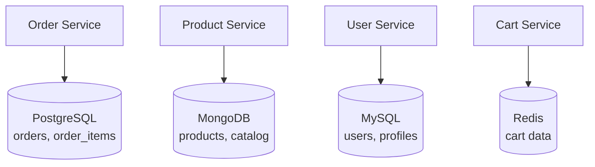

**Why separate DBs:**
- Services evolve their schema independently
- Technology choice per use case
- No coupling through shared tables
- Independent scaling (PostgreSQL vs Redis vs Mongo)

**Consequences:**
- No foreign keys across services — reference by ID only
- Cross-service queries require API calls or denormalized read models
- Distributed transactions require Saga (no ACID)

### API Composition for Cross-Service Queries
```java
@Service
public class OrderDashboardService {
    public OrderDashboard getDashboard(Long orderId) {
        // Parallel calls to 3 services
        CompletableFuture<Order> orderFuture = supplyAsync(() -> orderClient.getOrder(orderId));
        CompletableFuture<Customer> custFuture = supplyAsync(() -> customerClient.getCustomer(orderId));
        CompletableFuture<Payment> payFuture = supplyAsync(() -> paymentClient.getPayment(orderId));

        return CompletableFuture.allOf(orderFuture, custFuture, payFuture)
            .thenApply(v -> new OrderDashboard(orderFuture.join(), custFuture.join(), payFuture.join()))
            .join();
    }
}
```

---

## Saga Pattern

When a business operation spans multiple services (e.g., placing an order involves payment, inventory, and shipping), you can't use a single ACID transaction — each service owns its own database. The Saga pattern solves this by decomposing the operation into a sequence of local transactions, each publishing an event or sending a command. If any step fails, compensating transactions undo the previous steps. **Choreography** distributes the logic across services via events; **orchestration** centralizes it in a coordinator. Both have trade-offs in visibility and coupling.

Manages distributed transactions across multiple services **without a 2-phase commit lock**.

Each step has a **compensating transaction** (the "undo" operation).

### Choreography (event-driven, decentralized)

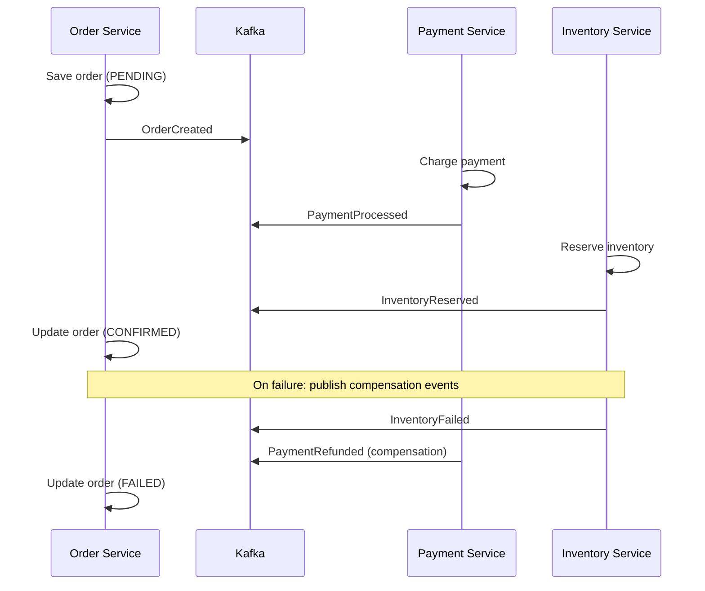

### Orchestration (centralized coordinator)

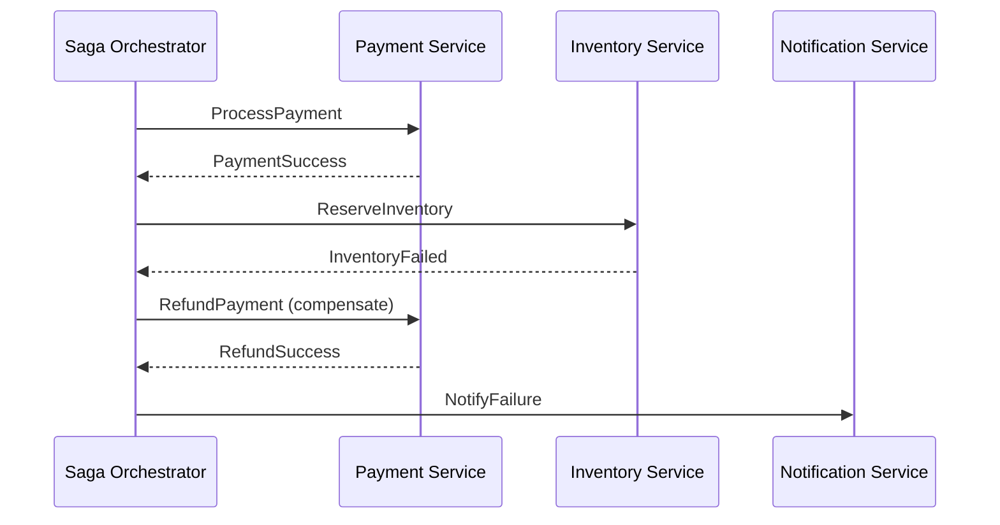

**Choreography vs Orchestration:**
| | Choreography | Orchestration |
|---|---|---|
| Coupling | Loose — services react to events | Central coordinator |
| Visibility | Hard — flow distributed across services | Easy — single place to debug |
| Complexity | Each service must know compensations | Orchestrator manages complexity |
| Use when | Simple flows, few services | Complex workflows, many steps |

---

## CQRS & Event Sourcing

CQRS recognizes that read and write workloads have fundamentally different characteristics. Writes need strong consistency, validation, and transactional integrity. Reads need fast, flexible queries — often joins across multiple entities. By separating them into distinct models (and optionally distinct services and databases), each can be optimized independently. Event Sourcing takes this further: instead of storing the *current state*, you store the full *history of events*. State becomes a projection — a view derived by replaying events. This gives you a complete audit log, time-travel queries, and the ability to build new read models retroactively.

### CQRS — Command Query Responsibility Segregation

Separate the **write model** (commands) from the **read model** (queries). Different optimizations for each.

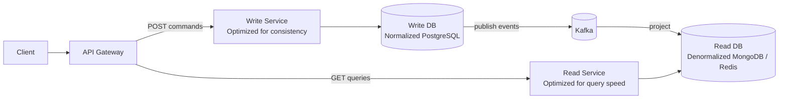

**Why:** write model needs strong consistency + validation. Read model needs fast queries for complex joins. They can even be different services with different databases.

### Event Sourcing

Instead of storing current state, store the **full history of events**. State = replay of all events.

```
Events stored:
1. AccountOpened {id: 42, owner: "Alice"}
2. MoneyDeposited {id: 42, amount: 1000}
3. MoneyWithdrawn {id: 42, amount: 200}
4. MoneyDeposited {id: 42, amount: 500}

Current state = replay → balance: 1300
```

```java
// Event store
public class BankAccount {
    private final List<DomainEvent> changes = new ArrayList<>();
    private BigDecimal balance = BigDecimal.ZERO;

    public void deposit(BigDecimal amount) {
        apply(new MoneyDeposited(id, amount)); // apply event
    }

    private void apply(MoneyDeposited event) {
        this.balance = this.balance.add(event.getAmount());
        this.changes.add(event); // store event
    }
}
```

**Benefits:** full audit log, time-travel (reconstruct state at any point), multiple read models from same event stream.  
**Costs:** complexity, eventual consistency, event schema evolution.

---

## Distributed Tracing & Observability

In a microservices system, a single user request may touch 10 services. When something goes wrong — high latency, an error, a partial failure — you need to trace the full request journey across all services. This is the problem distributed tracing solves. A `traceId` is generated at the entry point (API Gateway) and propagated through every service via HTTP headers or Kafka message headers. Each service creates a `span` — a timed unit of work — and reports it to a trace aggregator (Jaeger, Zipkin). Combined with structured logs and Prometheus metrics, the three pillars give you full observability.

**Three pillars:**
- **Metrics** — aggregated numbers (Prometheus + Grafana)
- **Logs** — timestamped events (ELK stack, CloudWatch)
- **Traces** — full request journey across services (Jaeger, Zipkin, AWS X-Ray)

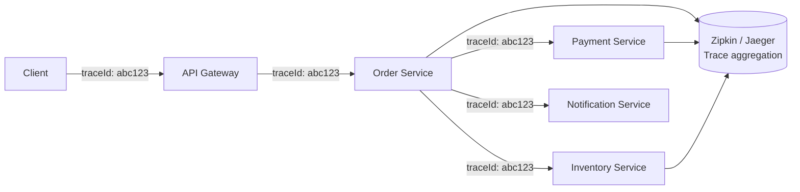

```yaml
# application.yml — Micrometer + Zipkin
management:
  tracing:
    sampling:
      probability: 1.0    # 100% in dev, 10% in prod
  zipkin:
    tracing:
      endpoint: http://zipkin:9411/api/v2/spans
```

**Key metrics to monitor:** request rate, error rate, latency percentiles (p50/p95/p99), saturation (queue depth, CPU), resource utilization.

**Structured logging:**
```java
log.info("Order created",
    StructuredArguments.kv("orderId", order.getId()),
    StructuredArguments.kv("customerId", order.getCustomerId()),
    StructuredArguments.kv("total", order.getTotal()));
// JSON output: {"level":"INFO","orderId":42,"customerId":7,"total":"150.00",...}
```

---

## Security in Microservices

Security in microservices is layered: the API Gateway is the public boundary that handles TLS termination, JWT validation, and rate limiting. Inside the cluster, services communicate over a private network — but you still need service-to-service authentication (mTLS, handled by a service mesh like Istio) to prevent a compromised internal service from calling others freely. At the application layer, `@PreAuthorize` scopes permissions to the operation. Secrets (DB passwords, API keys) must never be in code or ConfigMaps — use a secrets manager and rotate regularly.

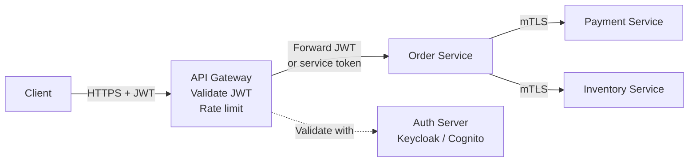

**Layers:**
1. **Edge (API Gateway):** TLS termination, JWT validation, rate limiting, WAF
2. **Service-to-service (internal):** mTLS (mutual TLS) or service mesh (Istio)
3. **Application:** `@PreAuthorize` + scope validation
4. **Data:** field-level encryption for sensitive data (PII, PAN)

**Secrets management:** never hardcode. Use AWS Secrets Manager, HashiCorp Vault, or Kubernetes Secrets. Rotate regularly.
