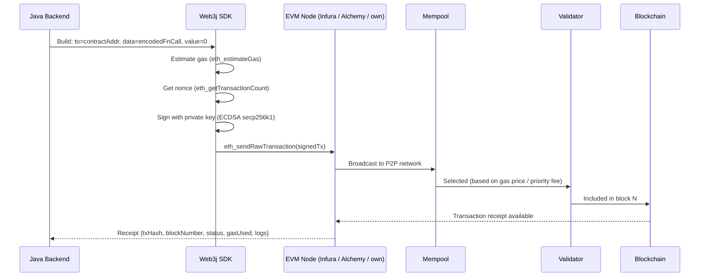
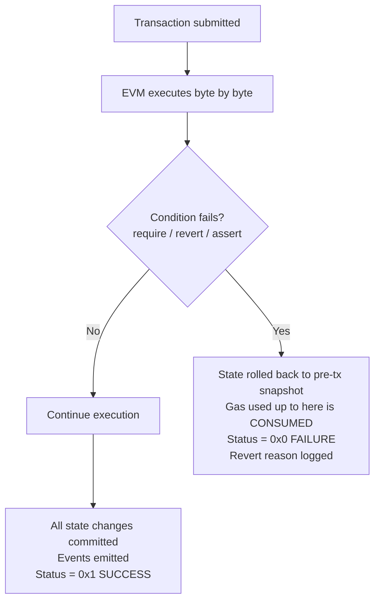
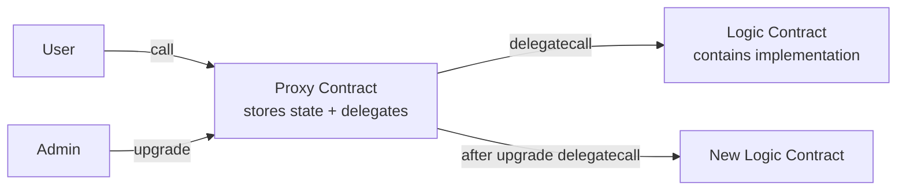

# Solidity & Blockchain

## Table of Contents
1. [Ethereum & Smart Contracts](#ethereum--smart-contracts)
2. [EVM Transaction Lifecycle E2E](#evm-transaction-lifecycle-e2e)
3. [Transaction Revert — What Happens?](#transaction-revert--what-happens)
4. [Testing API Integration with Smart Contracts](#testing-api-integration-with-smart-contracts)
5. [Solidity Language Fundamentals](#solidity-language-fundamentals)
6. [Data Types & Storage](#data-types--storage)
7. [Functions, Visibility & Modifiers](#functions-visibility--modifiers)
8. [Gas & Optimization](#gas--optimization)
9. [Security Patterns & Common Attacks](#security-patterns--common-attacks)
10. [Events & Logging](#events--logging)
11. [Contract Interactions & Interfaces](#contract-interactions--interfaces)
12. [Upgradeability Patterns](#upgradeability-patterns)

---

## Ethereum & Smart Contracts

### What is a Smart Contract?

A smart contract is **immutable, self-executing code** deployed to the blockchain. Once deployed:
- **Code cannot change** — bugs cannot be patched after deployment
- **State can change** — data stored in contract can be modified via function calls
- **Anyone can call** — permissionless (access control must be built into code)
- **Deterministic** — same input always gives same output across all nodes
- **Trustless** — rules enforced by code, not a third party

```solidity
// SPDX-License-Identifier: MIT
pragma solidity ^0.8.20;

contract Token {
    mapping(address => uint256) public balances;
    uint256 public totalSupply;

    constructor(uint256 _supply) {
        totalSupply = _supply;
        balances[msg.sender] = _supply;
    }

    function transfer(address to, uint256 amount) external returns (bool) {
        require(balances[msg.sender] >= amount, "Insufficient balance");
        balances[msg.sender] -= amount;
        balances[to] += amount;
        return true;
    }
}
```

### EVM (Ethereum Virtual Machine)

The EVM is a sandboxed, quasi-Turing-complete stack-based VM that executes smart contract bytecode. Every EVM node runs the same computation and must agree on the result (consensus).

**Key global variables:**
| Variable | Type | Meaning |
|---|---|---|
| `msg.sender` | `address` | Address calling the current function |
| `msg.value` | `uint256` | ETH (in wei) sent with the call |
| `msg.data` | `bytes` | Complete calldata |
| `block.timestamp` | `uint256` | Current block timestamp (can be manipulated by miner ±15s) |
| `block.number` | `uint256` | Current block number |
| `tx.origin` | `address` | Original transaction initiator (never use for auth — phishing risk) |

---

## EVM Transaction Lifecycle E2E

**How to manage a transaction end-to-end on EVM Blockchain:**



### Java / Web3j Implementation

```java
// 1. Connect to node
Web3j web3 = Web3j.build(new HttpService(System.getenv("RPC_URL")));

// 2. Load credentials (NEVER hardcode private keys)
Credentials credentials = Credentials.create(System.getenv("WALLET_PK"));
// In production: use KMS / HSM. AWS KMS example:
// Credentials credentials = KMSSigner.fromKeyId(kmsKeyId, kmsClient);

// 3. Load contract (generated from ABI via Web3j codegen)
MyContract contract = MyContract.load(
    contractAddress,
    web3,
    credentials,
    new DefaultGasProvider()
);

// 4. Call state-changing function (sends transaction)
try {
    TransactionReceipt receipt = contract.transfer(recipientAddress, amount).send();

    // 5. Validate receipt
    if (!receipt.isStatusOK()) {
        String reason = receipt.getRevertReason();
        throw new BlockchainTransactionException("Reverted: " + reason);
    }

    // 6. Parse events from logs
    List<MyContract.TransferEventResponse> events = contract.getTransferEvents(receipt);
    events.forEach(e -> log.info("Transfer: {} -> {} : {}", e.from, e.to, e.amount));

    log.info("Tx: {} | Block: {} | Gas used: {}",
        receipt.getTransactionHash(),
        receipt.getBlockNumber(),
        receipt.getGasUsed());

} catch (TransactionException e) {
    log.error("Transaction failed: {}", e.getMessage());
    throw new BlockchainException(e);
}
```

### Nonce Management

Each account has a nonce (transaction sequence counter). Transactions must be sequential.

```java
// Get current nonce
BigInteger nonce = web3.ethGetTransactionCount(
    credentials.getAddress(),
    DefaultBlockParameterName.PENDING  // use PENDING to account for in-flight txs
).send().getTransactionCount();

// For concurrent transactions: use a nonce manager
NonceManager nonceManager = new ContractGasProvider.NonceManager(web3, credentials.getAddress());
// Increment atomically before each tx; retry on nonce collision (error code -32000)
```

### Gas Management

```java
// Estimate gas before sending
EthEstimateGas estimate = web3.ethEstimateGas(
    Transaction.createFunctionCallTransaction(
        credentials.getAddress(), null, null, null, contractAddress, encodedFunction
    )
).send();

BigInteger gasLimit = estimate.getAmountUsed()
    .multiply(BigInteger.valueOf(120))
    .divide(BigInteger.valueOf(100)); // +20% buffer for safety

// EIP-1559 gas pricing (London fork)
BigInteger maxPriorityFeePerGas = web3.ethMaxPriorityFeePerGas().send().getMaxPriorityFeePerGas();
BigInteger baseFee = web3.ethGetBlockByNumber(LATEST, false).send().getBlock().getBaseFeePerGas();
BigInteger maxFeePerGas = baseFee.multiply(BigInteger.TWO).add(maxPriorityFeePerGas);
```

### Wait for Confirmation

```java
// Wait for N block confirmations before trusting finality
TransactionReceiptProcessor receiptProcessor = new PollingTransactionReceiptProcessor(
    web3,
    1_000,     // poll every 1 second
    60         // max 60 attempts (60s timeout)
);
TransactionReceipt receipt = receiptProcessor.waitForTransactionReceipt(txHash);

// For high-value transactions, wait for more confirmations
int currentBlock = web3.ethBlockNumber().send().getBlockNumber().intValue();
int txBlock = receipt.getBlockNumber().intValue();
while (currentBlock - txBlock < requiredConfirmations) {
    Thread.sleep(12_000); // Ethereum avg block time ~12s
    currentBlock = web3.ethBlockNumber().send().getBlockNumber().intValue();
}
```

---

## Transaction Revert — What Happens?

When a transaction reverts:
- **All state changes are rolled back** — as if the transaction never happened
- **The transaction is still included in the block** — it's a permanent record
- **Gas consumed is NOT refunded** — validator gets paid for the computation up to the revert point
- **Receipt status = 0** (failure) vs 1 (success)
- **Remaining gas (after revert) IS refunded** to the sender



### require vs revert vs assert

```solidity
// require: input validation, expected business rule violation
// Refunds remaining gas. Use for recoverable conditions.
require(balance >= amount, "Insufficient balance");         // string message
require(balance >= amount, Errors.INSUFFICIENT_BALANCE);   // custom error (cheaper)

// Custom errors (Solidity 0.8.4+) — preferred, ~50% cheaper in gas
error InsufficientBalance(uint256 available, uint256 required);
if (balance < amount) revert InsufficientBalance(balance, amount);

// revert: explicit revert, same gas behavior as require
revert("Something went wrong");
revert CustomError(param1, param2);

// assert: invariant check — should NEVER be false in correct code
// Uses all remaining gas if triggered (indicates a bug)
assert(totalSupply == sumOfBalances); // invariant
```

### Handling Reverts in Java (Web3j)

```java
// Always check receipt status — a confirmed transaction CAN be status=0
TransactionReceipt receipt = contract.doSomething().send();

if (!receipt.isStatusOK()) {
    // Decode revert reason
    String reason = receipt.getRevertReason();          // Web3j decodes if possible
    log.error("Transaction reverted: {}", reason);
    // Parse custom error from receipt data manually if needed
    throw new ContractRevertException(reason);
}

// For view/pure functions (no state change): exception thrown directly
try {
    BigInteger balance = contract.balanceOf(address).send();
} catch (ContractCallException e) {
    // Contract reverted in call context
    log.error("Contract call failed: {}", e.getMessage());
}

// Event-based: check for failure events
List<MyContract.TransferFailedEventResponse> failures = contract.getTransferFailedEvents(receipt);
if (!failures.isEmpty()) {
    handleFailure(failures.get(0));
}
```

### Revert in Batch Transactions (Multicall)
A single failing call in a Multicall reverting cascades to all calls in the batch if not handled carefully. Use `tryAggregate` for partial success.

---

## Testing API Integration with Smart Contracts

### Testing Pyramid for Blockchain

```
        E2E Tests (testnet)
       ─────────────────────
      Integration Tests (local node)
     ───────────────────────────────
    Unit Tests (Foundry/Hardhat)
   ─────────────────────────────────
```

### Strategy 1: Local Node + Testcontainers (Java Integration Tests)

```java
@Testcontainers
@SpringBootTest
class TokenServiceIntegrationTest {

    @Container
    static GenericContainer<?> ganache = new GenericContainer<>("trufflesuite/ganache:v7.9.0")
        .withExposedPorts(8545)
        .withCommand(
            "--deterministic",     // fixed mnemonic → predictable addresses
            "--accounts=10",
            "--chainId=1337"
        );

    private Web3j web3;
    private TokenContract token;
    private Credentials deployer;

    @BeforeEach
    void setUp() throws Exception {
        String rpcUrl = "http://localhost:" + ganache.getMappedPort(8545);
        web3 = Web3j.build(new HttpService(rpcUrl));

        // Ganache deterministic account #0
        deployer = Credentials.create("0x4f3edf983ac636a65a842ce7c78d9aa706d3b113b8a5b29f0a1efad0b5c836f7");

        // Deploy contract fresh for each test
        token = TokenContract.deploy(web3, deployer, new DefaultGasProvider(),
            BigInteger.valueOf(1_000_000L)).send();
    }

    @Test
    void transfer_happyPath_shouldUpdateBalances() throws Exception {
        String recipient = "0xFFcf8FDEE72ac11b5c542428B35EEF5769C409f0";
        BigInteger amount = BigInteger.valueOf(1000);

        TransactionReceipt receipt = token.transfer(recipient, amount).send();

        assertTrue(receipt.isStatusOK(), "Transfer should succeed");
        assertEquals(amount, token.balanceOf(recipient).send());
        assertEquals(BigInteger.valueOf(999_000), token.balanceOf(deployer.getAddress()).send());
    }

    @Test
    void transfer_insufficientBalance_shouldRevert() {
        String recipient = "0xFFcf8FDEE72ac11b5c542428B35EEF5769C409f0";
        BigInteger tooMuch = BigInteger.valueOf(2_000_000); // more than supply

        Exception ex = assertThrows(ContractCallException.class, () ->
            token.transfer(recipient, tooMuch).send()
        );
        assertThat(ex.getMessage()).contains("Insufficient balance");
    }

    @Test
    void transfer_emitsTransferEvent() throws Exception {
        TransactionReceipt receipt = token.transfer(
            "0xFFcf8FDEE72ac11b5c542428B35EEF5769C409f0",
            BigInteger.valueOf(500)
        ).send();

        List<TokenContract.TransferEventResponse> events = token.getTransferEvents(receipt);
        assertThat(events).hasSize(1);
        assertEquals(deployer.getAddress(), events.get(0).from.toLowerCase());
        assertEquals(BigInteger.valueOf(500), events.get(0).amount);
    }

    @AfterEach
    void tearDown() {
        web3.shutdown();
    }
}
```

### Strategy 2: Foundry Unit Tests (Solidity — Fastest)

```solidity
// SPDX-License-Identifier: MIT
pragma solidity ^0.8.20;

import {Test, console} from "forge-std/Test.sol";
import {Token} from "../src/Token.sol";

contract TokenTest is Test {
    Token token;
    address alice = makeAddr("alice");
    address bob   = makeAddr("bob");

    function setUp() public {
        token = new Token(1_000_000);
        // Give alice some tokens
        token.transfer(alice, 10_000);
    }

    function test_Transfer_Success() public {
        vm.prank(alice);  // next call comes from alice
        token.transfer(bob, 1_000);

        assertEq(token.balanceOf(alice), 9_000);
        assertEq(token.balanceOf(bob), 1_000);
    }

    function test_Transfer_RevertOnInsufficientBalance() public {
        vm.prank(alice);
        vm.expectRevert("Insufficient balance");
        token.transfer(bob, 999_999); // more than alice has
    }

    function test_Transfer_EmitsEvent() public {
        vm.prank(alice);
        vm.expectEmit(true, true, false, true);
        emit Token.Transfer(alice, bob, 1_000);
        token.transfer(bob, 1_000);
    }

    // Fuzz testing — Foundry runs with random inputs automatically
    function testFuzz_Transfer_NeverExceedsSupply(uint256 amount) public {
        amount = bound(amount, 0, token.balanceOf(alice));
        vm.prank(alice);
        token.transfer(bob, amount);
        assertLe(token.balanceOf(bob), token.totalSupply());
    }

    // Fork test against real mainnet state
    function test_ForkMainnet() public {
        vm.createSelectFork(vm.envString("MAINNET_RPC_URL"), 18_000_000); // pin block
        address dai = 0x6B175474E89094C44Da98b954EedeAC495271d0F;
        // Test against real deployed DAI
    }
}
```

```bash
forge test -vvv                         # run all tests
forge test --match-test test_Transfer   # specific test
forge coverage                          # code coverage report
forge fuzz --runs 10000                 # more fuzz iterations
```

### Strategy 3: Hardhat + Mainnet Fork (JavaScript/TypeScript)

```typescript
// hardhat.config.ts
networks: {
  hardhat: {
    forking: {
      url: process.env.MAINNET_RPC_URL!,
      blockNumber: 18_000_000   // pin block for deterministic tests
    }
  }
}

// test/Token.test.ts
describe("Token", () => {
  let token: Token;
  let owner: SignerWithAddress;
  let alice: SignerWithAddress;

  beforeEach(async () => {
    [owner, alice] = await ethers.getSigners();
    const TokenFactory = await ethers.getContractFactory("Token");
    token = await TokenFactory.deploy(1_000_000);
    await token.waitForDeployment();
  });

  it("should transfer tokens", async () => {
    await token.transfer(alice.address, 1000);
    expect(await token.balanceOf(alice.address)).to.equal(1000);
  });

  it("should revert on insufficient balance", async () => {
    await expect(token.connect(alice).transfer(owner.address, 999_999))
      .to.be.revertedWith("Insufficient balance");
  });
});
```

### Testing Checklist
- [ ] Happy path: correct state changes + event emission
- [ ] Revert cases: all `require`/`revert` conditions
- [ ] Access control: unauthorized callers revert
- [ ] Edge cases: zero amounts, max values, self-transfers
- [ ] Reentrancy: recursive call attempts
- [ ] Gas usage: track gas costs for optimization
- [ ] Fuzz testing: random inputs find unexpected edge cases

---

## Solidity Language Fundamentals

### Static vs Dynamic Typing
Solidity is **statically typed**. All variable types declared at compile time. The compiler catches type errors before deployment — critical since contracts are immutable post-deploy.

### Data Locations

```solidity
// storage: persisted on-chain. Most expensive (cold read: 2100 gas, warm: 100 gas)
uint256 public counter;                    // storage by default for state vars
mapping(address => uint256) public balances;

// memory: temporary, function scope. Cheap (3 gas/byte)
function process(string memory name) public pure returns (string memory) {
    bytes memory data = abi.encode(name);  // memory
    return string(data);
}

// calldata: read-only, external function params. Cheapest (1 gas/byte)
function bulkTransfer(address[] calldata recipients, uint256[] calldata amounts) external {
    // calldata cannot be modified — that's fine for input params
}

// stack: local value types (uint, bool, bytes32). Free.
uint256 localVar = 42; // on stack
```

### Value vs Reference Types
- **Value types** (stored directly): `uint`, `int`, `bool`, `bytes1`-`bytes32`, `address`, enums
- **Reference types** (pointer, must specify location): arrays, `bytes`, `string`, `mapping`, `struct`

---

## Data Types & Storage

```solidity
// Unsigned integers (0 to 2^N - 1)
uint8 small = 255;        // 0-255
uint256 big = 1e18;       // 0 - 2^256-1 (default uint)

// Signed integers
int256 signed = -100;

// Fixed-point: NOT fully supported — use integers × 1e18 for decimals
uint256 ONE_ETH = 1e18;   // 1 ETH = 10^18 wei

// Address
address owner;                       // 20-byte Ethereum address
address payable recipient;           // can receive ETH
recipient.transfer(1 ether);         // send ETH (2300 gas stipend, reverts on fail)
(bool ok,) = recipient.call{value: 1 ether}(""); // recommended: manual check

// Bytes
bytes32 hash = keccak256(abi.encodePacked(sender, amount, nonce));
bytes   dynamic;    // dynamic size, more expensive

// Mapping — key-value store (not iterable, no length)
mapping(address => uint256) public balances;
mapping(address => mapping(address => uint256)) public allowances; // nested

// Struct
struct Order {
    address buyer;
    uint256 amount;
    uint256 expiry;
    OrderStatus status;
}

// Enum
enum OrderStatus { PENDING, CONFIRMED, SHIPPED, CANCELLED }

// Arrays
uint256[] dynamic;               // push/pop, length
uint256[10] fixed_arr;           // fixed size
address[] public buyers;
buyers.push(msg.sender);
buyers.pop();
delete buyers[0];                // sets to default value, doesn't shrink
```

**Storage packing — save gas by fitting multiple vars in one 32-byte slot:**
```solidity
// BAD: 3 slots (each var takes full 32 bytes)
uint256 a;
uint128 b;
uint128 c;

// GOOD: 2 slots (b and c packed in same slot)
uint256 a;
uint128 b;
uint128 c; // b and c share one slot = saves 1 SSTORE (20,000 gas)
```

---

## Functions, Visibility & Modifiers

### Visibility
| Modifier | Callable from | Notes |
|---|---|---|
| `external` | Outside contract only | Cheaper for large array params (reads from calldata) |
| `public` | Anywhere | Generates getter for state vars; slightly more expensive |
| `internal` | This + derived contracts | No external access |
| `private` | This contract only | Still readable on-chain — not truly secret |

### State Mutability
```solidity
function readAndWrite() external { state = 1; }          // default: reads+writes
function readOnly() external view returns (uint256) { return state; } // no writes (free call)
function pureCompute(uint a) external pure returns (uint) { return a * 2; } // no state access
function receiveETH() external payable { balance += msg.value; } // can receive ETH
```

### Modifiers
```solidity
modifier onlyOwner() {
    require(msg.sender == owner, "Not owner");
    _;   // placeholder for function body
}

modifier validAmount(uint256 amount) {
    require(amount > 0 && amount <= maxAmount, "Invalid amount");
    _;
}

modifier nonReentrant() {
    require(!_locked, "Reentrant call");
    _locked = true;
    _;
    _locked = false;
}

function withdraw(uint256 amount)
    external
    onlyOwner
    validAmount(amount)
    nonReentrant    // modifiers applied in order, bodies execute in reverse
{
    payable(msg.sender).transfer(amount);
}
```

---

## Gas & Optimization

**Gas** = fee for computational work. Paid in ETH = gas used × gas price (Gwei).

| Operation | Gas cost (approx) |
|---|---|
| SSTORE (new value) | 20,000 |
| SSTORE (update existing) | 2,900 |
| SLOAD (cold) | 2,100 |
| SLOAD (warm, same tx) | 100 |
| MLOAD/MSTORE | 3 |
| ADD, SUB | 3 |
| SHA3 (keccak256) | 30 + 6/word |
| CREATE (deploy) | 32,000 + bytecode cost |
| CALL (to account) | 21,000 base |

**Optimization techniques:**
```solidity
// 1. Custom errors instead of strings (~50% cheaper)
error Unauthorized(address caller);       // cheaper than: require(..., "Unauthorized")
if (msg.sender != owner) revert Unauthorized(msg.sender);

// 2. Cache storage reads in memory
function sumItems() public view returns (uint256 total) {
    uint256 len = items.length;         // cache: 1 SLOAD
    for (uint256 i = 0; i < len; ++i) { // not items.length (SLOAD each iter)
        total += items[i].value;
    }
}

// 3. Pack structs (fit in 32-byte slots)
struct Packed { uint128 a; uint128 b; } // 1 slot
struct Unpacked { uint256 a; uint256 b; } // 2 slots

// 4. Use calldata for read-only external params
function process(uint256[] calldata data) external { ... } // vs memory

// 5. Use events instead of storage for historical data
emit OrderCreated(orderId, buyer, amount); // much cheaper than writing to storage

// 6. Short-circuit conditions
require(isActive && userBalance >= amount); // fast fail early

// 7. Avoid unbounded loops — gas limit risk
// Instead of looping all items, use mappings for O(1) access
```

---

## Security Patterns & Common Attacks

### Reentrancy Attack

```solidity
// VULNERABLE: external call before state update
contract Vulnerable {
    mapping(address => uint256) balances;

    function withdraw() external {
        uint256 amount = balances[msg.sender];
        (bool ok,) = msg.sender.call{value: amount}(""); // attacker re-enters here!
        require(ok);
        balances[msg.sender] = 0; // too late — attacker drained all funds
    }
}

// SAFE: Checks-Effects-Interactions (CEI) pattern
contract Safe {
    mapping(address => uint256) balances;
    bool private locked;

    modifier noReentrant() {
        require(!locked, "Reentrancy");
        locked = true;
        _;
        locked = false;
    }

    function withdraw() external noReentrant {
        uint256 amount = balances[msg.sender]; // 1. CHECK
        balances[msg.sender] = 0;              // 2. EFFECT (update state first!)
        (bool ok,) = msg.sender.call{value: amount}(""); // 3. INTERACTION last
        require(ok, "Transfer failed");
    }
}
```

### tx.origin vs msg.sender
```solidity
// NEVER use tx.origin for authentication — phishing attack vector
function badAuth() external {
    require(tx.origin == owner); // attacker trick: user → AttackContract → YourContract
    // tx.origin is user (owner), msg.sender is AttackContract
}

// ALWAYS use msg.sender
function goodAuth() external {
    require(msg.sender == owner);
}
```

### Integer Overflow/Underflow
Solidity 0.8.0+ has built-in overflow checks (revert on overflow). Pre-0.8 needed SafeMath.
```solidity
// In 0.8+: this reverts automatically
uint8 x = 255;
x += 1; // reverts with arithmetic overflow

// Use unchecked{} only when you know overflow is impossible (gas optimization)
unchecked { counter++; } // safe if we know it won't overflow
```

### Front-Running / MEV
Validators can reorder transactions. Commit-reveal scheme mitigates:
```solidity
mapping(address => bytes32) public commitments;

function commit(bytes32 hash) external {
    commitments[msg.sender] = hash;       // submit hashed bid
}

function reveal(uint256 bid, bytes32 salt) external {
    bytes32 hash = keccak256(abi.encodePacked(bid, salt));
    require(hash == commitments[msg.sender], "Invalid reveal");
    // process bid
}
```

---

## Events & Logging

Events are the cheapest way to store data — written to transaction logs (not state). ~1/20th the cost of storage.

```solidity
// Indexed params → searchable (up to 3 per event)
// Non-indexed → in `data` field (cheaper, not searchable)
event Transfer(
    address indexed from,
    address indexed to,
    uint256 amount          // not indexed
);

event OrderCreated(
    uint256 indexed orderId,
    address indexed buyer,
    uint256 indexed productId,
    uint256 quantity,
    uint256 price
);

// Emit
emit Transfer(msg.sender, recipient, amount);
```

**Listening in Java (Web3j):**
```java
// Subscribe to all future Transfer events
contract.transferEventFlowable(
    DefaultBlockParameterName.LATEST,
    DefaultBlockParameterName.LATEST
).subscribe(event -> {
    log.info("Transfer: {} -> {} : {}", event.from, event.to, event.amount);
    // Update off-chain database, trigger downstream processes
}, error -> log.error("Event subscription error", error));

// Query historical events
EthFilter filter = new EthFilter(
    new DefaultBlockParameter(BigInteger.valueOf(startBlock)),
    DefaultBlockParameterName.LATEST,
    contractAddress
);
filter.addSingleTopic(EventEncoder.encode(TokenContract.TRANSFER_EVENT));

List<EthLog.LogResult> logs = web3.ethGetLogs(filter).send().getLogs();
```

---

## Contract Interactions & Interfaces

```solidity
// Always interact via interface (type-safe, no need for full contract)
interface IERC20 {
    function transfer(address to, uint256 amount) external returns (bool);
    function balanceOf(address account) external view returns (uint256);
    function approve(address spender, uint256 amount) external returns (bool);
    function transferFrom(address from, address to, uint256 amount) external returns (bool);
}

contract DeFiProtocol {
    function depositTokens(address tokenAddr, uint256 amount) external {
        IERC20 token = IERC20(tokenAddr);
        require(token.transferFrom(msg.sender, address(this), amount), "Transfer failed");
        // process deposit
    }
}
```

**Low-level calls:**
```solidity
// call — external call; can send ETH; returns (bool, bytes)
(bool success, bytes memory data) = target.call{value: ethAmount}(
    abi.encodeWithSignature("functionName(uint256)", arg)
);
require(success, "Call failed");

// delegatecall — runs target's code in caller's storage context (proxy pattern)
// DANGER: storage layout must match
(bool ok, ) = implementation.delegatecall(msg.data);
```

---

## Upgradeability Patterns

Smart contracts are immutable — but you can build upgradeability into the architecture.

### Transparent Proxy Pattern


```solidity
// Proxy stores address of implementation
contract Proxy {
    address public implementation;
    address public admin;

    fallback() external payable {
        // delegate all calls to implementation
        (bool ok, ) = implementation.delegatecall(msg.data);
        require(ok);
    }

    function upgrade(address newImpl) external {
        require(msg.sender == admin, "Only admin");
        implementation = newImpl;
    }
}
```

**Critical:** proxy and implementation must have **identical storage layout** (same order of state variables). Storage layout mismatch = corrupted state.

**OpenZeppelin's UUPS and Transparent Proxy** are industry standards — use them instead of rolling your own.
