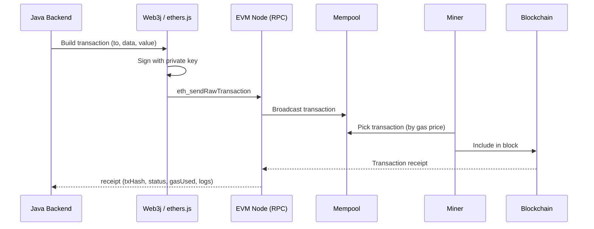
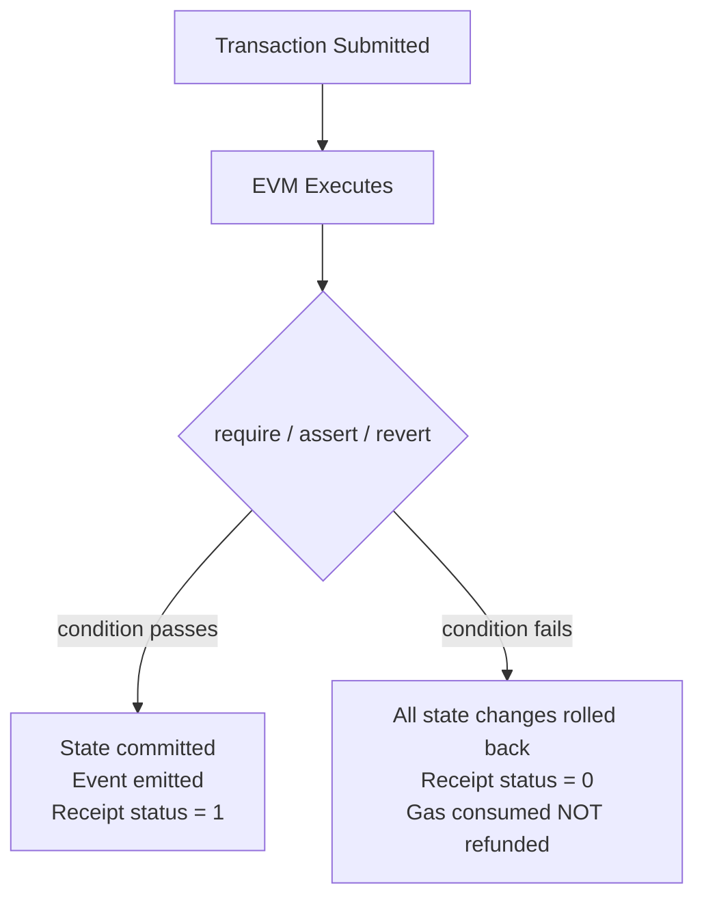

# Solidity & Blockchain

## Table of Contents
1. [Ethereum & Smart Contracts Basics](#ethereum--smart-contracts-basics)
2. [EVM Transaction Lifecycle (E2E)](#evm-transaction-lifecycle-e2e)
3. [What Happens When a Transaction is Reverted?](#what-happens-when-a-transaction-is-reverted)
4. [Testing API Integration with Smart Contracts](#testing-api-integration-with-smart-contracts)
5. [Solidity Language Fundamentals](#solidity-language-fundamentals)
6. [Gas & Optimization](#gas--optimization)
7. [Security Patterns](#security-patterns)
8. [Access Control & Modifiers](#access-control--modifiers)
9. [Events & Logging](#events--logging)
10. [Contract Interactions](#contract-interactions)

---

## Ethereum & Smart Contracts Basics

### What is a smart contract?

A smart contract is **immutable, self-executing code** deployed on a blockchain. Once deployed, no one — not even the creator — can change its logic.

| Property | Description |
|---|---|
| Immutable | Code cannot be modified after deployment |
| Trustless | Rules enforced by code, not third parties |
| Transparent | Code and state are publicly verifiable |
| Unstoppable | No one can halt execution |

**State is mutable** via function calls; **code is not**.

```solidity
// SPDX-License-Identifier: MIT
pragma solidity ^0.8.0;

contract Vault {
    mapping(address => uint256) public balances;

    function deposit() external payable {
        balances[msg.sender] += msg.value;
    }

    function withdraw(uint256 amount) external {
        require(balances[msg.sender] >= amount, "Insufficient");
        balances[msg.sender] -= amount;
        (bool ok,) = msg.sender.call{value: amount}("");
        require(ok, "Transfer failed");
    }
}
```

---

## EVM Transaction Lifecycle (E2E)

**How to manage a transaction end-to-end on EVM Blockchain:**



### E2E Transaction Management in Java (Web3j)

```java
// 1. Build credentials from private key
Credentials credentials = Credentials.create("0x<privateKey>");

// 2. Connect to node
Web3j web3 = Web3j.build(new HttpService("https://rpc-endpoint"));

// 3. Load contract (generated from ABI)
MyContract contract = MyContract.load(contractAddress, web3, credentials,
    new DefaultGasProvider());

// 4. Send transaction (state-changing function)
TransactionReceipt receipt = contract.transfer(to, amount).send();

// 5. Check status
if (receipt.isStatusOK()) {
    String txHash = receipt.getTransactionHash();
    BigInteger gasUsed = receipt.getGasUsed();
    // parse events from receipt.getLogs()
} else {
    throw new BlockchainException("Transaction reverted");
}
```

### Key Management Concerns

```java
// Never hardcode private keys — use environment variables or KMS
String pk = System.getenv("WALLET_PRIVATE_KEY");

// For production: use AWS KMS or HSM — sign without exposing private key
// Web3j supports custom signers
```

### Nonce Management

Each account has a nonce (transaction counter). Transactions must be sent in order.

```java
// Get current nonce
BigInteger nonce = web3.ethGetTransactionCount(
    credentials.getAddress(), DefaultBlockParameterName.LATEST
).send().getTransactionCount();

// Increment for each tx; concurrent tx requires nonce queuing
```

### Gas Estimation

```java
// Estimate gas before sending
BigInteger gasEstimate = web3.ethEstimateGas(transaction).send().getAmountUsed();
BigInteger gasWithBuffer = gasEstimate.multiply(BigInteger.valueOf(120)).divide(BigInteger.valueOf(100)); // +20%
```

---

## What Happens When a Transaction is Reverted?

A revert **rolls back all state changes** made within the transaction. Gas consumed up to the revert point is **not refunded** (execution cost is paid regardless).



### Revert vs Require vs Assert

```solidity
// require: input validation, expected failure — refunds remaining gas
require(balance >= amount, "Insufficient balance");

// revert: explicit revert with custom error (cheaper than string)
error InsufficientBalance(uint256 available, uint256 required);
if (balance < amount) revert InsufficientBalance(balance, amount);

// assert: invariant check — should never be false
// consumes ALL gas if triggered (indicates a bug)
assert(totalSupply == sum); 
```

### Handling Reverts in Java (Web3j)

```java
try {
    TransactionReceipt receipt = contract.transfer(to, amount).send();
    if (!receipt.isStatusOK()) {
        // Decode revert reason from receipt data
        String revertReason = decodeRevertReason(receipt.getRevertReason());
        log.error("Tx reverted: {}", revertReason);
    }
} catch (ContractCallException e) {
    // Contract threw during call (view function revert)
    log.error("Contract call failed: {}", e.getMessage());
}
```

**Important:** always check `receipt.isStatusOK()`. A submitted transaction can confirm as failed (status=0) without throwing an exception.

---

## Testing API Integration with Smart Contracts

### Testing Stack

| Layer | Tool |
|---|---|
| Unit (Solidity) | Foundry (forge test) or Hardhat (Mocha/Chai) |
| Integration (Java ↔ Contract) | Testcontainers + Ganache / Hardhat node |
| E2E | Hardhat scripts against local fork |

### Strategy 1: Local Node with Testcontainers (Java)

```java
@Testcontainers
class ContractIntegrationTest {

    @Container
    static GenericContainer<?> ganache = new GenericContainer<>("trufflesuite/ganache:latest")
        .withExposedPorts(8545)
        .withCommand("--deterministic --accounts 10");

    private Web3j web3;
    private MyContract contract;

    @BeforeEach
    void setup() throws Exception {
        String rpcUrl = "http://localhost:" + ganache.getMappedPort(8545);
        web3 = Web3j.build(new HttpService(rpcUrl));
        Credentials creds = Credentials.create("0x<deterministic-key>");
        contract = MyContract.deploy(web3, creds, new DefaultGasProvider()).send();
    }

    @Test
    void transfer_shouldUpdateBalances() throws Exception {
        BigInteger amount = BigInteger.valueOf(100);
        TransactionReceipt receipt = contract.transfer(recipient, amount).send();

        assertTrue(receipt.isStatusOK());
        assertEquals(amount, contract.balanceOf(recipient).send());
    }

    @Test
    void transfer_withInsufficientBalance_shouldRevert() {
        assertThrows(ContractCallException.class, () ->
            contract.transfer(recipient, BigInteger.valueOf(999_999)).send()
        );
    }
}
```

### Strategy 2: Foundry Unit Tests (Solidity)

```solidity
// test/Vault.t.sol
contract VaultTest is Test {
    Vault vault;
    address alice = makeAddr("alice");

    function setUp() public {
        vault = new Vault();
        vm.deal(alice, 1 ether);
    }

    function test_deposit() public {
        vm.prank(alice);
        vault.deposit{value: 0.5 ether}();
        assertEq(vault.balances(alice), 0.5 ether);
    }

    function test_withdraw_revertsIfInsufficient() public {
        vm.prank(alice);
        vm.expectRevert("Insufficient");
        vault.withdraw(1 ether);
    }
}
```

### Strategy 3: Hardhat Fork (test against real contract state)

```javascript
// hardhat.config.js
networks: {
  hardhat: {
    forking: { url: process.env.MAINNET_RPC_URL }
  }
}

// Test against real deployed contracts without spending real ETH
```

---

## Solidity Language Fundamentals

### Data Locations: memory vs storage vs calldata

```solidity
// storage: persisted on-chain (expensive)
uint256 public count; // implicitly storage

// memory: temporary, function scope (cheap)
function process(string memory name) public pure returns (string memory) { ... }

// calldata: read-only, for external function params (cheapest)
function bulkTransfer(address[] calldata recipients) external { ... }
```

### Visibility

```solidity
public    // callable from anywhere; generates getter
external  // callable from outside only (cheaper for large params)
internal  // this contract + children
private   // this contract only
```

### Common Patterns

```solidity
// Ownable (access control)
modifier onlyOwner() {
    require(msg.sender == owner, "Not owner");
    _;
}

// Reentrancy guard
bool private locked;
modifier noReentrant() {
    require(!locked, "Reentrant call");
    locked = true;
    _;
    locked = false;
}

// CEI pattern (Checks-Effects-Interactions)
function withdraw(uint256 amount) external {
    require(balances[msg.sender] >= amount);  // Check
    balances[msg.sender] -= amount;           // Effect
    (bool ok,) = msg.sender.call{value: amount}(""); // Interaction
    require(ok);
}
```

---

## Gas & Optimization

Gas is the unit of computational cost. Optimizing gas = reducing on-chain operations.

| Optimization | Saving |
|---|---|
| Use `uint256` (not smaller) | Less type conversion |
| Pack struct variables | Fewer storage slots |
| `calldata` instead of `memory` | ~3x cheaper for external calls |
| Custom errors instead of strings | ~50% cheaper revert |
| Cache storage reads in memory | Multiple reads → 1 cold + N warm |
| `++i` instead of `i++` | Saves 1 operation |

```solidity
// Bad: re-reads storage each iteration
for (uint i = 0; i < items.length; i++) { ... }

// Good: cache array length
uint len = items.length;
for (uint i = 0; i < len; ++i) { ... }

// Custom error (cheaper than string)
error Unauthorized(address caller);
if (msg.sender != owner) revert Unauthorized(msg.sender);
```

---

## Security Patterns

### Reentrancy Attack

```solidity
// Vulnerable — external call before state update
function withdraw() public {
    uint amount = balances[msg.sender];
    (bool ok,) = msg.sender.call{value: amount}(""); // attacker re-enters here
    balances[msg.sender] = 0; // too late
}

// Safe — CEI pattern or ReentrancyGuard
function withdraw() public nonReentrant {
    uint amount = balances[msg.sender];
    balances[msg.sender] = 0;  // effect first
    (bool ok,) = msg.sender.call{value: amount}("");
    require(ok);
}
```

### Integer Overflow (pre-0.8.0)

Solidity 0.8+ has built-in overflow checks. Legacy contracts needed `SafeMath`.

---

## Events & Logging

Events are the primary way to communicate state changes off-chain. They are stored in transaction logs (much cheaper than storage).

```solidity
event Transfer(address indexed from, address indexed to, uint256 amount);

function transfer(address to, uint256 amount) external {
    // ...
    emit Transfer(msg.sender, to, amount);
}
```

**Indexed fields** are searchable (up to 3 per event). Non-indexed fields are ABI-encoded in `data`.

```java
// Listen for events in Java (Web3j)
contract.transferEventFlowable(DefaultBlockParameterName.LATEST, DefaultBlockParameterName.LATEST)
    .subscribe(event -> {
        log.info("Transfer: {} → {} : {}", event.from, event.to, event.amount);
    });
```

---

## Contract Interactions

```solidity
// Interface-based call (preferred)
interface IERC20 { function transfer(address, uint256) external returns (bool); }

contract Distributor {
    function distribute(address token, address[] calldata recipients, uint256 amount) external {
        IERC20 erc20 = IERC20(token);
        for (address r : recipients) {
            require(erc20.transfer(r, amount), "Transfer failed");
        }
    }
}
```

**Delegate call** — executes another contract's code in the context of the caller's storage. Used in proxy/upgradeable patterns. High risk if misused.
