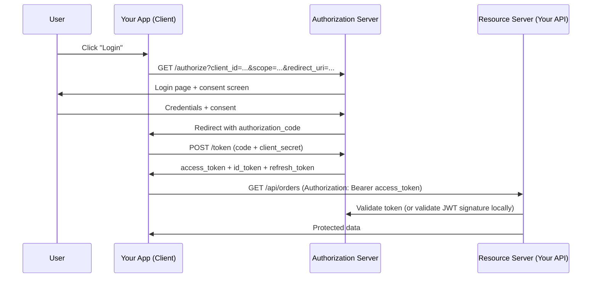
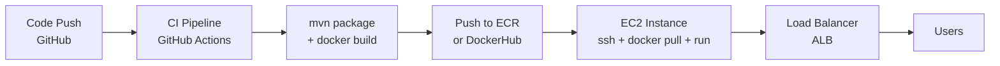

# Spring Boot

## Table of Contents
1. [What is Spring Boot?](#what-is-spring-boot)
2. [Spring Boot App vs Microservice](#spring-boot-app-vs-microservice)
3. [@Autowired — How it Works Internally](#autowired--how-it-works-internally)
4. [Spring Bean Lifecycle](#spring-bean-lifecycle)
5. [@Transactional](#transactional)
6. [JPA and How it Works](#jpa-and-how-it-works)
7. [Spring MVC & REST](#spring-mvc--rest)
8. [Spring Security & OAuth2](#spring-security--oauth2)
9. [Spring AOP](#spring-aop)
10. [Docker & Deployment (EC2)](#docker--deployment-ec2)
11. [Testing in Spring](#testing-in-spring)

---

## What is Spring Boot?

Spring Boot is an **opinionated, convention-over-configuration** wrapper around the Spring Framework that removes the boilerplate of Spring setup.

**Core features:**
- **Auto-configuration** — scans classpath, detects dependencies, configures beans automatically. Add `spring-boot-starter-data-jpa` → DataSource, EntityManagerFactory, TransactionManager auto-configured.
- **Embedded server** — Tomcat, Jetty, or Undertow baked in. Deploy as a runnable JAR (`java -jar app.jar`).
- **Starter POMs** — curated, compatible dependency sets.
- **Spring Boot Actuator** — production endpoints: `/actuator/health`, `/actuator/metrics`, `/actuator/info`, `/actuator/env`.
- **Externalized configuration** — `application.yml` / env vars / command-line args with defined precedence order.

```java
@SpringBootApplication
// = @Configuration + @EnableAutoConfiguration + @ComponentScan
public class Application {
    public static void main(String[] args) {
        SpringApplication.run(Application.class, args);
    }
}
```

**How auto-configuration works:**
1. `@EnableAutoConfiguration` triggers classpath scan
2. `spring.factories` (or `AutoConfiguration.imports` in Boot 3+) lists all configuration classes
3. Each `@ConditionalOn*` annotation decides whether to activate (e.g., `@ConditionalOnClass(DataSource.class)`)

**Spring Boot vs Spring Framework:** Spring requires explicit XML or Java config for every component. Spring Boot eliminates most of this with sensible defaults — you override only what differs.

---

## Spring Boot App vs Microservice

| Aspect | Spring Boot Application | Spring Boot Microservice |
|---|---|---|
| Scope | Single deployable (monolith or modular monolith) | One bounded context, one responsibility |
| Database | May share DB with other modules | **Database per service** (independence) |
| Communication | Internal method calls | REST / gRPC / messaging (Kafka) |
| Deployment | Single artifact per release | Independent CI/CD, independent scaling |
| Team ownership | Whole app per team | One service per team |
| Failure impact | Failure affects whole app | Isolated — other services unaffected |

A microservice **is** a Spring Boot application. A Spring Boot application is **not necessarily** a microservice.

**When to choose microservices:**
- Multiple teams that need to deploy independently
- Different parts of the system have vastly different scaling needs
- Technology diversity per domain is desired
- Not for small teams / MVPs — distributed systems complexity is high

---

## @Autowired — How it Works Internally

`@Autowired` is processed by `AutowiredAnnotationBeanPostProcessor` which runs after bean instantiation.

**Resolution order:**
1. **By type** — finds all beans matching the field/parameter type
2. **By `@Qualifier`** — if multiple candidates, `@Qualifier("name")` narrows to one
3. **By field/parameter name** — if still ambiguous, matches bean name to field name
4. If still ambiguous → `NoUniqueBeanDefinitionException`

```java
@Service
public class NotificationService {
    private final EmailSender emailSender;
    private final SmsSender smsSender;

    // Constructor injection — PREFERRED
    @Autowired // optional in Spring 4.3+ for single constructor
    public NotificationService(EmailSender emailSender,
                                @Qualifier("twilioSms") SmsSender smsSender) {
        this.emailSender = emailSender;
        this.smsSender = smsSender;
    }
}
```

**Why constructor injection is preferred:**
- Dependencies are explicit and **mandatory**
- Object is always in a valid state after construction
- Works with `final` fields — immutable
- No need for reflection in unit tests (just `new Service(mockDep)`)
- Circular dependency is detected at startup (not at runtime)

**Field injection** (`@Autowired` on fields) works but is discouraged — can't use `final`, harder to test, hides dependencies.

**`@Primary`** — marks one bean as the default when multiple candidates exist.  
**`@Lazy`** — defers bean initialization until first use.

---

## Spring Bean Lifecycle

```
┌──────────────────────────────────────────────────────────────────┐
│ 1. Instantiation   → Constructor called                          │
│ 2. Property inject → @Autowired fields/setters populated         │
│ 3. Aware callbacks → BeanNameAware, ApplicationContextAware, ... │
│ 4. BeanPostProcessor.postProcessBeforeInitialization()           │
│ 5. @PostConstruct  → Custom init logic                           │
│    OR InitializingBean.afterPropertiesSet()                      │
│    OR @Bean(initMethod="init")                                   │
│ 6. BeanPostProcessor.postProcessAfterInitialization()            │
│    (AOP proxies created here!)                                   │
│ 7. ─── BEAN IN USE ───                                           │
│ 8. @PreDestroy     → Cleanup (close connections, stop threads)   │
│    OR DisposableBean.destroy()                                   │
│    OR @Bean(destroyMethod="cleanup")                             │
└──────────────────────────────────────────────────────────────────┘
```

```java
@Component
public class ConnectionPool implements InitializingBean, DisposableBean {
    private DataSource dataSource;

    @PostConstruct
    public void init() {
        // Called after @Autowired injection complete
        dataSource = createPool();
        log.info("Connection pool initialized with {} connections", poolSize);
    }

    @PreDestroy
    public void shutdown() {
        // Called before context closes
        dataSource.close();
        log.info("Connection pool shut down");
    }
}
```

**Bean Scopes:**
| Scope | Description |
|---|---|
| `singleton` | **Default.** One instance per Spring context |
| `prototype` | New instance every time the bean is requested |
| `request` | One per HTTP request (web apps) |
| `session` | One per HTTP session (web apps) |
| `application` | One per ServletContext |

---

## @Transactional

Spring wraps the annotated method in a **proxy** that manages the transaction lifecycle: begin → method executes → commit (or rollback on exception).

```java
@Service
public class TransferService {
    @Transactional(
        propagation = Propagation.REQUIRED,     // default: join existing or create new
        isolation   = Isolation.READ_COMMITTED, // default in most DBs
        rollbackFor = Exception.class,          // rollback on any exception (not just RuntimeException)
        timeout     = 30,                       // 30 seconds max
        readOnly    = false
    )
    public void transfer(Long fromId, Long toId, BigDecimal amount) {
        Account from = accountRepo.findByIdForUpdate(fromId).orElseThrow();
        Account to   = accountRepo.findByIdForUpdate(toId).orElseThrow();
        from.debit(amount);
        to.credit(amount);
        // Any exception here → automatic rollback
    }
}
```

**Propagation levels:**
| Propagation | Behavior |
|---|---|
| `REQUIRED` | Join existing tx or create new (default) |
| `REQUIRES_NEW` | Always create new tx; suspend existing |
| `NESTED` | Savepoint in existing tx; can partially rollback |
| `NOT_SUPPORTED` | Suspend existing tx; run without tx |
| `NEVER` | Throw if tx exists |
| `MANDATORY` | Throw if no tx exists |

**Critical gotchas:**
```java
@Service
public class OrderService {
    // GOTCHA 1: self-invocation bypasses proxy
    public void placeOrder(Order order) {
        validateOrder(order);
        processPayment(order); // calling @Transactional method on 'this' — proxy bypassed!
    }

    @Transactional // WON'T WORK when called from placeOrder above
    public void processPayment(Order order) { ... }

    // Fix: inject self, or use separate service class, or ApplicationContext.getBean()
}

// GOTCHA 2: @Transactional on private methods — ignored (Spring AOP uses public methods only)
@Transactional
private void doPrivateWork() { ... } // no transaction!

// GOTCHA 3: default rollback only for RuntimeException
@Transactional
public void save(User user) throws IOException {
    repo.save(user);
    fileService.write(user); // IOException thrown — NO rollback by default!
}
// Fix: @Transactional(rollbackFor = Exception.class)
```

---

## JPA and How it Works

**JPA** (Jakarta Persistence API) is a **specification**. **Hibernate** is the main implementation in Spring Boot.

**Core concepts:**

```
Java Object (Entity)
      ↕ EntityManager (JPA API)
  Hibernate (translates to SQL)
      ↕
    Database
```

**Entity lifecycle states:**
| State | Description |
|---|---|
| **Transient** | New object, no ID, not tracked |
| **Managed** | Tracked by EntityManager; changes auto-flushed on tx commit |
| **Detached** | Was managed, tx ended or `em.detach(entity)` called |
| **Removed** | Marked for deletion on next flush |

```java
@Entity
@Table(name = "orders")
public class Order {
    @Id
    @GeneratedValue(strategy = GenerationType.SEQUENCE, generator = "order_seq")
    @SequenceGenerator(name = "order_seq", sequenceName = "order_seq", allocationSize = 50)
    private Long id;

    @Column(nullable = false, precision = 19, scale = 4)
    private BigDecimal total;

    @ManyToOne(fetch = FetchType.LAZY)  // LAZY is best default
    @JoinColumn(name = "customer_id")
    private Customer customer;

    @OneToMany(mappedBy = "order", cascade = CascadeType.ALL, orphanRemoval = true)
    private List<OrderItem> items = new ArrayList<>();

    @Version
    private Long version; // optimistic locking
}
```

**Spring Data JPA:**
```java
public interface OrderRepository extends JpaRepository<Order, Long> {
    // Method name → generated JPQL
    List<Order> findByCustomerIdAndStatus(Long customerId, OrderStatus status);

    // Custom JPQL
    @Query("SELECT o FROM Order o JOIN FETCH o.items WHERE o.id = :id")
    Optional<Order> findWithItems(@Param("id") Long id);

    // Native SQL
    @Query(value = "SELECT * FROM orders WHERE total > :minTotal", nativeQuery = true)
    List<Order> findHighValueOrders(@Param("minTotal") BigDecimal minTotal);

    // Projections — only load needed columns
    List<OrderSummary> findByStatus(OrderStatus status);  // interface projection
}

interface OrderSummary {
    Long getId();
    BigDecimal getTotal();
    OrderStatus getStatus();
}
```

**N+1 problem and fix:**
```java
// N+1: loading orders, then for each order loading customer (N extra queries)
List<Order> orders = orderRepo.findAll();
orders.forEach(o -> System.out.println(o.getCustomer().getName())); // N queries!

// Fix 1: JOIN FETCH in JPQL
@Query("SELECT o FROM Order o JOIN FETCH o.customer")
List<Order> findAllWithCustomer();

// Fix 2: @EntityGraph
@EntityGraph(attributePaths = {"customer", "items"})
List<Order> findAll();

// Fix 3: Batch fetching (Hibernate)
@BatchSize(size = 50)
private Customer customer;
```

---

## Spring MVC & REST

```java
@RestController
@RequestMapping("/api/v1/orders")
@Validated
public class OrderController {
    private final OrderService orderService;

    @GetMapping
    public ResponseEntity<Page<OrderResponse>> list(
            @RequestParam(defaultValue = "0") int page,
            @RequestParam(defaultValue = "20") int size,
            @RequestParam(required = false) OrderStatus status) {
        Pageable pageable = PageRequest.of(page, size, Sort.by("createdAt").descending());
        return ResponseEntity.ok(orderService.findAll(pageable, status));
    }

    @GetMapping("/{id}")
    public ResponseEntity<OrderResponse> get(@PathVariable Long id) {
        return ResponseEntity.ok(orderService.findById(id));
    }

    @PostMapping
    @ResponseStatus(HttpStatus.CREATED)
    public OrderResponse create(@Valid @RequestBody CreateOrderRequest request) {
        return orderService.create(request);
    }

    @PatchMapping("/{id}/status")
    public ResponseEntity<Void> updateStatus(@PathVariable Long id,
                                              @RequestBody StatusUpdate update) {
        orderService.updateStatus(id, update.getStatus());
        return ResponseEntity.noContent().build();
    }

    @DeleteMapping("/{id}")
    @ResponseStatus(HttpStatus.NO_CONTENT)
    public void cancel(@PathVariable Long id) {
        orderService.cancel(id);
    }
}
```

**Global exception handling:**
```java
@RestControllerAdvice
public class GlobalExceptionHandler {
    @ExceptionHandler(EntityNotFoundException.class)
    @ResponseStatus(HttpStatus.NOT_FOUND)
    public ErrorResponse handleNotFound(EntityNotFoundException ex) {
        return new ErrorResponse("NOT_FOUND", ex.getMessage());
    }

    @ExceptionHandler(MethodArgumentNotValidException.class)
    @ResponseStatus(HttpStatus.BAD_REQUEST)
    public ErrorResponse handleValidation(MethodArgumentNotValidException ex) {
        List<String> errors = ex.getBindingResult().getFieldErrors()
            .stream().map(f -> f.getField() + ": " + f.getDefaultMessage())
            .collect(Collectors.toList());
        return new ErrorResponse("VALIDATION_ERROR", errors);
    }
}
```

---

## Spring Security & OAuth2

### Role-Based Access Control
```java
@Configuration
@EnableMethodSecurity(prePostEnabled = true)
public class SecurityConfig {
    @Bean
    SecurityFilterChain filterChain(HttpSecurity http) throws Exception {
        return http
            .csrf(AbstractHttpConfigurer::disable)
            .sessionManagement(s -> s.sessionCreationPolicy(STATELESS))
            .authorizeHttpRequests(auth -> auth
                .requestMatchers("/actuator/health").permitAll()
                .requestMatchers("/api/admin/**").hasRole("ADMIN")
                .requestMatchers(HttpMethod.GET, "/api/**").hasAnyRole("USER", "ADMIN")
                .anyRequest().authenticated()
            )
            .oauth2ResourceServer(oauth2 -> oauth2.jwt(Customizer.withDefaults()))
            .build();
    }

    @Bean
    JwtDecoder jwtDecoder() {
        return JwtDecoders.fromIssuerLocation("https://auth.company.com");
    }
}

// Method-level security
@Service
public class AdminService {
    @PreAuthorize("hasRole('ADMIN')")
    public void deleteUser(Long id) { userRepo.deleteById(id); }

    @PreAuthorize("hasRole('ADMIN') or #userId == authentication.principal.id")
    public User getUser(Long userId) { return userRepo.findById(userId).orElseThrow(); }

    @PostAuthorize("returnObject.ownerId == authentication.principal.id")
    public Document getDocument(Long docId) { return docRepo.findById(docId).orElseThrow(); }
}
```

### OAuth2 Flow



**Authentication vs Authorization:**
- **Authentication** (AuthN) — verifying identity: "Who are you?" → handled by OpenID Connect (OIDC) on top of OAuth2
- **Authorization** (AuthZ) — verifying permissions: "What can you do?" → handled by OAuth2 scopes + roles

**JWT structure:** `header.payload.signature`
- Header: algorithm (`RS256`)
- Payload: claims (`sub`, `iss`, `exp`, `roles`)
- Signature: signed by Authorization Server's private key, verified with public key

---

## Spring AOP

AOP addresses **cross-cutting concerns** (logging, security, transactions, metrics) without scattering them across business logic.

**Core concepts:**
- **Aspect** — module containing cross-cutting logic
- **Advice** — the action (before, after, around)
- **Pointcut** — expression defining where advice applies
- **Join point** — specific execution point (method call)
- **Proxy** — Spring wraps the target bean (JDK proxy or CGLIB)

```java
@Aspect
@Component
public class LoggingAspect {

    @Around("@annotation(Monitored)")  // apply where @Monitored is present
    public Object logExecutionTime(ProceedingJoinPoint pjp) throws Throwable {
        long start = System.currentTimeMillis();
        String method = pjp.getSignature().toShortString();
        try {
            Object result = pjp.proceed(); // invoke actual method
            log.info("{} completed in {}ms", method, System.currentTimeMillis() - start);
            return result;
        } catch (Exception ex) {
            log.error("{} failed after {}ms: {}", method, System.currentTimeMillis() - start, ex.getMessage());
            throw ex;
        }
    }

    @Before("execution(* com.company.service.*Service.*(..))")
    public void logBefore(JoinPoint jp) {
        log.debug("Calling: {}", jp.getSignature());
    }
}
```

**`@Transactional` is an AOP advice.** When Spring creates a `@Transactional` bean, it wraps it in a proxy that intercepts method calls and manages the transaction.

---

## Docker & Deployment (EC2)

### Multi-Stage Dockerfile
```dockerfile
# Stage 1: Build
FROM eclipse-temurin:21-jdk-alpine AS build
WORKDIR /app
COPY pom.xml .
COPY .mvn/ .mvn/
COPY mvnw .
RUN ./mvnw dependency:go-offline -q      # cache deps separately
COPY src ./src
RUN ./mvnw package -DskipTests -q

# Stage 2: Runtime (lean image — no JDK, no sources)
FROM eclipse-temurin:21-jre-alpine
RUN addgroup -S appgroup && adduser -S appuser -G appgroup
USER appuser
WORKDIR /app
COPY --from=build /app/target/*.jar app.jar
EXPOSE 8080
ENTRYPOINT ["java",
    "-XX:+UseContainerSupport",
    "-XX:MaxRAMPercentage=75.0",
    "-Djava.security.egd=file:/dev/./urandom",
    "-jar", "app.jar"]
```

```bash
docker build -t my-service:1.0 .
docker run -p 8080:8080 \
    -e SPRING_PROFILES_ACTIVE=prod \
    -e DB_URL=jdbc:postgresql://db:5432/mydb \
    --memory=512m --cpus=1 \
    my-service:1.0
```

### Deploy to EC2



**Production steps:**
1. Build image in CI
2. Push to ECR (Elastic Container Registry)
3. EC2: `docker pull` + `docker-compose up -d`
4. Health check via ALB target group
5. Blue-green deployment: spin up new, switch LB, drain old

**Better approach:** ECS Fargate (managed containers) or EKS (Kubernetes) instead of raw EC2.

---

## Testing in Spring

```java
// @SpringBootTest: full context, integration test
@SpringBootTest(webEnvironment = SpringBootTest.WebEnvironment.RANDOM_PORT)
@AutoConfigureTestDatabase(replace = AutoConfigureTestDatabase.Replace.NONE)
@Testcontainers
class OrderServiceIntegrationTest {
    @Container
    static PostgreSQLContainer<?> postgres = new PostgreSQLContainer<>("postgres:16");

    @Autowired OrderService orderService;

    @Test
    void createOrder_shouldPersistAndReturnWithId() {
        Order order = orderService.create(validRequest());
        assertThat(order.getId()).isNotNull();
        assertThat(order.getStatus()).isEqualTo(OrderStatus.PENDING);
    }
}

// @WebMvcTest: test controller layer only (no DB)
@WebMvcTest(OrderController.class)
class OrderControllerTest {
    @Autowired MockMvc mvc;
    @MockBean OrderService orderService;

    @Test
    void getOrder_notFound_returns404() throws Exception {
        when(orderService.findById(99L)).thenThrow(new EntityNotFoundException("99"));
        mvc.perform(get("/api/v1/orders/99"))
            .andExpect(status().isNotFound())
            .andExpect(jsonPath("$.error").value("NOT_FOUND"));
    }
}

// @DataJpaTest: test repository layer only (in-memory H2 or Testcontainers)
@DataJpaTest
class OrderRepositoryTest {
    @Autowired TestEntityManager em;
    @Autowired OrderRepository repo;

    @Test
    void findByStatus_returnsPendingOrders() {
        em.persist(new Order(PENDING)); em.persist(new Order(COMPLETED)); em.flush();
        assertThat(repo.findByStatus(PENDING)).hasSize(1);
    }
}
```
