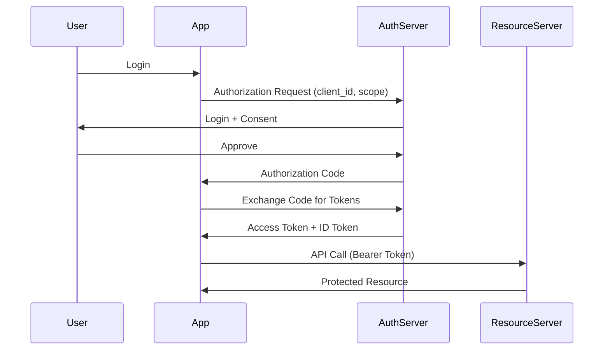
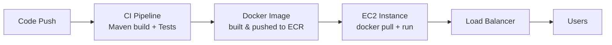

# Spring Boot

## Table of Contents
1. [What is Spring Boot?](#what-is-spring-boot)
2. [Spring Boot App vs Microservice](#spring-boot-app-vs-microservice)
3. [@Autowired internals](#autowired-internals)
4. [Bean Lifecycle](#bean-lifecycle)
5. [@Transactional](#transactional)
6. [JPA](#jpa)
7. [Security & OAuth2](#security--oauth2)
8. [Deployment](#deployment)

---

## What is Spring Boot?

Spring Boot is an **opinionated wrapper** around the Spring Framework that eliminates boilerplate configuration.

Key features:
- **Auto-configuration** — detects classpath dependencies and configures beans automatically
- **Embedded server** — Tomcat/Jetty baked in; run as a plain JAR
- **Starter POMs** — curated dependency sets (`spring-boot-starter-web`, `spring-boot-starter-data-jpa`)
- **Actuator** — production-ready endpoints (`/health`, `/metrics`, `/env`)

```java
@SpringBootApplication // = @Configuration + @EnableAutoConfiguration + @ComponentScan
public class App {
    public static void main(String[] args) {
        SpringApplication.run(App.class, args);
    }
}
```

---

## Spring Boot App vs Microservice

| | Spring Boot Application | Spring Boot Microservice |
|---|---|---|
| Scope | Single deployable unit (monolith or modular) | One bounded-context, one responsibility |
| Data | May share DB | Database per service |
| Communication | Internal method calls | REST / gRPC / messaging |
| Deployment | Single artifact | Independent CI/CD pipeline |
| Scale | Scale the whole app | Scale individual services |

A microservice **is** a Spring Boot app, but not all Spring Boot apps are microservices.

---

## @Autowired internals

`@Autowired` is resolved by Spring's `BeanFactory` at startup via **Dependency Injection**.

**Resolution order:**
1. **By type** — finds a bean matching the field/parameter type
2. **By qualifier** — if multiple candidates exist, `@Qualifier("name")` disambiguates
3. **By name** — fallback: matches the field name against bean names

```java
@Service
public class OrderService {
    private final PaymentService payment;

    // Constructor injection — preferred (immutable, testable)
    @Autowired
    public OrderService(PaymentService payment) {
        this.payment = payment;
    }
}
```

**Why constructor injection?** Mandatory dependencies are explicit, the object is always valid, and it works without reflection in tests.

**Internally:** `AutowiredAnnotationBeanPostProcessor` processes `@Autowired` after bean instantiation, using `BeanFactory.getBean()` to resolve dependencies.

---

## Bean Lifecycle

```
1. Instantiate     → constructor called
2. Populate props  → @Autowired fields injected
3. BeanNameAware   → setBeanName()
4. @PostConstruct  → custom init logic
5. In use          → handles requests
6. @PreDestroy     → cleanup (close connections, flush buffers)
7. Destroyed
```

```java
@Component
public class CacheService {
    @PostConstruct
    void init() { loadCache(); }   // runs after injection

    @PreDestroy
    void cleanup() { cache.clear(); } // runs on shutdown
}
```

Alternatively, `@Bean(initMethod = "init", destroyMethod = "cleanup")` in `@Configuration`.

---

## @Transactional

Marks a method to run within a **database transaction**. Spring wraps the call in a proxy that begins, commits, or rolls back the transaction.

```java
@Service
public class TransferService {
    @Transactional
    public void transfer(Long from, Long to, BigDecimal amount) {
        accountRepo.debit(from, amount);
        accountRepo.credit(to, amount);
        // any RuntimeException → automatic rollback
    }
}
```

**Key attributes:**
- `propagation` — `REQUIRED` (default, join or create), `REQUIRES_NEW` (always new tx)
- `isolation` — `READ_COMMITTED` (default), `SERIALIZABLE`, etc.
- `rollbackFor` — specify which exceptions trigger rollback (default: `RuntimeException`)
- `readOnly = true` — hint for optimization (no write flush)

**Gotcha:** `@Transactional` only works on **public** methods called **from outside** the class (proxy limitation). Calling a transactional method from within the same class bypasses the proxy.

---

## JPA

### What is JPA and how does it work?

JPA (Jakarta Persistence API) is a specification for ORM in Java. **Hibernate** is the default implementation in Spring Boot.

**How it works:**

```
Java Entity ←→ EntityManager ←→ SQL ←→ Database
```

```java
@Entity
@Table(name = "orders")
public class Order {
    @Id @GeneratedValue(strategy = GenerationType.IDENTITY)
    private Long id;

    @Column(nullable = false)
    private BigDecimal amount;

    @ManyToOne(fetch = FetchType.LAZY)
    private Customer customer;
}

public interface OrderRepository extends JpaRepository<Order, Long> {
    List<Order> findByCustomerId(Long customerId);
    // Spring Data generates the query from the method name
}
```

**EntityManager states:**
- **Transient** — new object, not tracked
- **Managed** — tracked; changes auto-flushed on transaction commit
- **Detached** — no longer tracked (after `clear()` or outside tx)
- **Removed** — scheduled for deletion

**N+1 problem:** lazy loading inside a loop fires 1 query per entity. Fix with `JOIN FETCH` or `@EntityGraph`.

```java
@Query("SELECT o FROM Order o JOIN FETCH o.customer WHERE o.id IN :ids")
List<Order> findWithCustomer(@Param("ids") List<Long> ids);
```

---

## Security & OAuth2

### How do you secure your application? Role-based access?

```java
@Configuration
@EnableMethodSecurity
public class SecurityConfig {
    @Bean
    SecurityFilterChain filterChain(HttpSecurity http) throws Exception {
        return http
            .authorizeHttpRequests(auth -> auth
                .requestMatchers("/admin/**").hasRole("ADMIN")
                .requestMatchers("/api/**").authenticated()
                .anyRequest().permitAll()
            )
            .oauth2ResourceServer(oauth2 -> oauth2.jwt(Customizer.withDefaults()))
            .build();
    }
}

// Method-level security
@PreAuthorize("hasRole('ADMIN')")
public void deleteUser(Long id) { ... }
```

**Layers of defense:** network (firewall/VPC), transport (TLS), application (JWT/OAuth2 + RBAC), data (field encryption).

### How OAuth2 works (Authentication vs Authorization)?

**Authentication** = who are you? (identity)  
**Authorization** = what can you do? (permissions)

OAuth2 handles **authorization**. OpenID Connect (OIDC) adds **authentication** on top.



**Roles:**
- **Resource Owner** — the user
- **Client** — your app
- **Authorization Server** — Keycloak, Auth0, Cognito
- **Resource Server** — your API

**Token types:** Access Token (short-lived, API calls) + Refresh Token (long-lived, get new access token).

---

## Deployment

### How do you deploy a microservice in EC2?



**Steps:**
1. Build: `mvn package -DskipTests` → `target/app.jar`
2. Dockerize (see below)
3. Push image to ECR / DockerHub
4. SSH into EC2: `docker pull && docker run`
5. Or use **Elastic Beanstalk** / **ECS** for managed deployments

### What is Docker? How do you containerize a Spring Boot app?

Docker packages an app and its dependencies into an **image** that runs identically anywhere.

```dockerfile
# Multi-stage build — smaller final image
FROM eclipse-temurin:21-jdk AS build
WORKDIR /app
COPY pom.xml .
COPY src ./src
RUN mvn package -DskipTests

FROM eclipse-temurin:21-jre
WORKDIR /app
COPY --from=build /app/target/*.jar app.jar
EXPOSE 8080
ENTRYPOINT ["java", "-jar", "app.jar"]
```

```bash
docker build -t my-service:1.0 .
docker run -p 8080:8080 -e SPRING_PROFILES_ACTIVE=prod my-service:1.0
```

**Key concepts:**
- **Image** — immutable blueprint
- **Container** — running instance of an image
- **Layer caching** — `COPY pom.xml` before `COPY src` to avoid reinstalling deps on code changes
- **Multi-stage build** — separate build environment from runtime; keeps image lean
