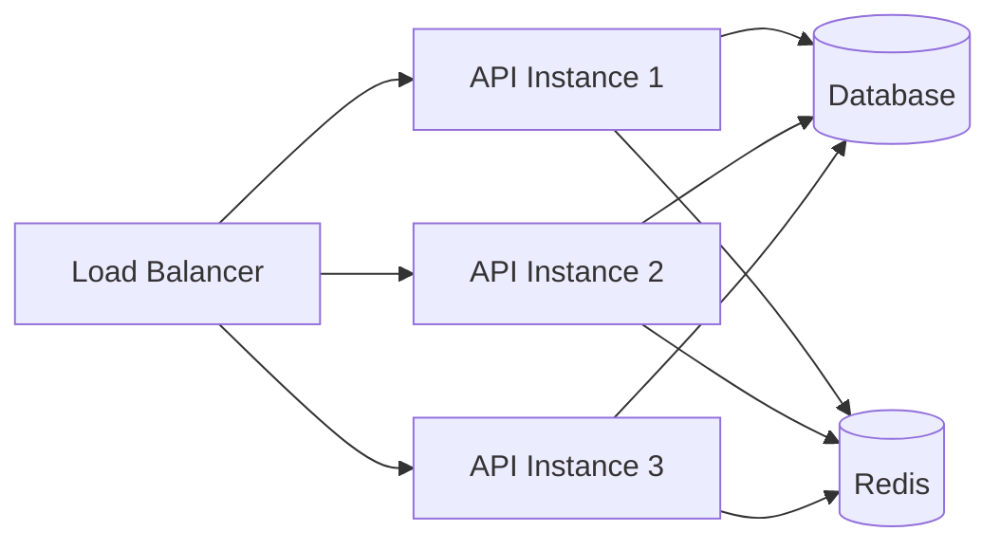
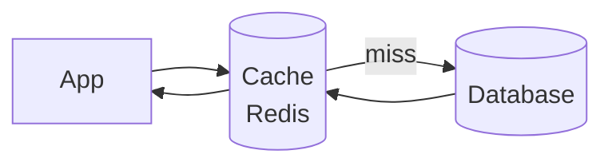
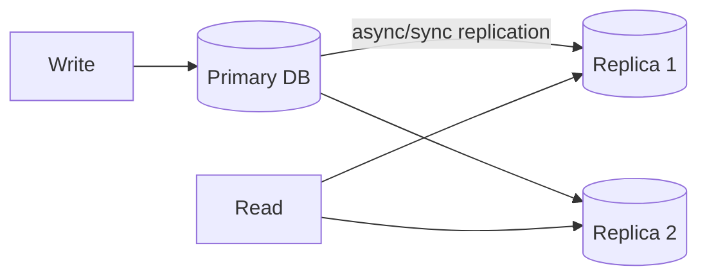
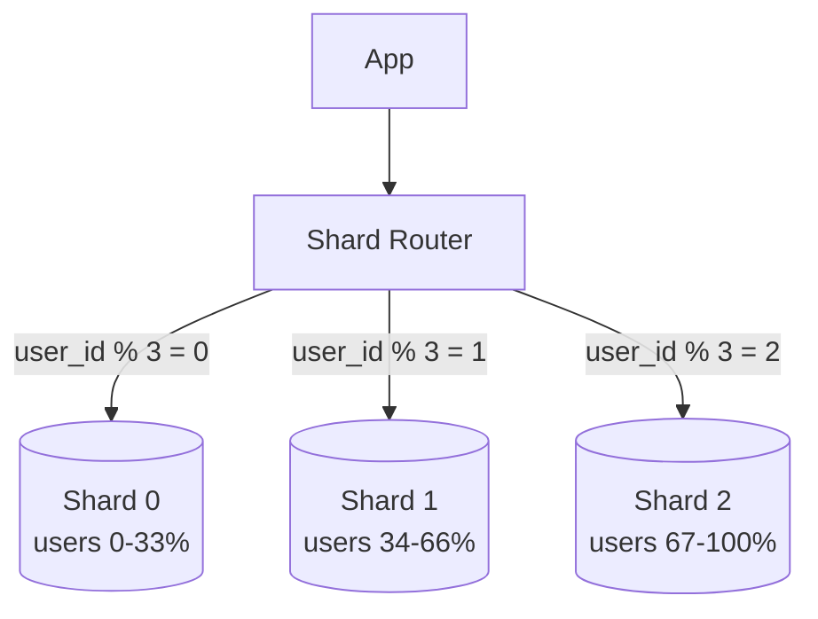
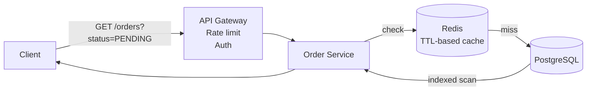
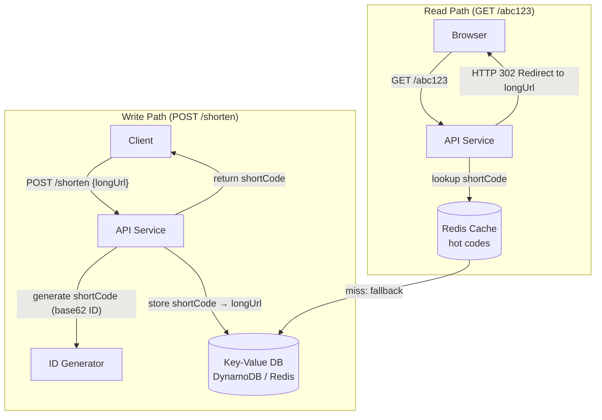
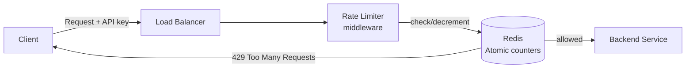
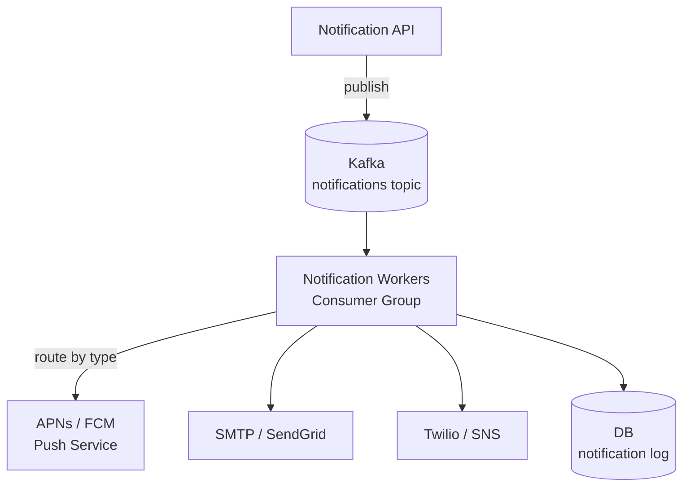
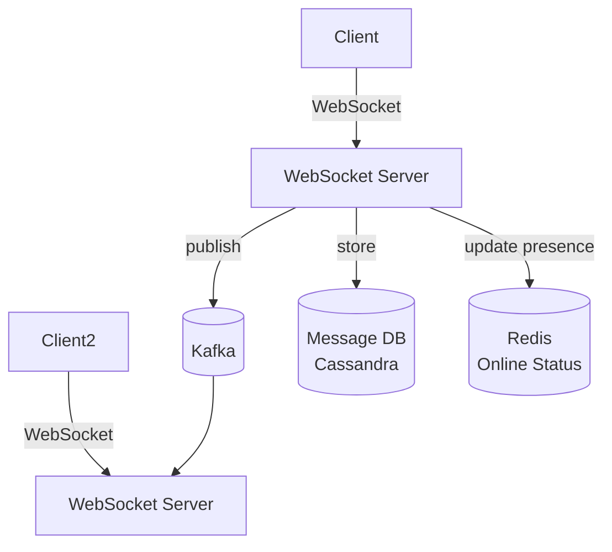

# System Design

## Table of Contents
1. [Interview Framework](#interview-framework)
2. [Availability, SLA, SLO, SLI](#availability-sla-slo-sli)
3. [Scalability](#scalability)
4. [CAP Theorem & PACELC](#cap-theorem--pacelc)
5. [Load Balancing](#load-balancing)
6. [Caching Strategies](#caching-strategies)
7. [Database Sharding & Replication](#database-sharding--replication)
8. [Consistent Hashing](#consistent-hashing)
9. [Designing a Queryable RESTful API](#designing-a-queryable-restful-api)
10. [Design: URL Shortener](#design-url-shortener)
11. [Design: Rate Limiter](#design-rate-limiter)
12. [Design: Notification System](#design-notification-system)
13. [Design: Chat System](#design-chat-system)

---

## Interview Framework

The system design interview tests your ability to reason through ambiguity, make justified trade-offs, and communicate architectural decisions clearly. Interviewers care more about *how* you think than whether you nail a specific implementation. Following a structured approach keeps you on track and shows maturity.

**5-step framework:**

```
1. CLARIFY REQUIREMENTS (5 min)
   ├── Functional: What must the system do? Core features only (no gold-plating)
   ├── Non-functional: Scale? Latency? Availability? Consistency?
   └── Constraints: Budget? Tech stack? Geographic regions?

2. BACK-OF-ENVELOPE ESTIMATION (3 min)
   ├── Users: DAU, MAU, concurrent users
   ├── Traffic: reads/sec, writes/sec, read:write ratio
   ├── Storage: object size × daily volume × retention
   └── Bandwidth: QPS × average response size

3. HIGH-LEVEL DESIGN (10 min)
   ├── Draw boxes: clients, API gateway, services, DBs, caches
   ├── Data flow: how does a request flow end-to-end?
   └── APIs: list 3-5 key endpoints

4. DEEP DIVE (15 min)
   ├── Pick 2-3 critical components to detail
   ├── Data models and schemas
   ├── Algorithms (e.g., consistent hashing, Bloom filter)
   └── Edge cases and failure modes

5. BOTTLENECKS & SCALE (5 min)
   ├── Where does it break at 10× scale?
   ├── Caching opportunities
   ├── DB sharding
   └── Trade-offs discussed
```

**Always discuss trade-offs.** No perfect design — show you understand the implications.

**Estimation numbers to know:**
| Item | Value |
|---|---|
| Memory access | ~100ns |
| SSD random read | ~100μs |
| Network round-trip (same region) | ~500μs |
| Disk seek | ~10ms |
| 1MB over network | ~10ms |
| QPS one machine can handle (simple) | ~50k-100k HTTP req/s |
| Read from DB (indexed) | ~1ms |

---

## Availability, SLA, SLO, SLI

Availability is not just uptime — it's the percentage of time a system correctly serves requests. A site can be "up" but returning 500 errors and still violate its SLA. The SLA/SLO/SLI hierarchy is how organizations formalize availability commitments: the SLA is the external promise, the SLO is the internal target (tighter, to leave a buffer), and the SLI is the actual measured reality.

| Term | Definition |
|---|---|
| **SLA** (Service Level Agreement) | Legal/contractual commitment to customers (e.g., 99.9% uptime) |
| **SLO** (Service Level Objective) | Internal target, stricter than SLA (e.g., 99.95% internally to have buffer) |
| **SLI** (Service Level Indicator) | Actual measured metric (e.g., percentage of successful requests over 30 days) |
| **Error Budget** | 1 - SLO = how much "badness" is allowed. 99.9% SLO = 8.76 hours/year error budget |

| Nines | Downtime/Year | Downtime/Month | Downtime/Week |
|---|---|---|---|
| 99% (two 9s) | 3.65 days | 7.31 hours | 1.68 hours |
| 99.9% (three 9s) | 8.76 hours | 43.83 min | 10.08 min |
| 99.99% (four 9s) | 52.60 min | 4.38 min | 1.01 min |
| 99.999% (five 9s) | 5.26 min | 26.30 sec | 6.05 sec |

**Achieving high availability:**
- Redundancy: active-active (both serve traffic) or active-passive (standby)
- Health checks + automatic failover
- Multi-AZ / multi-region deployment
- Circuit breakers to isolate failures
- Graceful degradation (serve cached/stale data vs complete failure)

---

## Scalability

Scalability is about growing capacity without redesigning the system. Vertical scaling has a hard ceiling (the biggest machine available), while horizontal scaling requires the application to be stateless — any server can handle any request. The diagram below shows the canonical pattern: a load balancer distributing requests to N identical API instances that all share the same external state (DB and cache).

### Horizontal vs Vertical Scaling

| | Vertical (Scale-Up) | Horizontal (Scale-Out) |
|---|---|---|
| Approach | Bigger machine (more CPU, RAM, SSD) | More machines |
| Limit | Hardware ceiling (~hundreds of cores) | Practically unlimited |
| Cost | Non-linear — very expensive at top end | Linear with commodity hardware |
| Failure mode | Single point of failure | Fault tolerant |
| Complexity | Simple (no code changes) | Requires statelessness, LB, distributed state |
| Best for | Databases, stateful services | Stateless web/API services |

**Making services horizontally scalable:**
1. **Stateless** — no local session data. Store sessions in Redis.
2. **Shared nothing** — each instance reads/writes from same external stores (DB, cache).
3. **Externalized config** — no hardcoded IPs or env-specific code.



---

## CAP Theorem & PACELC

CAP theorem states that no distributed system can simultaneously guarantee all three properties — and since network partitions are a reality (not a theoretical concern), every system must choose its behavior *when a partition occurs*: either stop responding (CP) or continue with potentially stale data (AP). PACELC adds the insight that even without a partition, there's a trade-off between consistency and latency — stronger consistency requires more coordination rounds between nodes, which adds latency.

**CAP:** A distributed system can guarantee at most 2 of 3: **Consistency, Availability, Partition Tolerance**.

Since network partitions are unavoidable, real systems choose between **CP** or **AP**:

| | CP Systems | AP Systems |
|---|---|---|
| Examples | Zookeeper, etcd, HBase, MongoDB (default) | Cassandra, DynamoDB, CouchDB |
| Partition behavior | Return error (consistent but unavailable) | Return possibly stale data (available but inconsistent) |
| Use case | Leader election, config, financial | Shopping carts, social feeds, DNS |

**PACELC** extends CAP: even without partitions, there's a trade-off between **Latency (L)** and **Consistency (C)**:
- DynamoDB: PA/EL (available + low latency)
- Spanner: PC/EC (consistent at the cost of latency)

**Consistency models (weakest to strongest):**
- **Eventual consistency** — replicas converge given no new writes
- **Monotonic reads** — never see older data than you've seen before
- **Read-your-writes** — you always see your own writes
- **Causal consistency** — causally related operations seen in order
- **Linearizability** — strongest; operations appear instantaneous; real-time ordered

---

## Load Balancing

A load balancer distributes incoming traffic across multiple backend instances. It's the first point of contact after DNS resolution and is responsible for health-checking backends, removing unhealthy instances from rotation, and applying routing policies. L4 balancers operate at the TCP level (fast, no HTTP awareness), while L7 balancers understand HTTP — enabling path-based routing, header inspection, and SSL offloading.

**Algorithms:**

| Algorithm | Description | Use case |
|---|---|---|
| Round Robin | Cycle through servers in order | Homogeneous servers |
| Weighted Round Robin | More requests to more powerful servers | Heterogeneous servers |
| Least Connections | Route to server with fewest active connections | Long-lived connections |
| IP Hash | Hash client IP → always route to same server | Session stickiness |
| Least Response Time | Route to fastest-responding server | Latency-sensitive |
| Random | Pick randomly | Simple, works well at scale |

**Layers:**
- **L4 (Transport):** Load balance TCP/UDP — fast, no HTTP awareness (AWS NLB)
- **L7 (Application):** Load balance HTTP — content-based routing, SSL termination, WAF (AWS ALB, Nginx)

**Health checks:** active (LB pings `/health`) or passive (monitor for failures). Unhealthy instances removed from rotation.

---

## Caching Strategies

Caching is the single most impactful optimization in most systems. The fundamental insight: a cache hit costs microseconds, a database read costs milliseconds — a 1000× difference. The choice of strategy determines when data enters the cache (on read vs on write), how fresh it is, and what happens on failures. Cache-aside is the most common because it only caches data that's actually requested and keeps the application in control.



### Cache-Aside (Lazy Loading) — Most Common
```
Read: Check cache → if miss: load from DB → store in cache → return
Write: Update DB → invalidate cache (or update cache)
```
```java
public Product getProduct(Long id) {
    return cache.get(id, () -> db.findById(id)); // Spring @Cacheable does this
}
```
**Pros:** only caches data that's actually requested. **Cons:** cache miss = extra latency; stale data possible.

### Write-Through
Write to cache AND DB synchronously. Cache always up-to-date.  
**Pros:** no stale reads. **Cons:** write latency, data not yet requested wastes cache space.

### Write-Behind (Write-Back)
Write to cache; async flush to DB. Fast writes.  
**Pros:** very fast writes. **Cons:** risk data loss if cache dies before flush.

### Read-Through
Cache sits in front; fetches from DB on miss transparently.  
**Pros:** simple app code. **Cons:** cold start problem.

### Cache Eviction Policies
| Policy | Description |
|---|---|
| LRU (default) | Evict least recently used |
| LFU | Evict least frequently used |
| TTL | Time-based expiration |
| FIFO | Evict oldest inserted |

**Cache stampede prevention:** when a cache key expires, N threads all hit DB simultaneously.
```java
// Probabilistic early expiration or mutex-based prevention
String cached = redis.get(key);
if (cached == null) {
    if (redis.setnx("lock:" + key, "1", 5, SECONDS)) { // only one thread re-fills
        try {
            String value = db.fetch(key);
            redis.setex(key, 3600, value);
        } finally { redis.del("lock:" + key); }
    } else {
        Thread.sleep(50); // brief wait, then retry
        return redis.get(key);
    }
}
```

**CDN caching:** static assets (images, JS, CSS) cached at edge locations closest to user. Reduces latency and origin load.

---

## Database Sharding & Replication

A single database node has finite read and write capacity. Replication solves read scalability by having multiple copies serve reads — but all writes still go to one primary. Sharding (also called horizontal partitioning) solves write scalability by splitting data across multiple independent nodes, each owning a slice of the dataset. Both techniques are often combined: each shard has its own replica set.

### Replication (read scalability + high availability)



- **Sync replication:** write confirmed after at least one replica acknowledges → zero data loss, higher write latency
- **Async replication:** write confirmed immediately → lower latency, possible replication lag

### Sharding (write scalability)

Partition data across multiple DB nodes by a **shard key**.



**Sharding strategies:**
| Strategy | Description | Pros/Cons |
|---|---|---|
| Range sharding | `user_id 0-999 → Shard 0` | Simple; can hotspot if data not uniform |
| Hash sharding | `hash(key) % N` | Even distribution; no range queries |
| Directory/Lookup | Mapping table: key → shard | Flexible; lookup table is bottleneck |
| Geo sharding | Route by geography | Low latency for regional data |

**Sharding challenges:**
- Cross-shard joins — expensive/impossible
- Distributed transactions — complex
- Rebalancing when adding shards — requires data migration
- Non-uniform key distribution → hotspots

---

## Consistent Hashing

With naive modulo hashing (`hash(key) % N`), adding or removing one node forces almost all keys to be remapped — an expensive reshuffling of data. Consistent hashing places both nodes and keys on a conceptual ring (0 to 2³²). Each key maps to the first node encountered clockwise from its position. Adding a node only takes keys from its immediate predecessor; removing a node only moves its keys to its successor. This limits remapping to approximately 1/N of the data.

Minimizes remapping when nodes are added/removed (vs modulo hashing where `hash % N` remaps almost everything).

```
Ring: 0 ────────────────── 2^32-1
             S1    S2    S3
              ↑     ↑     ↑   (servers on ring)
      K1   K2    K3   K4     (keys map to next server clockwise)
```

Adding a server: only the keys between it and its predecessor remap (1/N keys on average).  
Removing a server: only its keys move to successor.

**Virtual nodes:** each server gets multiple positions on the ring → better load distribution.

Used in: Cassandra, DynamoDB, Riak, CDN routing.

---

## Designing a Queryable RESTful API

Designing a queryable API goes beyond CRUD. The API needs to be expressive enough for clients to filter, sort, and paginate large datasets without overloading the backend. The key principle is that URL structure communicates *resource relationships*, while query parameters communicate *view preferences* (which subset, in what order, how many). A consistent response envelope makes it trivial for clients to handle pagination generically. RFC 7807 error format gives clients machine-readable error information for proper handling.

**My approach when designing a queryable REST API:**

### 1. Resource-Oriented URL Design
```
GET    /api/v1/orders              → list orders (paginated)
GET    /api/v1/orders/{id}         → get single order
POST   /api/v1/orders              → create order
PUT    /api/v1/orders/{id}         → full update
PATCH  /api/v1/orders/{id}         → partial update
DELETE /api/v1/orders/{id}         → delete order
GET    /api/v1/orders/{id}/items   → sub-resources
```
- Nouns, not verbs. Resources, not actions.
- Plural names (`/orders` not `/order`)
- Hierarchical for sub-resources

### 2. Filtering, Sorting, Pagination — Query Parameters

```
GET /api/v1/orders?
    status=PENDING                 → filter
    &customerId=42                 → filter
    &totalMin=100&totalMax=1000    → range filter
    &createdAfter=2024-01-01       → date filter
    &sort=createdAt,desc           → sort (field,direction)
    &page=0&size=20                → pagination (0-indexed)
    &fields=id,status,total        → sparse fieldsets
```

**Never return unbounded lists.** Always paginate with a reasonable default and max limit.

### 3. Response Envelope (Consistent Structure)

```json
{
  "data": [
    { "id": 1, "status": "PENDING", "total": 150.00 }
  ],
  "meta": {
    "page": 0,
    "size": 20,
    "totalElements": 150,
    "totalPages": 8
  },
  "links": {
    "self": "/api/v1/orders?page=0&size=20",
    "next": "/api/v1/orders?page=1&size=20",
    "prev": null
  }
}
```

### 4. Error Responses — RFC 7807 Problem Details
```json
{
  "type": "https://api.company.com/errors/validation-error",
  "status": 400,
  "title": "Validation Error",
  "detail": "order.items must not be empty",
  "traceId": "abc-123-def",
  "timestamp": "2024-01-15T10:30:00Z",
  "errors": [
    { "field": "items", "message": "must not be empty" }
  ]
}
```

### 5. Versioning Strategy

- **URL versioning:** `/api/v1/orders` — most common, explicit, easy to route
- **Header versioning:** `Accept: application/vnd.company.v1+json` — clean URLs, harder to test in browser
- **Query param:** `/api/orders?version=1` — messy

**Breaking vs non-breaking changes:**
- Non-breaking (safe): add optional field, add new endpoint, expand enum
- Breaking (new version): remove field, rename field, change type, change semantics

### 6. Performance for Queryable APIs



- **DB indexes on all filterable fields**: `status`, `customerId`, `createdAt`, composite indexes for common filter combos
- **Redis caching** for popular queries (short TTL + invalidation on write)
- **Projections** — SELECT only needed columns (avoid `SELECT *`)
- **Cursor-based pagination** for large datasets (avoids `OFFSET N` performance degradation)
- **Rate limiting** per API key
- **ETags** for conditional GET (304 Not Modified)

### 7. Spring Boot Implementation

```java
@RestController
@RequestMapping("/api/v1/orders")
public class OrderController {
    @GetMapping
    public ResponseEntity<Page<OrderResponse>> list(
            @RequestParam(required = false) OrderStatus status,
            @RequestParam(required = false) Long customerId,
            @RequestParam(required = false) @DateTimeFormat(iso = ISO.DATE) LocalDate createdAfter,
            @RequestParam(defaultValue = "0") int page,
            @RequestParam(defaultValue = "20") @Max(100) int size,
            @RequestParam(defaultValue = "createdAt,desc") String sort) {

        Sort sortSpec = parseSortParam(sort);
        Pageable pageable = PageRequest.of(page, size, sortSpec);

        Specification<Order> spec = Specification.where(null);
        if (status != null) spec = spec.and(OrderSpecs.hasStatus(status));
        if (customerId != null) spec = spec.and(OrderSpecs.hasCustomer(customerId));
        if (createdAfter != null) spec = spec.and(OrderSpecs.createdAfter(createdAfter));

        return ResponseEntity.ok(orderRepo.findAll(spec, pageable).map(orderMapper::toResponse));
    }
}
```

---

## Design: URL Shortener

A URL shortener maps a long URL to a unique short code (e.g., `sho.rt/abc123`). The write path stores the mapping; the read path is a simple lookup followed by an HTTP redirect. Because redirects vastly outnumber writes (read-heavy system), caching hot codes in Redis is critical. The short code is not derived from the URL itself (hashes risk collisions) — instead it's generated from an auto-incremented ID encoded in base62.

**Requirements:** shorten URLs, redirect short URLs, analytics (optional). 100M URLs/day.



**Key design decisions:**

1. **Short code generation:** base62 encoding of auto-incremented ID or random 7 chars
   - `hash(url)` → collision risk → not ideal
   - `ID → base62(ID)` → predictable, monotonically increasing
   - Random 7 chars (62^7 ≈ 3.5 trillion) → collision-free at scale
2. **301 vs 302 redirect:** 301 (permanent — browser caches, fewer server hits) vs 302 (temporary — every click hits server, enables analytics)
3. **Storage:** ~500 bytes per mapping × 100M/day × 365 days ≈ ~18 TB/year. Use KV store (DynamoDB, Redis) — simple GET/PUT with key = shortCode.
4. **Read optimization:** cache hot short codes in Redis (80% of traffic hits 20% of codes). TTL = hours to days.
5. **Analytics:** async pipeline — write click events to Kafka → aggregate in ClickHouse / BigQuery.

---

## Design: Rate Limiter

A rate limiter protects backend services from being overwhelmed by too many requests — whether from abusive clients, runaway scripts, or DDoS traffic. It sits at the API gateway or as middleware and decisions must be made in microseconds (before the request is forwarded). Because there are multiple gateway instances, counters must be shared — Redis is the standard choice since its atomic operations (`INCR`, `SETNX`, Lua scripts) prevent race conditions between instances.

**Goal:** limit requests per user/IP/API key to protect backend.

**Algorithms:**

| Algorithm | Allows Bursts? | Memory | Accuracy |
|---|---|---|---|
| Token Bucket | Yes | Low | Good |
| Leaky Bucket | No (smoothed) | Low | Good |
| Fixed Window Counter | Yes (at boundaries) | Very low | Approximate |
| Sliding Window Log | No | High | Exact |
| Sliding Window Counter | Partially | Low | Good |



**Token Bucket in Redis (atomic Lua script):**
```lua
-- Arguments: key, capacity, refill_rate, cost
local tokens = tonumber(redis.call('GET', KEYS[1])) or ARGV[1]
local now = tonumber(ARGV[2])
-- refill tokens based on elapsed time
tokens = math.min(ARGV[1], tokens + (now - last_time) * ARGV[2])
if tokens >= ARGV[3] then
    tokens = tokens - ARGV[3]
    redis.call('SET', KEYS[1], tokens)
    return 1  -- allowed
else
    return 0  -- rejected
end
```

**Distributed rate limiting:** all gateway instances share Redis counters → consistent limits across nodes.

---

## Design: Notification System

A notification system decouples the triggering event from the actual delivery. The producing service simply publishes to a Kafka topic; worker consumers handle routing and delivery per channel. This design absorbs traffic spikes (Kafka buffers), allows independent scaling per channel (push workers vs email workers), and ensures at-least-once delivery with retries. Each channel has its own rate limits, throttling rules, and third-party SLAs.

**Types:** push (mobile), email, SMS, in-app. Scale: 10M notifications/day.



**Key considerations:**
- **Priority queues:** critical alerts vs marketing (separate Kafka topics/partitions)
- **Deduplication:** idempotency key prevents sending same notification twice
- **Rate limiting per user:** max 3 SMS/hour per user
- **Retry with backoff:** failed deliveries retry with exponential backoff
- **Dead letter queue:** after N retries, move to DLQ for manual inspection
- **User preferences:** respect opt-out, do-not-disturb hours, channel preference

---

## Design: Chat System

A chat system is fundamentally a real-time message routing problem. WebSocket provides bidirectional, persistent connections so the server can push messages without the client polling. The challenge is that sender and receiver may be connected to *different* WebSocket servers — Kafka acts as the message bus between them. For persistence, Cassandra is ideal because messages are always appended (never updated), queried by conversation + time (perfectly mapped to partition key + clustering key), and write throughput is enormous.

**Requirements:** 1-to-1 and group chat, online status, message history.



**Key design decisions:**
1. **WebSocket** for real-time; fallback to long polling
2. **Message delivery:** publisher → Kafka → subscriber's server → WebSocket
3. **Message storage:** Cassandra for write-heavy time-series (messages by conversation + time)
4. **Online status:** Redis with TTL (heartbeat every 5s updates TTL)
5. **Message ordering:** Snowflake ID (timestamp + machine ID + sequence) — time-sortable, globally unique
6. **Group chat fan-out:** for large groups (>1000 members), don't fan-out at send time — pull on read
7. **Read receipts:** separate event stream, async
8. **End-to-end encryption:** keys managed on client, server never has plaintext
