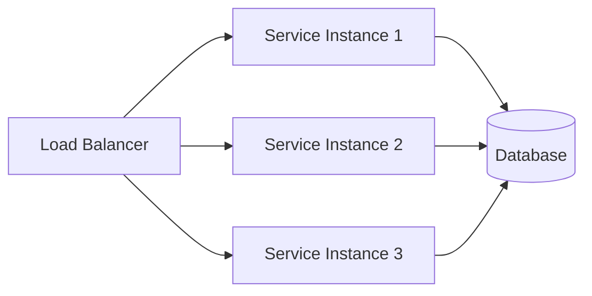
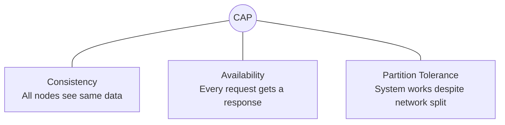
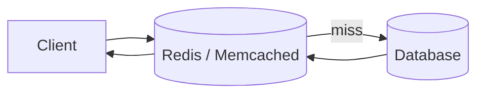
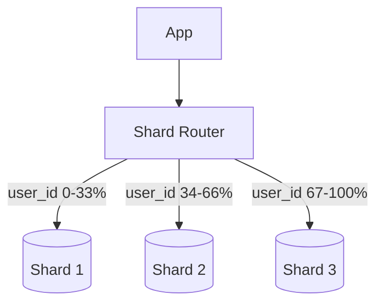
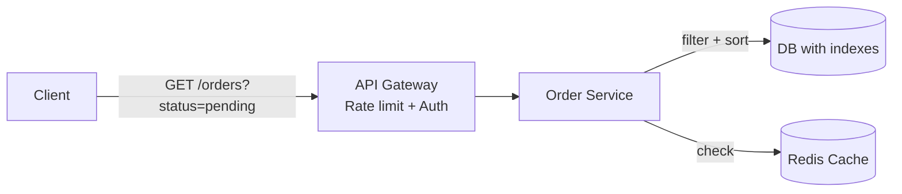
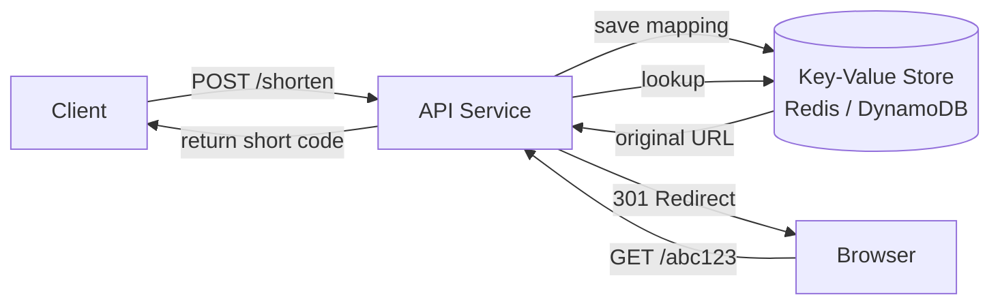

# System Design

## Table of Contents
1. [Interview Framework](#interview-framework)
2. [Availability & SLA](#availability--sla)
3. [Scalability](#scalability)
4. [CAP Theorem](#cap-theorem)
5. [Load Balancing](#load-balancing)
6. [Caching](#caching)
7. [Database Sharding](#database-sharding)
8. [Designing a Queryable RESTful API](#designing-a-queryable-restful-api)
9. [Common Design Problems](#common-design-problems)

---

## Interview Framework

**5-step approach:**

```
1. CLARIFY (5 min)   → functional + non-functional requirements, scale, constraints
2. ESTIMATE (3 min)  → QPS, storage, bandwidth
3. HIGH-LEVEL (10 min) → draw components, data flow, APIs
4. DEEP DIVE (15 min)  → critical components, data models, algorithms
5. BOTTLENECKS (5 min) → where will it break? caching, sharding, queues
```

Always discuss **trade-offs**. There are no perfect designs, only appropriate ones.

---

## Availability & SLA

| Nines | Downtime/year | Downtime/month |
|---|---|---|
| 99% | 3.65 days | 7.3 hours |
| 99.9% | 8.76 hours | 43 min |
| 99.99% | 52 min | 4.4 min |
| 99.999% | 5.2 min | 26 sec |

**SLA** = contractual commitment. **SLO** = internal target. **SLI** = actual measured metric.

Achieve high availability with: active-active redundancy, health checks, circuit breakers, multi-AZ deployments.

---

## Scalability

### Horizontal vs Vertical

| | Vertical (scale-up) | Horizontal (scale-out) |
|---|---|---|
| Method | Bigger machine | More machines |
| Limit | Hardware ceiling | Practically unlimited |
| Failure mode | Single point | Fault tolerant |
| Best for | Databases, stateful | Stateless services |



**Key to horizontal scaling:** statelessness. Store session state in Redis, not in-process.

---

## CAP Theorem

A distributed system can guarantee at most **2 of 3**: Consistency, Availability, Partition Tolerance.

Since network partitions are inevitable, the real choice is **CP vs AP**:



- **CP** (Zookeeper, HBase): returns error if partition → correct but unavailable
- **AP** (Cassandra, DynamoDB): returns possibly stale data → available but not consistent
- **PACELC** extends CAP: even without partitions, there's a latency/consistency trade-off

---

## Load Balancing

**Algorithms:**
- **Round Robin** — simple rotation; best when servers are identical
- **Least Connections** — route to server with fewest active connections
- **IP Hash** — consistent routing per client (session stickiness)
- **Weighted** — route more traffic to more capable servers

**Health checks:** LB removes unhealthy instances from the pool automatically.

---

## Caching



**Strategies:**
- **Cache-Aside** — app checks cache first; on miss, loads DB and populates cache (most common)
- **Write-Through** — write to cache + DB synchronously; always consistent, higher write latency
- **Write-Behind** — write to cache; async flush to DB; fast writes, risk of data loss

**Eviction policies:** LRU (default), LFU, TTL-based.

**Cache invalidation** is the hard part. Use short TTLs + event-driven invalidation for critical data.

---

## Database Sharding

Partitioning data across multiple DB nodes to scale writes.



**Shard key choice is critical.** A bad key causes hotspots (one shard handles all traffic).

**Consistent hashing** minimizes rebalancing when adding/removing shards.

**Challenges:** cross-shard joins are expensive; distributed transactions are complex; rebalancing is hard.

---

## Designing a Queryable RESTful API

My approach when designing a queryable REST API:

### 1. Resource-Oriented URLs

```
GET  /orders             → list (paginated)
GET  /orders/{id}        → single resource
POST /orders             → create
PUT  /orders/{id}        → full update
PATCH /orders/{id}       → partial update
DELETE /orders/{id}      → delete
```

### 2. Filtering, Sorting, Pagination

Always on collections. Use query parameters, never verbs in the path.

```
GET /orders?status=pending&customerId=42&sort=createdAt,desc&page=0&size=20
```

Never return an unbounded list. Default to pagination with sensible limits (e.g., 20 items max).

### 3. Consistent Response Envelope

```json
{
  "data": [...],
  "meta": {
    "page": 0,
    "size": 20,
    "totalElements": 150,
    "totalPages": 8
  },
  "links": {
    "next": "/orders?page=1&size=20",
    "prev": null
  }
}
```

### 4. Versioning

Use URL versioning for breaking changes: `/api/v1/orders`, `/api/v2/orders`.

### 5. Error Responses

```json
{
  "status": 400,
  "error": "VALIDATION_ERROR",
  "message": "amount must be positive",
  "traceId": "abc-123"
}
```

### 6. HATEOAS (when warranted)

Include links to related actions in responses. Useful for discoverability in complex APIs.

### 7. Performance Considerations

- Add DB indexes on all filterable fields
- Use projections — return only requested fields
- Cache `GET` responses with short TTLs (ETags, `Cache-Control`)
- Rate-limit per API key to prevent abuse



---

## Common Design Problems

### Design a URL Shortener (bit.ly)



Key decisions: base62 encoding for short codes; 301 (permanent) vs 302 (temporary) redirect; analytics tracking.

### Design a Rate Limiter

Algorithms: **Token Bucket** (allows bursts), **Sliding Window** (smooth), **Fixed Window** (simple).

```java
// Token Bucket in Redis (Lua script for atomicity)
// tokens = min(capacity, tokens + rate * elapsed)
// if tokens >= 1: allow, tokens -= 1
// else: reject 429
```

Store counters in Redis with TTL. Use **distributed rate limiting** with Redis cluster for multi-instance services.
